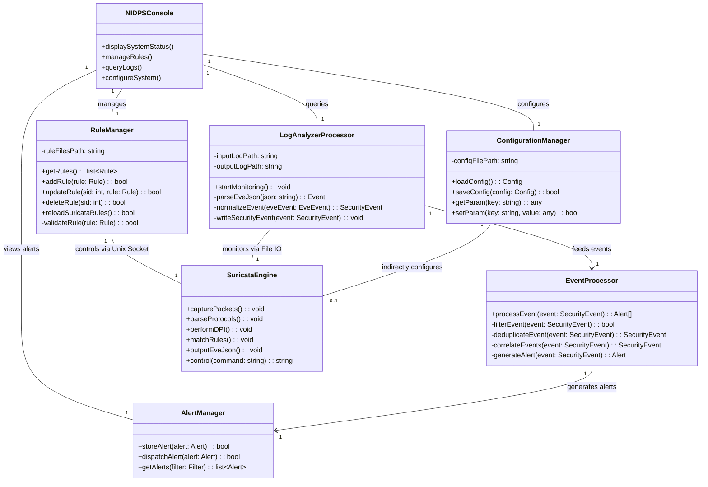
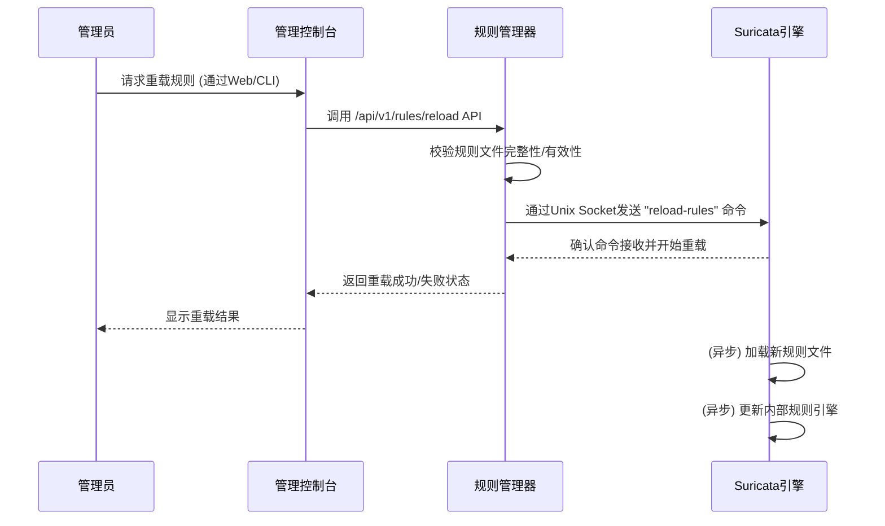
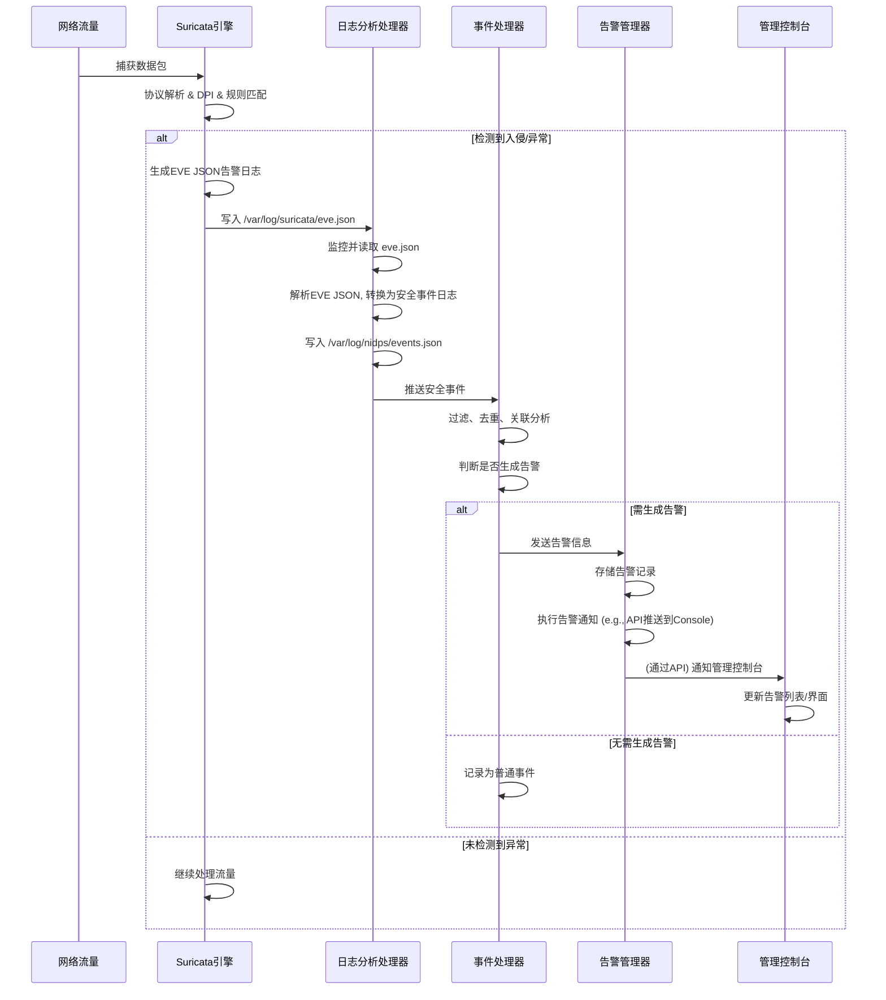

# 车载网络入侵检测系统（NIDPS）设计文档

## 文档信息与目录

| 项目 | 内容 |
|------|------|
| 文档编号 | NIDPS-DESIGN-0002 |
| 版本 | v1.0.0 |
| 创建日期 | 2026-01-13 |
| 状态 | 草案 |

---

## 目录

1.  [设计概述](#1-设计概述)
    1.1. [项目背景与目标](#11-项目背景与目标)
    1.2. [系统主要功能](#12-系统主要功能)
    1.3. [技术选型](#13-技术选型)
2.  [系统详细架构设计](#2-系统详细架构设计)
    2.1. [总体架构](#21-总体架构)
    2.2. [GPL组件层设计](#22-gpl组件层设计)
    2.3. [私有代码层设计](#23-私有代码层设计)
    2.4. [IPC通信设计](#24-ipc通信设计)
3.  [模块设计](#3-模块设计)
    3.1. [Suricata引擎模块](#31-suricata引擎模块)
    3.2. [NIDPS管理模块（私有代码层）](#32-nidps管理模块私有代码层)
    3.3. [模块类图](#33-模块类图)
    3.4. [模块序列图](#34-模块序列图)
4.  [接口设计](#4-接口设计)
    4.1. [Suricata控制接口（Unix Socket）](#41-suricata控制接口unix-socket)
    4.2. [私有管理接口（RESTful API）](#42-私有管理接口restful-api)
    4.3. [文件接口](#43-文件接口)
5.  [数据结构设计](#5-数据结构设计)
    5.1. [Suricata规则结构](#51-suricata规则结构)
    5.2. [EVE JSON日志结构](#52-eve-json日志结构)
    5.3. [安全事件日志结构](#53-安全事件日志结构)
6.  [部署设计](#6-部署设计)
    6.1. [部署环境](#61-部署环境)
    6.2. [安装与配置](#62-安装与配置)
    6.3. [目录结构](#63-目录结构)
7.  [安全设计](#7-安全设计)
    7.1. [GPL合规性](#71-gpl合规性)
    7.2. [访问控制](#72-访问控制)
    7.3. [日志安全](#73-日志安全)
8.  [测试设计](#8-测试设计)
    8.1. [测试策略](#81-测试策略)
    8.2. [测试环境](#82-测试环境)
    8.3. [测试用例（示例）](#83-测试用例示例)
9.  [附录](#9-附录)
    9.1. [术语定义](#91-术语定义)
    9.2. [参考文献](#92-参考文献)
    9.3. [事件严重级别定义](#93-事件严重级别定义)
    9.4. [变更记录](#94-变更记录)

---

## 1. 设计概述

### 1.1 项目背景与目标

随着智能网联汽车的快速发展，车载网络安全面临日益严峻的挑战。本项目旨在基于开源高性能入侵检测引擎Suricata，开发一套适用于车载ARMv8架构平台的网络入侵检测系统（NIDPS）。核心目标包括：

*   基于Suricata开源引擎构建车载网络入侵检测系统。
*   支持ARMv8（ARM64/AArch64）架构车载平台，实现高效运行。
*   实现对OSI模型2-7层网络协议的深度包检测（DPI）。
*   特别支持车载专用协议（如SomeIP、DoIP、GB/T 32960.3）的深度检测。
*   严格遵循GPL v2许可证要求，通过进程隔离和标准IPC通信机制，规避GPL许可证传染风险。
*   提供灵活、可扩展的规则配置和管理机制。
*   建立完善的日志存储、分析和告警处理系统。

### 1.2 系统主要功能

本系统将提供以下核心功能：

*   **多层网络协议检测**：支持Ethernet、VLAN、ARP、IPv4/IPv6、ICMP、IGMP、TCP、UDP、SCTP以及应用层协议（HTTP/HTTPS、TLS/SSL、DNS、MQTT、FTP、Telnet、SSH、SMTP、SomeIP、DoIP、GB/T 32960.3）的入侵检测。
*   **深度包检测 (DPI)**：对应用层协议内容进行深度解析，识别异常行为和攻击特征。
*   **攻击类型检测**：包括TCP/UDP/ICMP Flood、畸形报文、Land攻击、ARP欺骗、IP分片攻击、弱密码尝试、已知漏洞利用、Web应用漏洞、命令注入等。
*   **协议行为监控**：对DoIP、MQTT、GB/T 32960.3、SomeIP等协议的异常行为进行监控和告警。
*   **灵活的规则管理**：支持Suricata标准规则语法，通过私有管理接口实现规则的增删改查及热加载。
*   **全面的日志管理**：生成EVE JSON格式的原始日志及格式化的安全事件日志，并提供日志轮转、清理和存储管理功能。
*   **系统状态监控与控制**：通过RESTful API提供系统启动/停止、状态查询等管理功能。

### 1.3 技术选型

*   **核心引擎**: Suricata (版本: suricata-7.0.3)
*   **目标平台**: ARMv8 (ARM64/AArch64)
*   **开发语言**: C/C++ (Suricata核心), 推荐Python/Go (私有管理模块)
*   **操作系统**: 宿主机 Ubuntu 20.04/22.04 LTS (x86_64), 目标机 Linux (ARM64)
*   **IPC机制**: Unix Socket, 文件I/O, 命令行调用, 共享内存, TCP Socket
*   **数据格式**: JSON (EVE JSON, 自定义安全事件日志)
*   **API规范**: RESTful API
*   **容器化**: Docker, QEMU (用于ARM64测试环境模拟)
*   **交叉编译**: `aarch64-linux-gnu` 工具链

## 2. 系统详细架构设计

### 2.1 总体架构

NIDPS系统采用**进程隔离 + 标准IPC通信**的架构，严格分离GPL许可的Suricata引擎与私有业务代码，以规避GPL许可证传染风险。系统逻辑上分为"GPL组件层"和"私有代码层"两个独立进程区域。

```
┌─────────────────────────────────────────────────────────────────┐
│                        车载NIDPS系统                             │
├─────────────────────────────────────────────────────────────────┤
│  ┌──────────────────────────────────────────────────────────┐   │
│  │                  私有代码层（非GPL，独立进程）               │   │
│  │  ┌─────────────┐ ┌─────────────┐ ┌─────────────────────┐ │   │
│  │  │ 管理控制台   │ │ 规则管理器  │ │ 日志分析处理器       │ │   │
│  │  └─────────────┘ └─────────────┘ └─────────────────────┘ │   │
│  │  ┌─────────────┐ ┌─────────────┐ ┌─────────────────────┐ │   │
│  │  │ 事件处理器   │ │ 告警管理器  │ │ 配置管理器          │ │   │
│  │  └─────────────┘ └─────────────┘ └─────────────────────┘ │   │
│  └──────────────────────────────────────────────────────────┘   │
│                              │                                   │
│                    IPC通信边界（进程间通信）                        │
│              ┌───────────────┼───────────────┐                  │
│              │               │               │                  │
│         Unix Socket    文件监控     命令行调用                   │
│              │               │               │                  │
│  ┌──────────────────────────────────────────────────────────┐   │
│  │                  GPL组件层（Suricata引擎，独立进程）          │   │
│  │  ┌─────────────┐ ┌─────────────┐ ┌─────────────────────┐ │   │
│  │  │ 包捕获模块   │ │ 协议解析器  │ │ 规则匹配引擎         │ │   │
│  │  └─────────────┘ └─────────────┘ └─────────────────────┘ │   │
│  │  ┌─────────────┐ ┌─────────────┐ ┌─────────────────────┐ │   │
│  │  │ DPI引擎     │ │ 日志输出    │ │ EVE JSON输出        │ │   │
│  │  └─────────────┘ └─────────────┘ └─────────────────────┘ │   │
│  └──────────────────────────────────────────────────────────┘   │
└─────────────────────────────────────────────────────────────────┘
```

**设计要点：**
*   **进程隔离**：Suricata引擎作为一个独立的进程运行，与私有代码层的各个模块完全分离。
*   **标准IPC通信**：所有模块之间的交互通过明确定义的、业界标准的进程间通信（IPC）机制进行，不涉及代码共享或静态/动态链接。
*   **数据中立**：IPC传输的数据采用JSON等标准、中立的格式。
*   **松耦合**：各模块之间通过接口进行通信，降低耦合度，提高系统的可维护性和扩展性。

### 2.2 GPL组件层设计

GPL组件层主要由开源Suricata引擎及其相关配置和规则文件构成。此层不进行任何源代码修改，直接使用官方发布的二进制版本或通过交叉编译生成。

*   **Suricata引擎**：核心入侵检测和防御功能，包括：
    *   **包捕获模块**：负责从网络接口捕获原始数据包（基于AF_PACKET或libpcap）。
    *   **协议解析器**：对捕获的数据包进行2-7层协议解析，识别协议类型和字段。
    *   **DPI引擎**：进行深度包检测，解析应用层协议（如HTTP, TLS, MQTT, SomeIP, DoIP等）内容。
    *   **规则匹配引擎**：根据加载的Suricata规则对解析后的流量进行模式匹配，识别潜在威胁。
    *   **日志输出模块**：将检测到的事件、告警、流量和协议元数据以EVE JSON格式输出到指定文件。
*   **配置文件**：`suricata.yaml` 用于配置Suricata的运行参数、输出设置、规则文件路径等。
*   **规则文件**：存放入侵检测规则，按类别组织在`/etc/suricata/rules/`目录下。

### 2.3 私有代码层设计

私有代码层包含NIDPS的核心业务逻辑和管理功能，采用非GPL许可证，可保持闭源。此层模块负责与Suricata引擎进行IPC交互，并对外提供管理接口。

*   **管理控制台 (NIDPS Console)**：提供Web界面或命令行工具，供管理员进行系统配置、规则管理、日志查询和告警处理。通过RESTful API与后端服务交互。
*   **规则管理器 (Rule Manager)**：负责Suricata规则文件的生命周期管理（增、删、改、查、发布）。接收来自管理控制台的规则操作请求，更新规则文件，并通过IPC机制触发Suricata规则热加载。
*   **日志分析处理器 (Log Parser & Analyzer)**：持续监控Suricata输出的EVE JSON日志，解析原始日志，提取关键安全事件信息，并转换为统一的"安全事件日志"格式，进行初步分析和筛选。
*   **事件处理器 (Event Processor)**：接收日志分析处理器生成的安全事件，根据预设的事件处理策略进行进一步处理，例如事件去重、关联分析、上下文丰富等，并决定是否生成告警。
*   **告警管理器 (Alert Manager)**：接收事件处理器生成的告警信息，负责告警的分发、存储和通知。可支持多种通知方式（如本地存储、API推送至上层平台）。
*   **配置管理器 (Configuration Manager)**：管理NIDPS系统的各项配置参数，包括日志路径、清理策略、性能优化参数等，并将其持久化。

### 2.4 IPC通信设计

GPL组件层与私有代码层之间的通信严格遵循标准IPC机制，确保不产生GPL传染。

| 通信方式 | GPL组件层角色 | 私有代码层角色 | 用途 |
|----------|--------------|--------------|------|
| Unix Socket | 提供命令Socket | 作为客户端发送命令 | Suricata引擎的启停、规则热加载、状态查询等控制命令。 `/var/run/suricata/suricata-command.socket` |
| 文件读写 | 输出EVE JSON日志 | 监控/读取日志文件 | Suricata将告警、流量、协议等信息输出为EVE JSON日志文件；私有层读取这些日志进行分析。 |
| 命令行调用 | 独立可执行程序 | 启动/停止Suricata | 私有层通过系统调用执行Suricata二进制启动或停止引擎。 |
| 共享内存 | 不直接使用 (可选) | 不直接使用 (可选) | 若未来有极端性能需求，可考虑通过标准POSIX共享内存进行数据交换，但需谨慎设计以确保合规性。 |
| TCP Socket | (未明确使用) | (未明确使用) | 可作为Suricata的远程管理接口，但本项目以Unix Socket为主。 |

**合规性保障：**
1.  **进程边界**：Suricata引擎与NIDPS管理模块运行在不同的进程中。
2.  **标准化接口**：只使用操作系统提供的标准IPC机制，如Unix Socket、文件系统。
3.  **数据格式**： IPC传递的数据严格采用JSON等与具体编程语言或库无关的中立格式。
4.  **无代码共享**：私有代码不链接或包含Suricata的任何源代码或库文件，仅通过外部进程通信。

## 3. 模块设计

### 3.1 Suricata引擎模块

作为GPL组件层，主要负责数据包捕获、解析、检测和原始日志输出。

#### 3.1.1 包捕获模块

*   **功能**：从车载网络接口高效捕获原始数据包。
*   **实现**：基于Linux `AF_PACKET` 或 `libpcap` 库。`AF_PACKET` 模式提供更高的性能和更低的CPU开销。
*   **配置**：`suricata.yaml`中配置监听的网络接口。
*   **性能优化**：支持多线程捕获，使用Ring Buffer。

#### 3.1.2 协议解析器

*   **功能**：对捕获的数据包进行自下而上的多层协议解析。
*   **支持协议**：Ethernet, VLAN, ARP, IPv4, IPv6, ICMP, IGMP, TCP, UDP, SCTP, HTTP, DNS, TLS, MQTT, FTP, Telnet, SSH, SMTP, SomeIP, DoIP, GB/T 32960.3。
*   **实现**：Suricata内置的协议解析引擎，支持协议栈重组和流重组。
*   **输出**：解析后的协议元数据供DPI引擎和规则匹配引擎使用。

#### 3.1.3 DPI引擎

*   **功能**：对应用层协议内容进行深度解析，提取协议特定字段和数据。
*   **实现**：Suricata的DPI模块，通过解析器插件支持各种应用层协议。
*   **车载协议DPI**：
    *   **SomeIP**：解析Service ID, Method ID, Client ID, Session ID, 消息类型, 返回码, Payload内容。
    *   **DoIP**：解析协议版本, Payload类型, 诊断消息, 路由激活, 实体状态, 诊断会话。
    *   **GB/T 32960.3**：监控消息类型和关键字段。
*   **通用协议DPI**：
    *   **HTTP/HTTPS**：URL, 方法, 头, Cookie, User-Agent, 请求/响应体。
    *   **TLS/SSL**：版本, 证书, SNI, 加密套件, JA3/JA3S指纹。
    *   **DNS**：查询类型, 域名, DNS隧道特征。
    *   **MQTT**：客户端ID, Topic, 消息内容, 认证信息, QoS。

#### 3.1.4 规则匹配引擎

*   **功能**：根据加载的规则文件，对经过协议解析和DPI处理的数据包和流进行模式匹配，识别入侵行为和异常。
*   **实现**：Suricata高性能规则引擎，支持签名、协议异常、流量统计等多种检测策略。
*   **规则语法**：遵循Suricata标准规则语法 (`action protocol src_ip src_port -> dst_ip dst_port (options)`)。
*   **规则管理**：支持规则热加载，允许在不重启引擎的情况下更新规则。
*   **性能优化**：通过AC自动机、多线程、流引擎优化等技术加速匹配。

#### 3.1.5 日志输出模块

*   **功能**：将所有检测到的事件、流量、协议、告警信息以标准EVE JSON格式输出。
*   **配置**：通过`suricata.yaml`配置输出类型、文件路径、轮转策略、包含字段等。
*   **输出类型**：alert, flow, http, dns, tls, mqtt, anomaly, stats等。
*   **日志路径**：默认输出到`/var/log/suricata/eve.json`。

### 3.2 NIDPS管理模块（私有代码层）

#### 3.2.1 管理控制台模块 (NIDPS Console)

*   **职责**：提供用户友好的接口（Web/CLI）与系统交互。
*   **核心功能**：
    *   系统状态概览：显示Suricata运行状态、资源占用、告警统计。
    *   规则管理界面：可视化增删改查规则，支持规则文件上传。
    *   日志查询与分析：提供安全事件的过滤、搜索、详情查看。
    *   配置管理：调整系统参数，如日志保留策略、性能参数。
    *   告警通知：查看告警历史，配置告警阈值和通知方式。
*   **技术选型**：Web前端（如Vue/React）+ 后端API（如Python Flask/FastAPI, Go Gin/Echo）。

#### 3.2.2 规则管理器模块 (Rule Manager)

*   **职责**：负责管理和同步Suricata规则。
*   **核心功能**：
    *   **规则存储**：在本地文件系统维护规则文件目录 (`/etc/suricata/rules/`)。
    *   **API接口实现**：提供RESTful API (`/api/v1/rules`) 实现规则的CRUD操作。
    *   **规则校验**：对新增或修改的规则进行语法校验。
    *   **规则下发**：将更新后的规则写入相应文件。
    *   **热加载触发**：通过Unix Socket向Suricata引擎发送`reload-rules`命令。
*   **数据结构**：规则以文本文件存储，内部可能以结构化数据（如JSON）表示便于API处理，最终转换为Suricata规则语法写入文件。

#### 3.2.3 日志分析处理器模块 (Log Parser & Analyzer)

*   **职责**：实时处理Suricata输出的EVE JSON日志，并转换为结构化的安全事件日志。
*   **核心功能**：
    *   **日志监控**：监控`/var/log/suricata/eve.json`文件的变化。
    *   **JSON解析**：解析EVE JSON日志，提取`event_type`, `alert`, `src_ip`, `dest_ip`, `proto`等关键字段。
    *   **事件归一化**：根据EVE JSON中的`signature_id`和`category`，映射到预定义的"安全事件代号" (`event_code`) 和`event_name`。
    *   **信息提取**：从原始EVE JSON中提取与安全事件相关的详细信息，如`client_id` for MQTT, `url` for HTTP, `signature` for alert，填充到`details`字段。
    *   **日志输出**：将处理后的"安全事件日志"以JSON格式写入`/var/log/nidps/events.json`。
*   **技术选型**：可使用Python脚本或Go程序实现，利用`inotify`等机制监控文件变化。

#### 3.2.4 事件处理器模块 (Event Processor)

*   **职责**：对日志分析处理器生成的安全事件进行进一步处理和决策。
*   **核心功能**：
    *   **事件过滤**：根据配置，过滤掉低优先级或已知误报的事件。
    *   **事件去重**：在一定时间窗口内，对相同特征的事件进行去重处理，避免重复告警。
    *   **事件关联**：可选功能，对不同但相关的事件进行关联分析，以发现更复杂的攻击链。
    *   **告警生成**：根据事件的严重级别和用户配置的阈值，决定是否生成告警，并将告警发送给告警管理器。
*   **数据结构**：处理"安全事件日志"格式，可能维护一个内存中的事件状态表。

#### 3.2.5 告警管理器模块 (Alert Manager)

*   **职责**：管理和分发系统生成的安全告警。
*   **核心功能**：
    *   **告警存储**：将告警信息持久化存储。
    *   **告警通知**：根据配置，通过不同渠道（如RESTful API推送至中央管理平台、写入特定日志文件、MQTT消息）发送告警。
    *   **告警去重/抑制**：防止短时间内产生大量重复告警，可设置告警抑制策略。
*   **数据结构**：存储类似于"安全事件日志"的告警记录，可能增加告警状态（已处理/未处理）。

#### 3.2.6 配置管理器模块 (Configuration Manager)

*   **职责**：管理整个NIDPS私有代码层的运行配置。
*   **核心功能**：
    *   **配置存储**：将配置参数（如日志清理策略、API认证信息等）持久化到配置文件（如YAML/JSON）或数据库。
    *   **配置读取**：系统启动时加载配置。
    *   **配置更新**：提供API或CLI接口修改配置，并触发相关模块重新加载配置。
*   **技术选型**：可使用`libyaml`或`json`库进行配置文件的读写。

### 3.3 模块类图

由于具体的编程语言未指定，以下为概念性的模块类图，展示私有代码层主要模块之间的关系。



### 3.4 模块序列图

#### 3.4.1 规则重载序列图

此序列图展示了管理员通过管理控制台触发Suricata规则重载的流程。



#### 3.4.2 安全事件处理序列图

此序列图展示了Suricata检测到安全事件后，私有代码层对其进行处理并生成告警的流程。



## 4. 接口设计

### 4.1 Suricata控制接口（Unix Socket）

私有代码层通过Unix Socket与Suricata引擎进行进程间通信，发送控制命令。

*   **Socket路径**: `/var/run/suricata/suricata-command.socket`
*   **通信协议**: Suricata提供的命令协议。
*   **支持命令**:
    *   `shutdown`: 关闭Suricata引擎。
    *   `reload-rules`: 重新加载所有规则文件。
    *   `iface-list`: 列出当前Suricata正在监听的网络接口。
    *   `iface-stat <iface>`: 获取指定网络接口的实时统计信息。
    *   `capture-mode`: 显示当前Suricata的包捕获模式。
    *   `version`: 获取Suricata引擎的版本信息。

**示例（Python伪代码）**:

```python
import socket
import json

def send_suricata_command(command, args=None):
    sock = socket.socket(socket.AF_UNIX, socket.SOCK_STREAM)
    try:
        sock.connect("/var/run/suricata/suricata-command.socket")
        msg = {"command": command}
        if args:
            msg.update(args)
        sock.sendall(json.dumps(msg).encode('utf-8'))
        response = sock.recv(4096).decode('utf-8')
        return json.loads(response)
    except Exception as e:
        print(f"Error communicating with Suricata socket: {e}")
        return None
    finally:
        sock.close()

# 示例：重载规则
# response = send_suricata_command("reload-rules")
# print(response)
```

### 4.2 私有管理接口（RESTful API）

NIDPS管理模块对外提供RESTful API，供管理控制台或其他上层应用进行系统管理、规则管理和日志查询。

*   **Base URL**: `http://localhost:8080/api/v1`
*   **认证机制**: Bearer Token (JWT或其他认证令牌)。
*   **数据格式**: 请求和响应均为 `application/json`。

**接口列表**:

#### 4.2.1 系统管理API

| 接口路径 | 方法 | 描述 | 请求体示例 | 响应体示例 |
|----------|------|------|----------|----------|
| `/system/status` | GET | 获取NIDPS系统（包括Suricata）的运行状态、资源占用、最新告警统计等。 | 无 | `{"status": "running", "suricata_status": "active", "cpu_usage": 15, "memory_usage": 200, "latest_alerts": [...]}` |
| `/system/start` | POST | 启动Suricata检测服务。 | 无 | `{"message": "Suricata service started.", "code": 200}` |
| `/system/stop` | POST | 停止Suricata检测服务。 | 无 | `{"message": "Suricata service stopped.", "code": 200}` |
| `/system/restart` | POST | 重启Suricata检测服务。 | 无 | `{"message": "Suricata service restarted.", "code": 200}` |

#### 4.2.2 规则管理API

| 接口路径 | 方法 | 描述 | 请求体示例 | 响应体示例 |
|----------|------|------|----------|----------|
| `/rules` | GET | 获取所有规则的列表（可分页、过滤）。 | `?page=1&limit=10&keyword=mqtt` | `{"total": 100, "data": [{"sid": 5000019, "rule": "alert mqtt...", "status": "enabled"}, ...]}` |
| `/rules` | POST | 添加一条新规则。 | `{"rule_content": "alert tcp any any -> any any (msg:\"New Rule\"; sid:5000999;)"}` | `{"message": "Rule added successfully.", "sid": 5000999, "code": 201}` |
| `/rules/{sid}` | GET | 获取指定SID的规则详情。 | 无 | `{"sid": 5000019, "rule": "alert mqtt...", "status": "enabled"}` |
| `/rules/{sid}` | PUT | 更新指定SID的规则内容或状态。 | `{"rule_content": "alert mqtt any any -> any any (msg:\"Updated MQTT Rule\"; sid:5000019;)", "status": "disabled"}` | `{"message": "Rule updated successfully.", "code": 200}` |
| `/rules/{sid}` | DELETE | 删除指定SID的规则。 | 无 | `{"message": "Rule deleted successfully.", "code": 204}` |
| `/rules/reload` | POST | 触发Suricata引擎重新加载规则。 | 无 | `{"message": "Suricata rules reload initiated.", "code": 202}` |

#### 4.2.3 日志管理API

| 接口路径 | 方法 | 描述 | 请求体示例 | 响应体示例 |
|----------|------|------|----------|----------|
| `/logs/events` | GET | 获取安全事件日志（可分页、按时间、事件码、IP过滤）。 | `?start_time=...&end_time=...&event_code=212&src_ip=...` | `{"total": 500, "data": [{"event_id": "...", "event_code": 212, ...}, ...]}` |
| `/logs/alerts` | GET | 获取告警记录（可分页、按严重级别、时间过滤）。 | `?severity=high&page=1` | `{"total": 50, "data": [{"alert_id": "...", "event_code": 102, "severity": "high", ...}, ...]}` |
| `/logs/stats` | GET | 获取Suricata引擎的性能统计信息。 | `?interval=minute` | `{"timestamp": "...", "capture_pkts": 100000, "alert_count": 50, "dropped_pkts": 0, ...}` |

### 4.3 文件接口

系统通过文件系统进行配置和日志的存储，这是GPL组件层与私有代码层交互的重要方式。

*   **配置文件**:
    *   `/etc/suricata/suricata.yaml`: Suricata引擎的主配置文件。
    *   `/etc/suricata/rules/`: Suricata规则文件目录，包含`local.rules`, `tcp-attacks.rules`, `automotive/someip.rules`等。
    *   `/etc/suricata/vars.yaml`: Suricata变量定义文件。
    *   `/etc/nidps/config.yaml` (示例): NIDPS私有管理模块的配置文件。
*   **日志文件**:
    *   `/var/log/suricata/eve.json`: Suricata引擎输出的原始EVE JSON格式日志。
    *   `/var/log/suricata/fast.log`: Suricata快速告警日志（文本格式）。
    *   `/var/log/suricata/stats.log`: Suricata性能统计日志。
    *   `/var/log/nidps/events.json`: 经私有模块处理后的统一安全事件日志。
    *   `/var/log/nidps/alerts.json` (示例): 私有模块生成的告警日志。

## 5. 数据结构设计

### 5.1 Suricata规则结构

Suricata规则以纯文本形式存储，遵循特定的语法结构。在私有代码层，为方便管理和API交互，可将其抽象为以下结构（示例JSON表示）：

```json
{
  "sid": 5000019,
  "rev": 1,
  "action": "alert",
  "protocol": "mqtt",
  "src_ip": "any",
  "src_port": "any",
  "direction": "->",
  "dst_ip": "any",
  "dst_port": "any",
  "options": [
    {"name": "msg", "value": "MQTT illegal Client ID:e23f53bb221e4d75b362f01936238841"},
    {"name": "mqtt.connect.clientid"},
    {"name": "content", "value": "\"e23f53bb22\""},
    {"name": "classtype", "value": "misc-attack"}
  ],
  "raw_rule": "alert mqtt any any -> any any (msg:\"MQTT illegal Client ID:e23f53bb221e4d75b362f01936238841\"; mqtt.connect.clientid; content:\"e23f53bb22\"; classtype:misc-attack; sid:5000019; rev:1;)",
  "status": "enabled"
}
```
**说明**:
*   `sid`: 规则唯一标识符。
*   `rev`: 规则版本号。
*   `action`, `protocol`, `src_ip`, `src_port`, `direction`, `dst_ip`, `dst_port`: 规则头部字段。
*   `options`: 规则选项列表，每个选项包含名称和值。
*   `raw_rule`: 完整的原始Suricata规则字符串，便于存储和直接写入文件。
*   `status`: 规则的启用/禁用状态（私有管理）。

### 5.2 EVE JSON日志结构

Suricata输出的EVE JSON日志是原始事件的详细记录。结构多样，但核心字段如下：

```json
{
  "timestamp": "2026-01-13T10:30:45.123456+0800",
  "flow_id": 1234567890,
  "event_type": "alert",
  "src_ip": "192.168.1.100",
  "src_port": 54321,
  "dest_ip": "192.168.1.1",
  "dest_port": 80,
  "proto": "TCP",
  "alert": {
    "action": "allowed",
    "gid": 1,
    "signature_id": 5000019,
    "rev": 1,
    "signature": "MQTT illegal Client ID",
    "category": "Misc Attack",
    "severity": 2
  },
  "mqtt": {
    "type": "CONNECT",
    "client_id": "e23f53bb221e4d75b362f01936238841",
    "username": "user",
    "version": 4
  },
  "app_proto": "mqtt"
}
```

**字段说明**:
*   `timestamp`: 事件时间。
*   `flow_id`: 流ID。
*   `event_type`: 事件类型 (alert, flow, http, dns, tls, mqtt, stats等)。
*   `src_ip`, `src_port`: 源IP地址和端口。
*   `dest_ip`, `dest_port`: 目的IP地址和端口。
*   `proto`: 协议。
*   `alert`: 告警详细信息 (仅当event_type为alert时存在)。
*   `mqtt`, `http`, `dns`等: 协议特定信息 (根据event_type不同而变化)。
*   `app_proto`: 应用层协议。

### 5.3 安全事件日志结构

私有代码层对EVE JSON日志进行解析、归一化后生成的统一安全事件日志结构，更便于上层应用处理。

```json
{
  "event_id": "uuid-string",
  "event_code": 212,
  "event_name": "MQTT协议监控",
  "timestamp": "2026-01-13T10:30:45.123456+0800",
  "severity": "medium",
  "source": {
    "ip": "192.168.1.100",
    "port": 54321,
    "mac": "AA:BB:CC:DD:EE:FF"
  },
  "destination": {
    "ip": "192.168.1.1",
    "port": 1883
  },
  "protocol": "MQTT",
  "description": "检测到非法MQTT客户端ID",
  "details": {
    "client_id": "e23f53bb221e4d75b362f01936238841",
    "rule_sid": 5000019,
    "original_signature": "MQTT illegal Client ID",
    "original_category": "Misc Attack"
  }
}
```
**说明**:
*   `event_id`: 用于标识每个独立安全事件的唯一UUID。
*   `event_code`: 根据需求规格书中定义的安全事件代号进行分类。
*   `severity`: 统一为 `critical`, `high`, `medium`, `low`。
*   `source`, `destination`: 包含IP、端口、MAC地址等网络信息。
*   `details`: 键值对形式的扩展字段，包含事件特有的详细信息。

## 6. 部署设计

### 6.1 部署环境

*   **目标硬件**: 基于ARMv8 (ARM64/AArch64) 架构的智能网联汽车车载平台。
    *   最低配置：CPU ARMv8 4核，内存 2GB，存储 8GB，网络 100Mbps。
    *   推荐配置：CPU ARMv8 8核，内存 4GB，存储 32GB，网络 1Gbps。
*   **操作系统**: 兼容Linux发行版，如Ubuntu Core for ARM，Debian for ARM等。
*   **网络接口**: 至少一个用于流量镜像或桥接的网络接口用于数据包捕获。

### 6.2 安装与配置

1.  **交叉编译Suricata**: 在x86_64宿主机上，使用`aarch64-linux-gnu`工具链将Suricata编译为ARM64二进制文件。
    *   确保所有依赖库（libpcap, libyaml, libjansson等）也针对ARM64平台进行了交叉编译，并放置在`SYSROOT`中。
    *   参照`build-arm64.sh`脚本进行编译。
2.  **私有模块编译**: 编译NIDPS私有管理模块（如使用C++/Go/Python）。若为解释型语言（Python），则确保目标环境有相应解释器。
3.  **文件部署**:
    *   Suricata二进制文件及库：部署到`/opt/nidps/bin` 和 `/opt/nidps/lib`。
    *   Suricata配置文件：`suricata.yaml` 部署到 `/etc/suricata/`。
    *   规则文件：部署到 `/etc/suricata/rules/`。
    *   NIDPS私有模块可执行文件/脚本：部署到 `/opt/nidps/app/`。
    *   NIDPS私有模块配置文件：`/etc/nidps/config.yaml`。
4.  **服务配置**:
    *   配置Suricata为系统服务（systemd），开机自启。
    *   配置NIDPS私有管理模块为系统服务，开机自启。
    *   配置`logrotate`，管理`/var/log/suricata/`和`/var/log/nidps/`下的日志文件。
5.  **网络配置**:
    *   确保Suricata监听的网络接口能够捕获到车载网络的流量。可配置为镜像端口或In-line模式（如果需要IPS功能）。
    *   NIDPS管理模块的RESTful API默认监听在`http://localhost:8080/api/v1`，确保端口不冲突。

### 6.3 目录结构

建议的部署目录结构如下：

```
/
├── etc/
│   ├── suricata/                  # Suricata配置文件目录
│   │   ├── suricata.yaml          # Suricata主配置文件
│   │   ├── vars.yaml              # Suricata变量定义
│   │   └── rules/                 # 规则文件目录
│   │       ├── local.rules
│   │       ├── tcp-attacks.rules
│   │       └── automotive/
│   │           ├── someip.rules
│   │           └── doip.rules
│   └── nidps/                     # NIDPS私有模块配置目录
│       └── config.yaml            # NIDPS私有模块主配置文件
├── opt/
│   └── nidps/                     # NIDPS应用安装目录
│       ├── bin/                   # 可执行文件 (suricata, 私有模块app)
│       ├── lib/                   # 运行时库
│       └── app/                   # 私有管理模块脚本/程序
├── var/
│   ├── log/
│   │   ├── suricata/              # Suricata日志目录
│   │   │   ├── eve.json           # EVE JSON日志
│   │   │   ├── fast.log           # 快速告警日志
│   │   │   └── stats.log          # 统计日志
│   │   └── nidps/                 # NIDPS私有模块日志目录
│   │       └── events.json        # 统一安全事件日志
│   └── run/
│       └── suricata/
│           └── suricata-command.socket # Suricata Unix Socket
```

## 7. 安全设计

### 7.1 GPL合规性

*   **进程隔离**: Suricata引擎作为独立进程运行，其代码、库和数据与私有代码层完全隔离。
*   **标准IPC**: 私有代码层与Suricata引擎通过标准IPC机制（Unix Socket, 文件I/O, 命令行调用）通信，不进行任何形式的静态或动态链接。
*   **数据中立**: IPC通信中传递的数据使用JSON等中立、通用的数据格式，避免特定数据结构或API的共享。
*   **不修改Suricata源码**: 仅使用官方Suricata二进制版本或自行交叉编译的官方源码，不进行任何修改，以避免GPL传染。
*   **许可证声明**: 部署时需保留Suricata及其依赖的开源组件的GPL许可证声明，并提供获取源代码的方式。

### 7.2 访问控制

*   **RESTful API认证**: NIDPS管理模块的RESTful API通过Bearer Token进行身份认证，防止未经授权的访问。API密钥应妥善管理，并通过TLS/SSL加密通信。
*   **权限管理**: 私有管理模块可实现基于角色的访问控制（RBAC），限制不同用户对规则管理、系统控制和日志查询的权限。
*   **文件权限**: 严格设置`etc/suricata/`、`var/log/suricata/`、`var/log/nidps/`等关键目录和文件的读写权限，确保只有Suricata进程和NIDPS管理模块有必要权限，防止非法篡改和数据泄露。例如，日志文件应仅可由NIDPS进程和root用户写入，其他用户只读。
*   **最小权限原则**: Suricata进程和NIDPS私有模块应以非root的最小权限用户运行。

### 7.3 日志安全

*   **日志完整性**: 确保日志文件不被篡改。可考虑对关键日志进行哈希校验或数字签名。
*   **日志保密性**: 对包含敏感信息的日志（如某些攻击Payload）进行脱敏处理，防止敏感数据泄露。
*   **日志存储隔离**: 生产环境建议将日志存储到独立的存储介质或分区，避免日志填满系统盘影响系统运行。
*   **日志清理**: 按照日志清理策略进行日志轮转和清理，防止日志文件过大耗尽存储空间，同时避免长期存储敏感数据。
    *   **保留策略**: 默认保留30天日志。
    *   **磁盘阈值**: 当磁盘使用率达到80%时，自动清理最旧的日志。
    *   **压缩策略**: 对历史日志进行gzip压缩。
*   **传输安全**: 如果日志需要传输到远程服务器，应使用TLS/SSL等加密通道。

## 8. 测试设计

### 8.1 测试策略

*   **单元测试 (Unit Test)**：对NIDPS私有代码层的各个独立函数和模块进行测试，确保其功能正确性。
*   **集成测试 (Integration Test)**：
    *   私有代码层各模块间的集成测试：验证规则管理器、日志分析处理器、事件处理器和告警管理器之间的API和数据流是否正确。
    *   私有代码层与Suricata引擎的集成测试：验证Unix Socket通信、规则热加载、日志文件监控和解析是否正常。
*   **系统测试 (System Test)**：
    *   功能测试：验证所有功能需求，包括各类攻击检测、协议监控、规则管理、日志管理是否符合预期。
    *   性能测试：在模拟车载网络环境下，验证系统在不同流量负载下的包处理速率、检测延迟、CPU和内存占用是否满足性能要求。
    *   压力测试：模拟高并发攻击流量，测试系统在高压下的稳定性和资源消耗。
    *   兼容性测试：在不同的ARM64 Linux发行版和硬件平台上进行测试。
    *   安全合规测试：验证GPL规避策略是否有效，文件权限设置是否正确，API认证是否健壮。
*   **回归测试 (Regression Test)**：在每次代码更新或功能迭代后，运行自动化测试套件，确保现有功能不受影响。

### 8.2 测试环境

*   **开发测试环境**: x86_64宿主机上的Docker容器，利用QEMU用户态模拟技术构建ARM64测试环境。
    *   **Dockerfile.arm64-test**: 用于构建包含Suricata运行时依赖的ARM64 Ubuntu镜像。
    *   **build-arm64.sh**: 用于在宿主机上交叉编译Suricata，并将编译结果挂载到ARM64容器中进行测试。
*   **模拟车载网络环境**: 使用网络仿真工具（如`netem`、`ns-3`）或实际车载以太网硬件，模拟车载网络拓扑和流量特征。
*   **流量生成工具**: 使用`hping3`、`scapy`、`tcpreplay`等工具生成各种攻击流量和协议流量，用于功能和性能测试。
*   **日志分析工具**: 使用`jq`、`grep`等命令行工具或自定义脚本，分析Suricata和NIDPS输出的日志文件。

### 8.3 测试用例（示例）

#### 8.3.1 规则管理功能测试

| 测试用例ID | 测试描述 | 前置条件 | 操作步骤 | 预期结果 |
|------------|----------|----------|----------|----------|
| RULE-001 | 添加一条新规则并验证 | Suricata运行中，无冲突规则 | 1. 通过API添加一条MQTT非法客户端ID检测规则。 2. 通过API查询规则列表，确认新规则存在。 3. 通过API触发规则重载。 4. 生成包含非法MQTT客户端ID的流量。 | 1. API返回成功，规则SID分配正确。 2. 规则列表中能查到新规则。 3. API返回重载成功。 4. Suricata生成相应的EVE JSON告警日志，NIDPS生成安全事件日志。 |
| RULE-002 | 删除一条规则并验证 | 已有一条测试规则 (SID: 5000999) | 1. 通过API删除SID为5000999的规则。 2. 通过API查询规则列表。 3. 通过API触发规则重载。 | 1. API返回删除成功。 2. 规则列表中不再包含SID 5000999的规则。 3. API返回重载成功，Suricata不再检测该规则对应的流量。 |

#### 8.3.2 攻击检测功能测试

| 测试用例ID | 测试描述 | 前置条件 | 操作步骤 | 预期结果 |
|------------|----------|----------|----------|----------|
| ATTACK-001 | TCP SYN Flood攻击检测 | Suricata运行中，已加载SYN Flood检测规则 (事件代号: 102) | 1. 使用`hping3`工具对NIDPS监听接口发送大量SYN包。 2. 观察NIDPS日志输出。 | 1. Suricata的EVE JSON日志中出现`event_type: "alert"`，`signature_id`对应SYN Flood规则，`severity: 1`或`2`。 2. NIDPS安全事件日志中出现`event_code: 102`，`event_name: "TCP SYN Flood攻击"`，`severity: "high"`。 |
| ATTACK-002 | SomeIP协议异常检测 | Suricata运行中，已加载SomeIP异常检测规则 (事件代号: 214) | 1. 使用`scapy`或自定义工具构造异常的SomeIP消息包（如Service ID或Method ID非法）。 2. 将异常SomeIP包发送到NIDPS监听接口。 3. 观察NIDPS日志输出。 | 1. Suricata的EVE JSON日志中出现针对SomeIP异常的告警。 2. NIDPS安全事件日志中出现`event_code: 214`，`event_name: "SomeIP协议监控"`，`severity: "medium"`，`details`中包含异常SomeIP字段。 |

#### 8.3.3 日志管理功能测试

| 测试用例ID | 测试描述 | 前置条件 | 操作步骤 | 预期结果 |
|------------|----------|----------|----------|----------|
| LOG-001 | 安全事件日志查询 | 已生成若干安全事件日志 | 1. 通过API查询最近1小时内所有安全事件。 2. 通过API查询`event_code`为212（MQTT协议监控）的安全事件。 | 1. API返回指定时间范围内的安全事件列表。 2. API返回所有MQTT协议监控相关的安全事件列表。 |
| LOG-002 | 日志轮转与清理 | 存在大量Suricata和NIDPS日志 | 1. 模拟运行系统，产生大量日志，持续数天。 2. 观察`/var/log/suricata/`和`/var/log/nidps/`目录。 3. 模拟磁盘空间达到80%阈值。 | 1. 日志文件按配置进行每日轮转、压缩。 2. 超过30天的日志文件被自动清理。 3. 达到阈值后，最旧的日志被自动清理以释放空间。 |

## 9. 附录

### 9.1 术语定义

| 术语 | 定义 |
|------|------|
| NIDPS | Network Intrusion Detection and Prevention System，网络入侵检测与防御系统 |
| DPI | Deep Packet Inspection，深度包检测 |
| Suricata | 开源的高性能网络IDS/IPS引擎 |
| SomeIP | Scalable service-Oriented MiddlewarE over IP，车载服务导向中间件协议 |
| DoIP | Diagnostics over IP，基于IP的诊断协议 |
| GB/T 32960.3 | 电动汽车远程服务与管理系统技术规范 |
| GPL | GNU General Public License，GNU通用公共许可证 |
| IPC | Inter-Process Communication，进程间通信 |
| EVE JSON | Suricata输出的增强型JSON事件日志格式 |
| SID | Signature ID，Suricata规则的唯一标识符 |
| ARMv8 | ARM架构的第8代版本，支持AArch64指令集 |
| SYSROOT | 交叉编译时的系统根目录，包含目标平台的头文件和库 |
| AF_PACKET | Linux内核提供的直接访问网络数据链路层的套接字接口，通常比libpcap性能更高 |

### 9.2 参考文献

1.  Suricata官方文档：[https://docs.suricata.io/](https://docs.suricata.io/)
2.  Suricata规则语法：[https://docs.suricata.io/en/latest/rules/](https://docs.suricata.io/en/latest/rules/)
3.  GPL许可证条款：[https://www.gnu.org/licenses/gpl-2.0.html](https://www.gnu.org/licenses/gpl-2.0.html)
4.  SomeIP规范：AUTOSAR CP R20-11
5.  DoIP规范：ISO 13400
6.  GB/T 32960.3-2016：电动汽车远程服务与管理系统技术规范

### 9.3 事件严重级别定义

| 级别 | 名称 | 描述 |
|------|------|------|
| 1 | 严重 (Critical) | 系统可能被入侵或遭受严重攻击，需立即响应和处理。 |
| 2 | 高 (High) | 高危攻击尝试或严重违规行为，可能导致业务中断或数据泄露，需紧急关注。 |
| 3 | 中 (Medium) | 可疑活动或轻微违规，可能预示更严重问题，需关注和调查。 |
| 4 | 低 (Low) | 一般信息或潜在风险，通常为监控事件或低威胁活动。 |

### 9.4 变更记录

| 版本 | 日期 | 作者 | 变更说明 |
|------|------|------|----------|
| v1.0.0 | 2026-01-13 | AI Assistant | 初始版本，基于需求规格说明书NIDPS-SPEC-0001生成。 |

---

*文档结束*
