# 入侵检测系统详细设计方案

## 1. 概述

### 1.1 项目目标

构建一个基于 Suricata 的入侵检测系统（IDS），提供以下核心功能：
- 基于 Suricata 引擎的网络流量检测
- 集成 Emerging Threats Open 规则集
- Web 管理界面（告警查看、规则管理）
- 规则自动/手动更新与版本管理
- 基于 Scapy 的攻击流量生成与规则验证测试

### 1.2 设计原则

| 原则 | 说明 |
|------|------|
| 单一数据库 | 使用 MySQL 存储所有数据（规则、告警、配置） |
| 直连架构 | 日志解析器直接调用 API，减少中间件依赖 |
| 实时流量生成 | 使用 Scapy 实时发包，不依赖 PCAP 文件 |
| 真实网卡 | 直接使用物理/虚拟网卡，无需额外测试网卡 |

### 1.3 技术选型概览

| 层级 | 技术选型 |
|------|----------|
| 前端 | Vue 3 + Element Plus |
| 后端 | FastAPI (Python) |
| 数据库 | MySQL 8.x |
| IDS 引擎 | Suricata 7.x |
| 流量生成 | Scapy |
| 日志解析 | Python (watchdog + JSON 解析) |
| 部署 | Docker Compose |

---

## 2. 系统架构

### 2.1 整体架构图

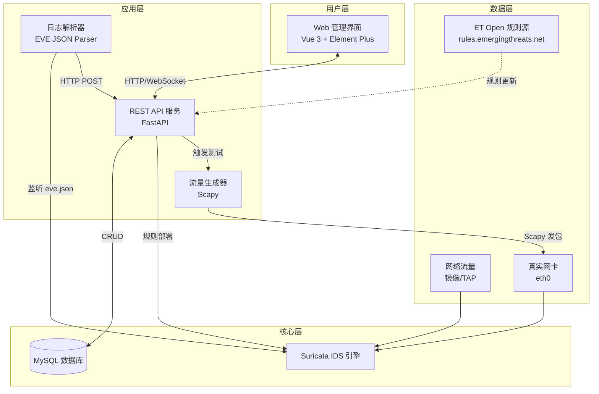
```mermaid
graph TB
    subgraph "用户层"
        WebUI[Web 管理界面<br/>Vue 3 + Element Plus]
    end

    subgraph "应用层"
        API[REST API 服务<br/>FastAPI]
        LogParser[日志解析器<br/>EVE JSON Parser]
        TrafficGen[流量生成器<br/>Scapy]
    end

    subgraph "核心层"
        Suricata[Suricata IDS 引擎]
        MySQL[(MySQL 数据库)]
    end

    subgraph "数据层"
        ETOpen[ET Open 规则源<br/>rules.emergingthreats.net]
        Network[网络流量<br/>镜像/TAP]
        RealNIC[真实网卡<br/>eth0]
    end

    WebUI <-->|HTTP/WebSocket| API

    API <-->|CRUD| MySQL
    API -->|规则部署| Suricata
    API -->|触发测试| TrafficGen

    LogParser -->|监听 eve.json| Suricata
    LogParser -->|HTTP POST| API

    TrafficGen -->|Scapy 发包| RealNIC
    RealNIC --> Suricata

    Network --> Suricata
    ETOpen -.->|规则更新| API
```

### 2.2 组件交互图

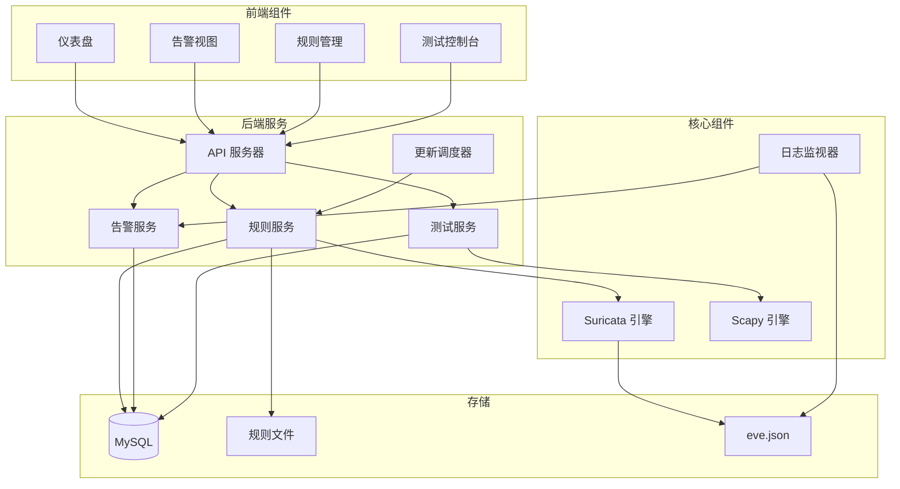
```mermaid
graph TB
    subgraph "前端组件"
        Dashboard[仪表盘]
        AlertView[告警视图]
        RuleManager[规则管理]
        TestConsole[测试控制台]
    end

    subgraph "后端服务"
        APIServer[API 服务器]
        RuleService[规则服务]
        AlertService[告警服务]
        TestService[测试服务]
        UpdateScheduler[更新调度器]
    end

    subgraph "核心组件"
        SuricataEngine[Suricata 引擎]
        LogWatcher[日志监视器]
        ScapyEngine[Scapy 引擎]
    end

    subgraph "存储"
        DB[(MySQL)]
        RuleFiles[规则文件]
        EVELog[eve.json]
    end

    Dashboard --> APIServer
    AlertView --> APIServer
    RuleManager --> APIServer
    TestConsole --> APIServer

    APIServer --> RuleService
    APIServer --> AlertService
    APIServer --> TestService

    RuleService --> DB
    RuleService --> RuleFiles
    RuleService --> SuricataEngine

    AlertService --> DB

    TestService --> ScapyEngine
    TestService --> DB

    UpdateScheduler --> RuleService

    SuricataEngine --> EVELog
    LogWatcher --> EVELog
    LogWatcher --> AlertService
```

---

## 3. 告警日志模块

### 3.1 模块架构

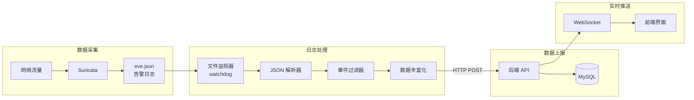
```mermaid
graph LR
    subgraph "数据采集"
        Network[网络流量] --> Suricata
        Suricata --> EVE[eve.json<br/>告警日志]
    end

    subgraph "日志处理"
        EVE --> Watcher[文件监视器<br/>watchdog]
        Watcher --> Parser[JSON 解析器]
        Parser --> Filter[事件过滤器]
        Filter --> Enricher[数据丰富化]
    end

    subgraph "数据上报"
        Enricher -->|HTTP POST| API[后端 API]
        API --> MySQL[(MySQL)]
    end

    subgraph "实时推送"
        API --> WS[WebSocket]
        WS --> UI[前端界面]
    end
```

### 3.2 EVE JSON 告警格式

Suricata 输出的 EVE JSON 包含告警的完整信息：

| 字段 | 类型 | 说明 |
|------|------|------|
| timestamp | string | 告警时间 (ISO 8601) |
| flow_id | integer | 流标识符 |
| event_type | string | 事件类型 (alert) |
| src_ip | string | 源 IP 地址 |
| src_port | integer | 源端口 |
| dest_ip | string | 目的 IP 地址 |
| dest_port | integer | 目的端口 |
| proto | string | 协议 (TCP/UDP/ICMP) |
| alert.signature_id | integer | 规则 SID |
| alert.signature | string | 规则描述 |
| alert.category | string | 威胁类别 |
| alert.severity | integer | 严重级别 (1-3) |
| alert.metadata | object | 规则元数据 |
| http/dns/tls | object | 应用层协议详情 |

### 3.3 日志处理流程

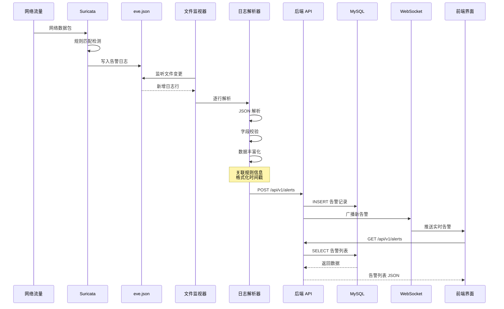
```mermaid
sequenceDiagram
    participant Net as 网络流量
    participant Suri as Suricata
    participant EVE as eve.json
    participant Watcher as 文件监视器
    participant Parser as 日志解析器
    participant API as 后端 API
    participant DB as MySQL
    participant WS as WebSocket
    participant UI as 前端界面

    Net->>Suri: 网络数据包
    Suri->>Suri: 规则匹配检测
    Suri->>EVE: 写入告警日志

    Watcher->>EVE: 监听文件变更
    EVE-->>Watcher: 新增日志行
    Watcher->>Parser: 逐行解析

    Parser->>Parser: JSON 解析
    Parser->>Parser: 字段校验
    Parser->>Parser: 数据丰富化
    Note over Parser: 关联规则信息<br/>格式化时间戳

    Parser->>API: POST /api/v1/alerts
    API->>DB: INSERT 告警记录
    API->>WS: 广播新告警
    WS->>UI: 推送实时告警

    UI->>API: GET /api/v1/alerts
    API->>DB: SELECT 告警列表
    DB-->>API: 返回数据
    API-->>UI: 告警列表 JSON
```

### 3.4 告警-规则关联

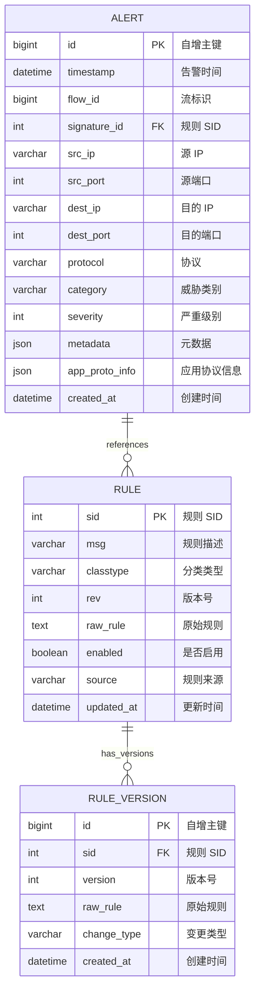
```mermaid
erDiagram
    ALERT ||--o{ RULE : "references"

    ALERT {
        bigint id PK "自增主键"
        datetime timestamp "告警时间"
        bigint flow_id "流标识"
        int signature_id FK "规则 SID"
        varchar src_ip "源 IP"
        int src_port "源端口"
        varchar dest_ip "目的 IP"
        int dest_port "目的端口"
        varchar protocol "协议"
        varchar category "威胁类别"
        int severity "严重级别"
        json metadata "元数据"
        json app_proto_info "应用协议信息"
        datetime created_at "创建时间"
    }

    RULE {
        int sid PK "规则 SID"
        varchar msg "规则描述"
        varchar classtype "分类类型"
        int rev "版本号"
        text raw_rule "原始规则"
        boolean enabled "是否启用"
        varchar source "规则来源"
        datetime updated_at "更新时间"
    }

    RULE_VERSION {
        bigint id PK "自增主键"
        int sid FK "规则 SID"
        int version "版本号"
        text raw_rule "原始规则"
        varchar change_type "变更类型"
        datetime created_at "创建时间"
    }

    RULE ||--o{ RULE_VERSION : "has_versions"
```

### 3.5 日志解析器工作模式

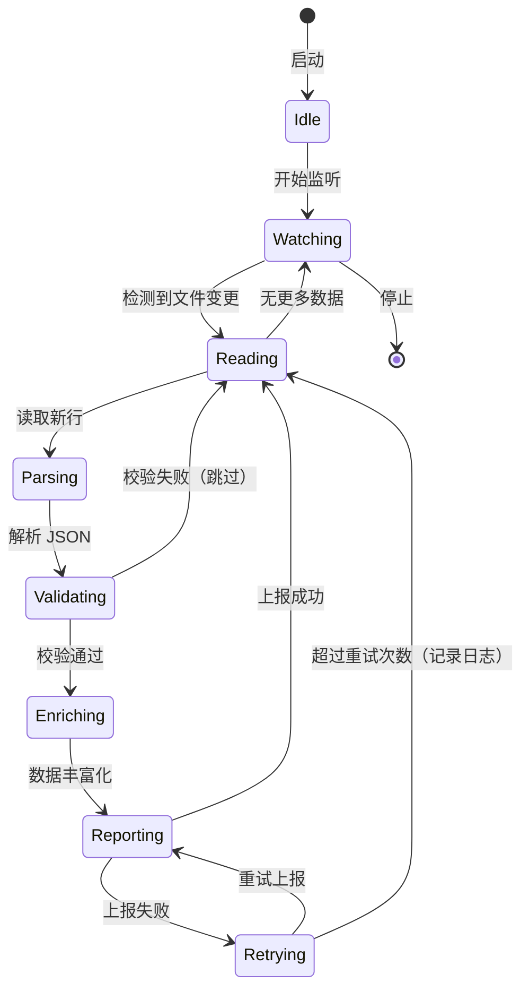
```mermaid
stateDiagram-v2
    [*] --> Idle: 启动

    Idle --> Watching: 开始监听
    Watching --> Reading: 检测到文件变更

    Reading --> Parsing: 读取新行
    Parsing --> Validating: 解析 JSON

    Validating --> Enriching: 校验通过
    Validating --> Reading: 校验失败（跳过）

    Enriching --> Reporting: 数据丰富化
    Reporting --> Reading: 上报成功
    Reporting --> Retrying: 上报失败

    Retrying --> Reporting: 重试上报
    Retrying --> Reading: 超过重试次数（记录日志）

    Reading --> Watching: 无更多数据

    Watching --> [*]: 停止
```

---

## 4. 规则管理模块

### 4.1 模块架构

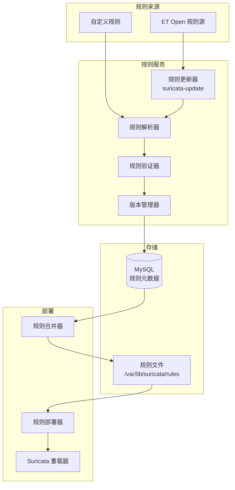
```mermaid
graph TB
    subgraph "规则来源"
        ETOpen[ET Open 规则源]
        Custom[自定义规则]
    end

    subgraph "规则服务"
        Updater[规则更新器<br/>suricata-update]
        Parser[规则解析器]
        Validator[规则验证器]
        Versioner[版本管理器]
    end

    subgraph "存储"
        DB[(MySQL<br/>规则元数据)]
        Files[规则文件<br/>/var/lib/suricata/rules]
    end

    subgraph "部署"
        Merger[规则合并器]
        Deployer[规则部署器]
        Reloader[Suricata 重载器]
    end

    ETOpen --> Updater
    Custom --> Parser

    Updater --> Parser
    Parser --> Validator
    Validator --> Versioner
    Versioner --> DB

    DB --> Merger
    Merger --> Files
    Files --> Deployer
    Deployer --> Reloader
```

### 4.2 规则更新流程

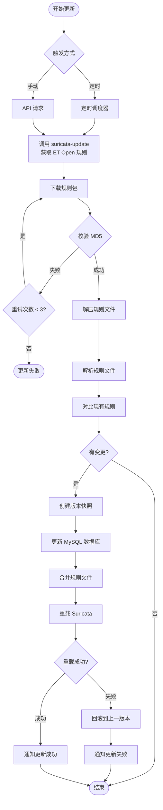
```mermaid
flowchart TD
    Start([开始更新]) --> CheckTrigger{触发方式}

    CheckTrigger -->|定时| Cron[定时调度器]
    CheckTrigger -->|手动| API[API 请求]

    Cron --> FetchRules
    API --> FetchRules

    FetchRules[调用 suricata-update<br/>获取 ET Open 规则]
    FetchRules --> Download[下载规则包]

    Download --> ValidateMD5{校验 MD5}
    ValidateMD5 -->|失败| Retry{重试次数 < 3?}
    Retry -->|是| Download
    Retry -->|否| Fail([更新失败])

    ValidateMD5 -->|成功| Extract[解压规则文件]
    Extract --> ParseRules[解析规则文件]

    ParseRules --> DiffRules[对比现有规则]
    DiffRules --> HasChanges{有变更?}

    HasChanges -->|否| End([结束])
    HasChanges -->|是| CreateVersion[创建版本快照]

    CreateVersion --> UpdateDB[更新 MySQL 数据库]
    UpdateDB --> MergeRules[合并规则文件]

    MergeRules --> ReloadSuricata[重载 Suricata]
    ReloadSuricata --> VerifyReload{重载成功?}

    VerifyReload -->|成功| NotifySuccess[通知更新成功]
    VerifyReload -->|失败| Rollback[回滚到上一版本]

    Rollback --> NotifyFail[通知更新失败]
    NotifyFail --> End
    NotifySuccess --> End
```

### 4.3 规则版本管理

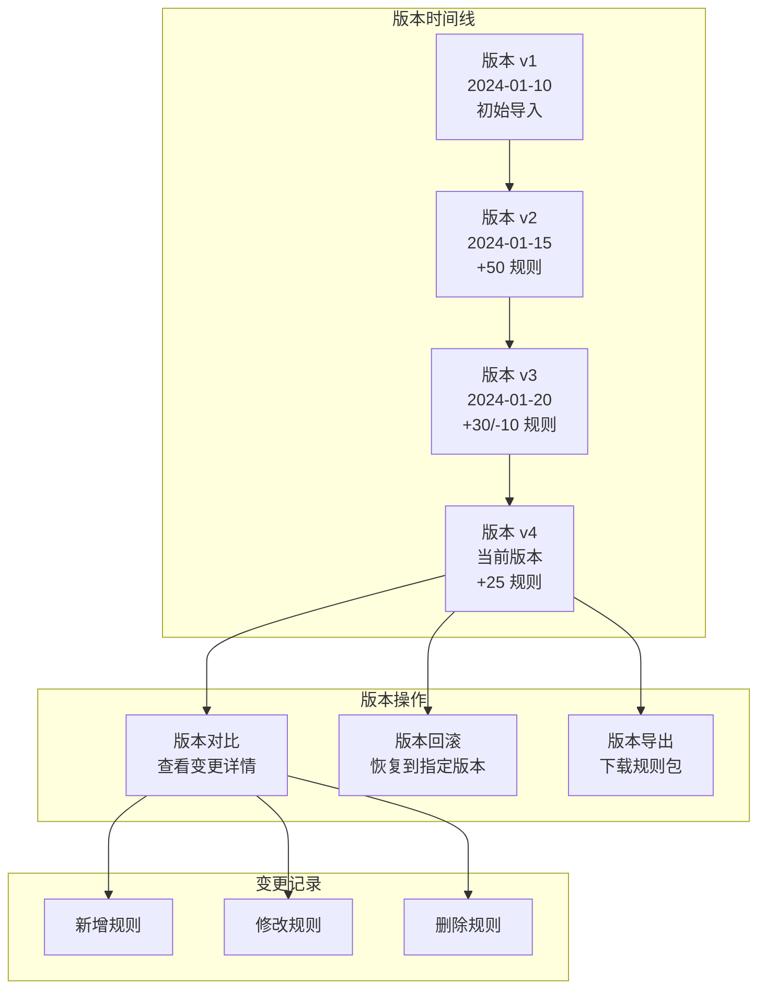
```mermaid
graph TB
    subgraph "版本时间线"
        V1[版本 v1<br/>2024-01-10<br/>初始导入]
        V2[版本 v2<br/>2024-01-15<br/>+50 规则]
        V3[版本 v3<br/>2024-01-20<br/>+30/-10 规则]
        V4[版本 v4<br/>当前版本<br/>+25 规则]

        V1 --> V2 --> V3 --> V4
    end

    subgraph "版本操作"
        Diff[版本对比<br/>查看变更详情]
        Rollback[版本回滚<br/>恢复到指定版本]
        Export[版本导出<br/>下载规则包]
    end

    subgraph "变更记录"
        Added[新增规则]
        Modified[修改规则]
        Deleted[删除规则]
    end

    V4 --> Diff
    V4 --> Rollback
    V4 --> Export

    Diff --> Added
    Diff --> Modified
    Diff --> Deleted
```

### 4.4 规则启用/禁用流程

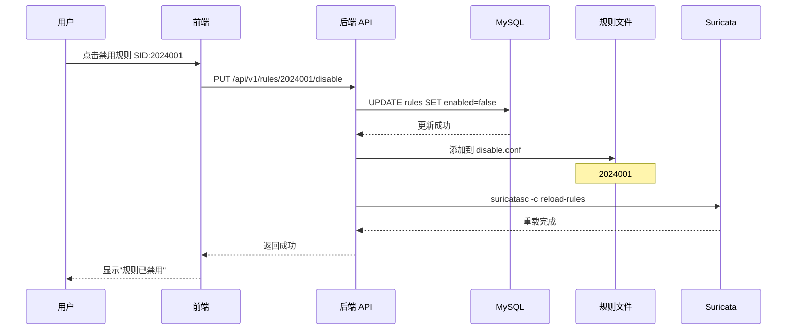
```mermaid
sequenceDiagram
    participant User as 用户
    participant UI as 前端
    participant API as 后端 API
    participant DB as MySQL
    participant File as 规则文件
    participant Suri as Suricata

    User->>UI: 点击禁用规则 SID:2024001
    UI->>API: PUT /api/v1/rules/2024001/disable

    API->>DB: UPDATE rules SET enabled=false
    DB-->>API: 更新成功

    API->>File: 添加到 disable.conf
    Note over File: 2024001

    API->>Suri: suricatasc -c reload-rules
    Suri-->>API: 重载完成

    API-->>UI: 返回成功
    UI-->>User: 显示"规则已禁用"
```

---

## 5. 攻击测试模块

### 5.1 模块架构

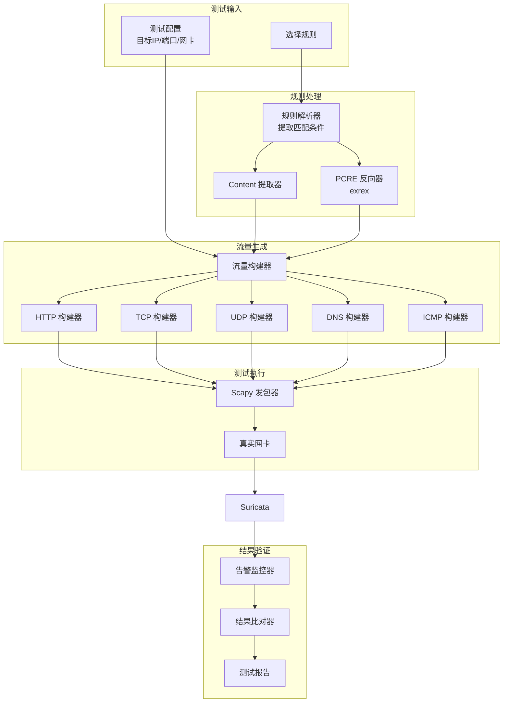
```mermaid
graph TB
    subgraph "测试输入"
        RuleSelect[选择规则]
        TestConfig[测试配置<br/>目标IP/端口/网卡]
    end

    subgraph "规则处理"
        RuleParser[规则解析器<br/>提取匹配条件]
        ContentExtractor[Content 提取器]
        PCREReverser[PCRE 反向器<br/>exrex]
    end

    subgraph "流量生成"
        TrafficBuilder[流量构建器]
        HTTPBuilder[HTTP 构建器]
        TCPBuilder[TCP 构建器]
        UDPBuilder[UDP 构建器]
        DNSBuilder[DNS 构建器]
        ICMPBuilder[ICMP 构建器]
    end

    subgraph "测试执行"
        ScapySender[Scapy 发包器]
        RealNIC[真实网卡]
    end

    subgraph "结果验证"
        AlertMonitor[告警监控器]
        ResultComparator[结果比对器]
        TestReport[测试报告]
    end

    RuleSelect --> RuleParser
    TestConfig --> TrafficBuilder

    RuleParser --> ContentExtractor
    RuleParser --> PCREReverser

    ContentExtractor --> TrafficBuilder
    PCREReverser --> TrafficBuilder

    TrafficBuilder --> HTTPBuilder
    TrafficBuilder --> TCPBuilder
    TrafficBuilder --> UDPBuilder
    TrafficBuilder --> DNSBuilder
    TrafficBuilder --> ICMPBuilder

    HTTPBuilder --> ScapySender
    TCPBuilder --> ScapySender
    UDPBuilder --> ScapySender
    DNSBuilder --> ScapySender
    ICMPBuilder --> ScapySender

    ScapySender --> RealNIC
    RealNIC --> Suricata[Suricata]

    Suricata --> AlertMonitor
    AlertMonitor --> ResultComparator
    ResultComparator --> TestReport
```

### 5.2 测试执行流程

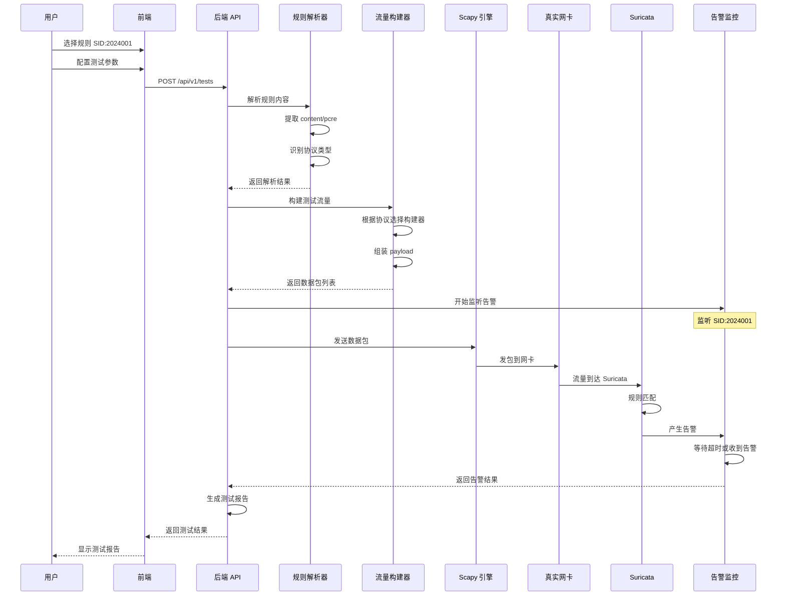
```mermaid
sequenceDiagram
    participant User as 用户
    participant UI as 前端
    participant API as 后端 API
    participant Parser as 规则解析器
    participant Builder as 流量构建器
    participant Scapy as Scapy 引擎
    participant NIC as 真实网卡
    participant Suri as Suricata
    participant Monitor as 告警监控

    User->>UI: 选择规则 SID:2024001
    User->>UI: 配置测试参数
    UI->>API: POST /api/v1/tests

    API->>Parser: 解析规则内容
    Parser->>Parser: 提取 content/pcre
    Parser->>Parser: 识别协议类型
    Parser-->>API: 返回解析结果

    API->>Builder: 构建测试流量
    Builder->>Builder: 根据协议选择构建器
    Builder->>Builder: 组装 payload
    Builder-->>API: 返回数据包列表

    API->>Monitor: 开始监听告警
    Note over Monitor: 监听 SID:2024001

    API->>Scapy: 发送数据包
    Scapy->>NIC: 发包到网卡
    NIC->>Suri: 流量到达 Suricata

    Suri->>Suri: 规则匹配
    Suri->>Monitor: 产生告警

    Monitor->>Monitor: 等待超时或收到告警
    Monitor-->>API: 返回告警结果

    API->>API: 生成测试报告
    API-->>UI: 返回测试结果
    UI-->>User: 显示测试报告
```

### 5.3 流量生成策略

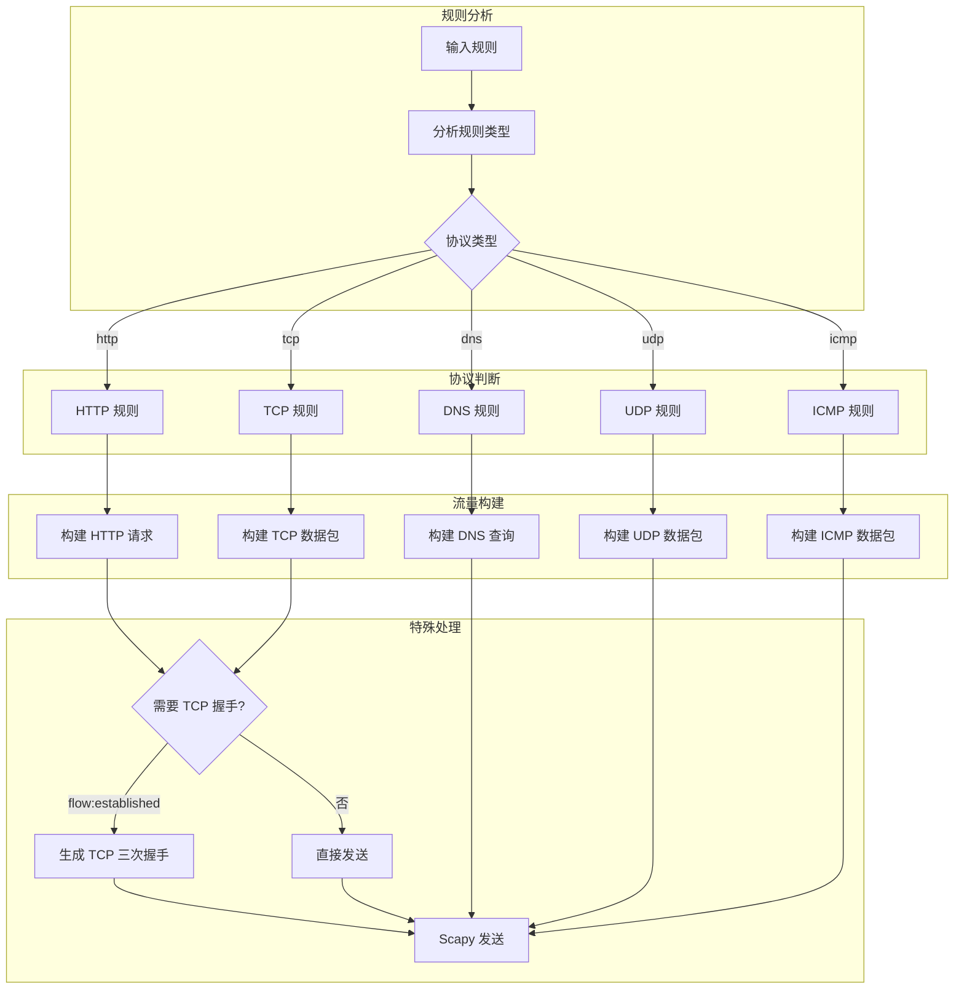
```mermaid
flowchart TB
    subgraph "规则分析"
        Input[输入规则] --> Analyze[分析规则类型]
        Analyze --> Protocol{协议类型}
    end

    subgraph "协议判断"
        Protocol -->|http| HTTP[HTTP 规则]
        Protocol -->|dns| DNS[DNS 规则]
        Protocol -->|tcp| TCP[TCP 规则]
        Protocol -->|udp| UDP[UDP 规则]
        Protocol -->|icmp| ICMP[ICMP 规则]
    end

    subgraph "流量构建"
        HTTP --> HTTPBuild[构建 HTTP 请求]
        DNS --> DNSBuild[构建 DNS 查询]
        TCP --> TCPBuild[构建 TCP 数据包]
        UDP --> UDPBuild[构建 UDP 数据包]
        ICMP --> ICMPBuild[构建 ICMP 数据包]
    end

    subgraph "特殊处理"
        HTTPBuild --> CheckFlow{需要 TCP 握手?}
        TCPBuild --> CheckFlow

        CheckFlow -->|flow:established| Handshake[生成 TCP 三次握手]
        CheckFlow -->|否| Direct[直接发送]

        Handshake --> Send[Scapy 发送]
        Direct --> Send

        DNSBuild --> Send
        UDPBuild --> Send
        ICMPBuild --> Send
    end
```

### 5.4 Content 与 PCRE 处理

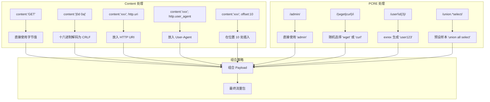
```mermaid
graph TB
    subgraph "Content 处理"
        C1[content:'GET'] --> C1R[直接使用字节值]
        C2["content:'|0d 0a|'"] --> C2R[十六进制解码为 CRLF]
        C3[content:'xxx'; http.uri] --> C3R[放入 HTTP URI]
        C4[content:'xxx'; http.user_agent] --> C4R[放入 User-Agent]
        C5[content:'xxx'; offset:10] --> C5R[在位置 10 处插入]
    end

    subgraph "PCRE 处理"
        P1["/admin/"] --> P1R[直接使用 'admin']
        P2["/(wget|curl)/i"] --> P2R[随机选择 'wget' 或 'curl']
        P3["/user\\d{3}/"] --> P3R[exrex 生成 'user123']
        P4["/union.*select/"] --> P4R[预设样本 'union all select']
    end

    subgraph "组合策略"
        C1R --> Combine[组合 Payload]
        C2R --> Combine
        C3R --> Combine
        C4R --> Combine
        C5R --> Combine
        P1R --> Combine
        P2R --> Combine
        P3R --> Combine
        P4R --> Combine

        Combine --> Final[最终流量包]
    end
```

### 5.5 TCP 会话生成

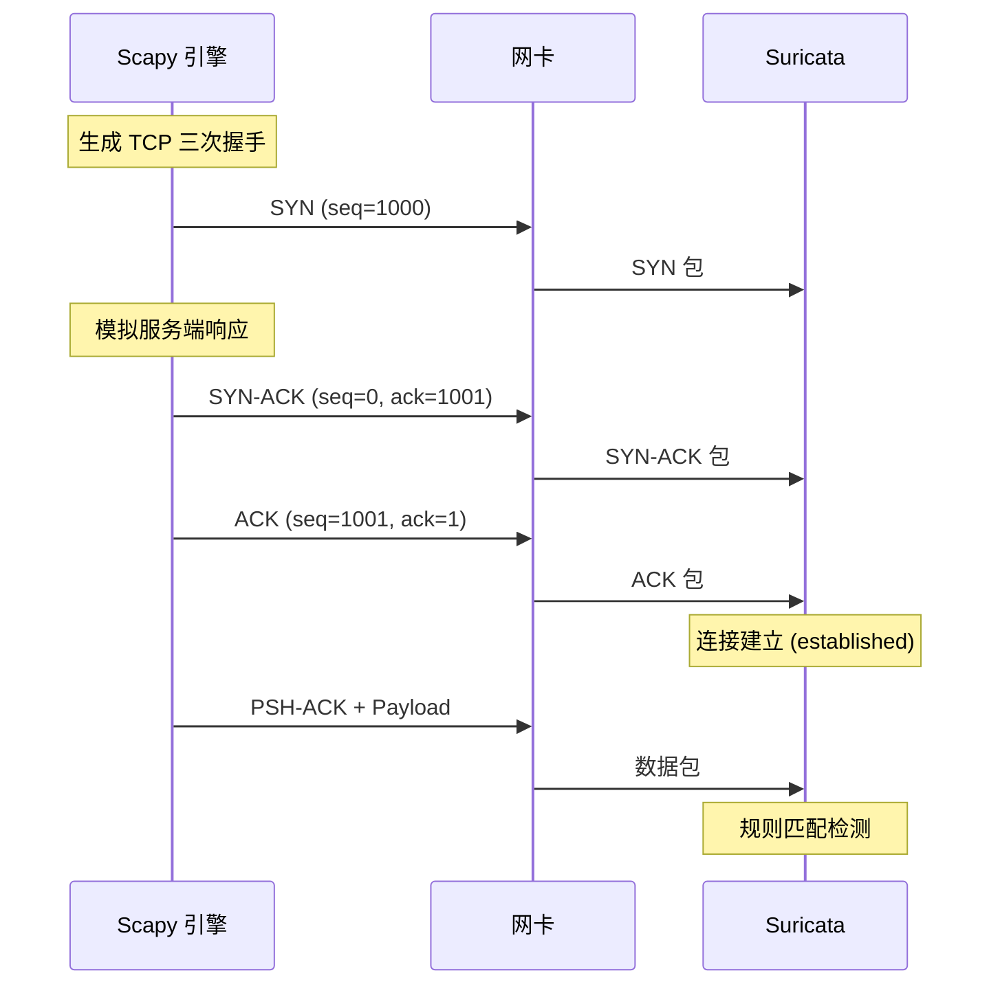
```mermaid
sequenceDiagram
    participant Scapy as Scapy 引擎
    participant NIC as 网卡
    participant Suri as Suricata

    Note over Scapy: 生成 TCP 三次握手

    Scapy->>NIC: SYN (seq=1000)
    NIC->>Suri: SYN 包

    Note over Scapy: 模拟服务端响应
    Scapy->>NIC: SYN-ACK (seq=0, ack=1001)
    NIC->>Suri: SYN-ACK 包

    Scapy->>NIC: ACK (seq=1001, ack=1)
    NIC->>Suri: ACK 包

    Note over Suri: 连接建立 (established)

    Scapy->>NIC: PSH-ACK + Payload
    NIC->>Suri: 数据包

    Note over Suri: 规则匹配检测
```

---

## 6. 前端设计

### 6.1 页面结构

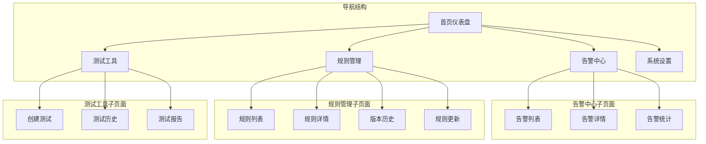
```mermaid
graph TB
    subgraph "导航结构"
        Home[首页仪表盘]
        Alerts[告警中心]
        Rules[规则管理]
        Tests[测试工具]
        Settings[系统设置]
    end

    subgraph "告警中心子页面"
        AlertList[告警列表]
        AlertDetail[告警详情]
        AlertStats[告警统计]
    end

    subgraph "规则管理子页面"
        RuleList[规则列表]
        RuleDetail[规则详情]
        RuleVersions[版本历史]
        RuleUpdate[规则更新]
    end

    subgraph "测试工具子页面"
        TestCreate[创建测试]
        TestHistory[测试历史]
        TestReport[测试报告]
    end

    Home --> Alerts
    Home --> Rules
    Home --> Tests
    Home --> Settings

    Alerts --> AlertList
    Alerts --> AlertDetail
    Alerts --> AlertStats

    Rules --> RuleList
    Rules --> RuleDetail
    Rules --> RuleVersions
    Rules --> RuleUpdate

    Tests --> TestCreate
    Tests --> TestHistory
    Tests --> TestReport
```

### 6.2 仪表盘设计

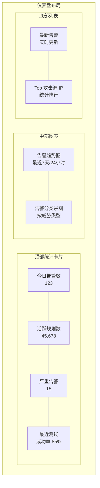
```mermaid
graph TB
    subgraph "仪表盘布局"
        subgraph "顶部统计卡片"
            Card1[今日告警数<br/>123]
            Card2[活跃规则数<br/>45,678]
            Card3[严重告警<br/>15]
            Card4[最近测试<br/>成功率 85%]
        end

        subgraph "中部图表"
            Chart1[告警趋势图<br/>最近7天/24小时]
            Chart2[告警分类饼图<br/>按威胁类型]
        end

        subgraph "底部列表"
            List1[最新告警<br/>实时更新]
            List2[Top 攻击源 IP<br/>统计排行]
        end
    end

    Card1 --- Card2 --- Card3 --- Card4
    Chart1 --- Chart2
    List1 --- List2
```

### 6.3 告警列表界面

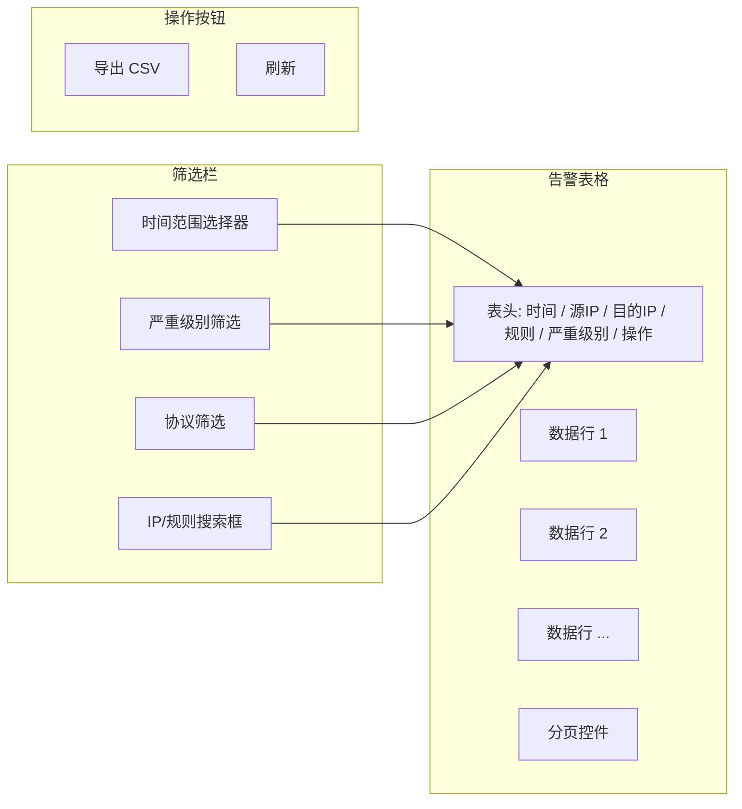
```mermaid
graph LR
    subgraph "筛选栏"
        TimeRange[时间范围选择器]
        Severity[严重级别筛选]
        Protocol[协议筛选]
        SearchBox[IP/规则搜索框]
    end

    subgraph "告警表格"
        Header["表头: 时间 / 源IP / 目的IP / 规则 / 严重级别 / 操作"]
        Row1[数据行 1]
        Row2[数据行 2]
        Row3[数据行 ...]
        Pagination[分页控件]
    end

    subgraph "操作按钮"
        Export[导出 CSV]
        Refresh[刷新]
    end

    TimeRange --> Header
    Severity --> Header
    Protocol --> Header
    SearchBox --> Header
```

### 6.4 规则测试界面

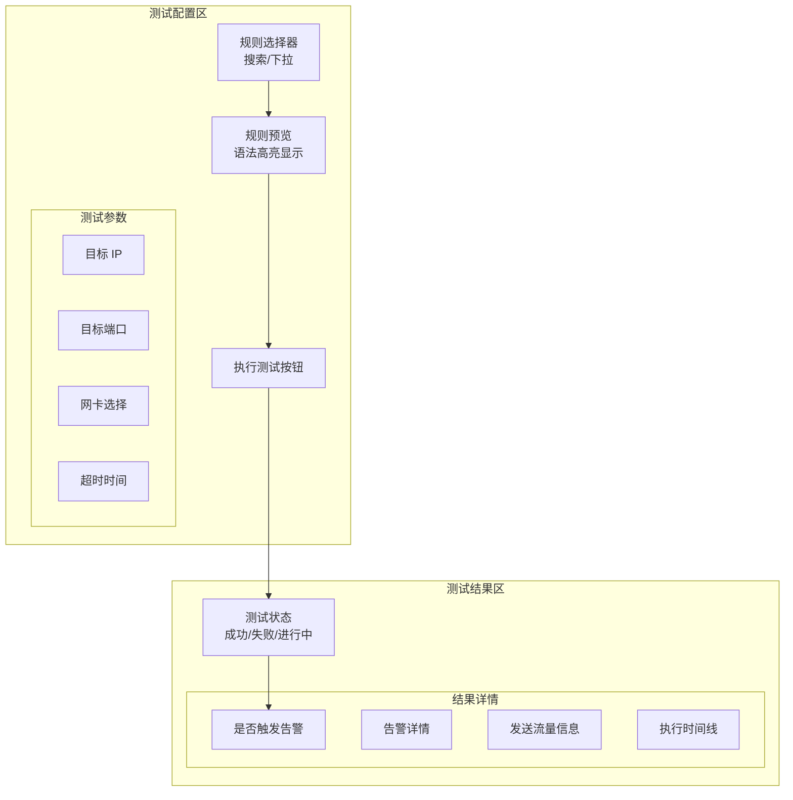
```mermaid
graph TB
    subgraph "测试配置区"
        RuleSelector[规则选择器<br/>搜索/下拉]
        RulePreview[规则预览<br/>语法高亮显示]

        subgraph "测试参数"
            TargetIP[目标 IP]
            TargetPort[目标端口]
            Interface[网卡选择]
            Timeout[超时时间]
        end

        TestButton[执行测试按钮]
    end

    subgraph "测试结果区"
        Status[测试状态<br/>成功/失败/进行中]

        subgraph "结果详情"
            Triggered[是否触发告警]
            AlertInfo[告警详情]
            TrafficInfo[发送流量信息]
            Timeline[执行时间线]
        end
    end

    RuleSelector --> RulePreview
    RulePreview --> TestButton
    TestButton --> Status
    Status --> Triggered
```

---

## 7. 后端设计

### 7.1 API 路由结构

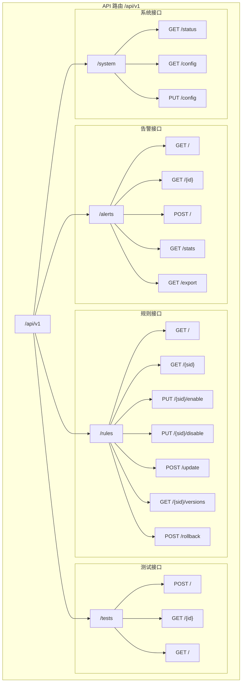
```mermaid
graph TB
    subgraph "API 路由 /api/v1"
        Root["/api/v1"]

        Root --> Alerts["/alerts"]
        Root --> Rules["/rules"]
        Root --> Tests["/tests"]
        Root --> System["/system"]

        subgraph "告警接口"
            Alerts --> AlertsList["GET /"]
            Alerts --> AlertsGet["GET /{id}"]
            Alerts --> AlertsCreate["POST /"]
            Alerts --> AlertsStats["GET /stats"]
            Alerts --> AlertsExport["GET /export"]
        end

        subgraph "规则接口"
            Rules --> RulesList["GET /"]
            Rules --> RulesGet["GET /{sid}"]
            Rules --> RulesEnable["PUT /{sid}/enable"]
            Rules --> RulesDisable["PUT /{sid}/disable"]
            Rules --> RulesUpdate["POST /update"]
            Rules --> RulesVersions["GET /{sid}/versions"]
            Rules --> RulesRollback["POST /rollback"]
        end

        subgraph "测试接口"
            Tests --> TestsCreate["POST /"]
            Tests --> TestsGet["GET /{id}"]
            Tests --> TestsList["GET /"]
        end

        subgraph "系统接口"
            System --> SysStatus["GET /status"]
            System --> SysConfig["GET /config"]
            System --> SysConfigUpdate["PUT /config"]
        end
    end
```

### 7.2 服务层架构

```mermaid
graph TB
    subgraph "API 层"
        Router[FastAPI Router]
    end

    subgraph "服务层"
        AlertService[告警服务]
        RuleService[规则服务]
        TestService[测试服务]
        SystemService[系统服务]
    end

    subgraph "数据访问层"
        AlertRepo[告警仓库]
        RuleRepo[规则仓库]
        TestRepo[测试仓库]
        ConfigRepo[配置仓库]
    end

    subgraph "基础设施层"
        DB[(MySQL)]
        FileSystem[文件系统]
        Suricata[Suricata 控制]
        Scapy[Scapy 引擎]
    end

    Router --> AlertService
    Router --> RuleService
    Router --> TestService
    Router --> SystemService

    AlertService --> AlertRepo
    RuleService --> RuleRepo
    TestService --> TestRepo
    SystemService --> ConfigRepo

    AlertRepo --> DB
    RuleRepo --> DB
    RuleRepo --> FileSystem
    TestRepo --> DB
    ConfigRepo --> DB

    RuleService --> Suricata
    TestService --> Scapy
```

### 7.3 核心 API 接口定义

| 接口 | 方法 | 路径 | 说明 |
|------|------|------|------|
| 获取告警列表 | GET | /api/v1/alerts | 分页查询告警 |
| 获取告警详情 | GET | /api/v1/alerts/{id} | 获取单条告警 |
| 上报告警 | POST | /api/v1/alerts | 日志解析器调用 |
| 告警统计 | GET | /api/v1/alerts/stats | 统计数据 |
| 获取规则列表 | GET | /api/v1/rules | 分页查询规则 |
| 获取规则详情 | GET | /api/v1/rules/{sid} | 获取单条规则 |
| 启用规则 | PUT | /api/v1/rules/{sid}/enable | 启用指定规则 |
| 禁用规则 | PUT | /api/v1/rules/{sid}/disable | 禁用指定规则 |
| 触发规则更新 | POST | /api/v1/rules/update | 手动更新规则 |
| 规则版本历史 | GET | /api/v1/rules/{sid}/versions | 版本列表 |
| 版本回滚 | POST | /api/v1/rules/rollback | 回滚到指定版本 |
| 创建测试 | POST | /api/v1/tests | 创建并执行测试 |
| 获取测试结果 | GET | /api/v1/tests/{id} | 获取测试结果 |
| 测试历史 | GET | /api/v1/tests | 测试历史列表 |

### 7.4 请求/响应示例

**创建测试请求:**

| 字段 | 类型 | 必填 | 说明 |
|------|------|------|------|
| rule_sid | integer | 是 | 要测试的规则 SID |
| target_ip | string | 否 | 目标 IP，默认 127.0.0.1 |
| target_port | integer | 否 | 目标端口，默认 80 |
| interface | string | 否 | 网卡名称，默认 eth0 |
| timeout | integer | 否 | 超时时间(秒)，默认 5 |

**测试结果响应:**

| 字段 | 类型 | 说明 |
|------|------|------|
| id | string | 测试 ID |
| rule_sid | integer | 规则 SID |
| status | string | 状态: pending/running/success/failed |
| triggered | boolean | 是否触发告警 |
| alert_count | integer | 告警数量 |
| traffic_info | object | 发送的流量信息 |
| execution_time_ms | number | 执行时间(毫秒) |
| error | string | 错误信息(如有) |
| created_at | datetime | 创建时间 |

---

## 8. 数据库设计

### 8.1 数据库 ER 图

```mermaid
erDiagram
    RULE ||--o{ ALERT : "triggers"
    RULE ||--o{ RULE_VERSION : "has"
    RULE ||--o{ TEST : "tested_by"
    TEST ||--o| ALERT : "may_trigger"

    RULE {
        int sid PK "规则SID"
        varchar msg "规则描述"
        varchar classtype "分类类型"
        int rev "版本号"
        int priority "优先级"
        text raw_rule "原始规则"
        boolean enabled "是否启用"
        varchar source "来源"
        json metadata "元数据"
        datetime created_at "创建时间"
        datetime updated_at "更新时间"
    }

    RULE_VERSION {
        bigint id PK "版本ID"
        int sid FK "规则SID"
        int version "版本号"
        text raw_rule "原始规则"
        varchar change_type "变更类型"
        datetime created_at "创建时间"
    }

    ALERT {
        bigint id PK "告警ID"
        datetime timestamp "告警时间"
        bigint flow_id "流ID"
        int signature_id FK "规则SID"
        varchar src_ip "源IP"
        int src_port "源端口"
        varchar dest_ip "目的IP"
        int dest_port "目的端口"
        varchar protocol "协议"
        varchar category "类别"
        int severity "严重级别"
        json metadata "元数据"
        json app_proto_info "协议详情"
        bigint test_id FK "测试ID"
        datetime created_at "创建时间"
    }

    TEST {
        bigint id PK "测试ID"
        int rule_sid FK "规则SID"
        varchar target_ip "目标IP"
        int target_port "目标端口"
        varchar interface "网卡"
        varchar status "状态"
        boolean triggered "是否触发"
        int alert_count "告警数"
        json traffic_info "流量信息"
        float execution_time_ms "执行时间"
        text error "错误信息"
        datetime created_at "创建时间"
    }

    SYSTEM_CONFIG {
        varchar key PK "配置键"
        text value "配置值"
        varchar type "值类型"
        varchar description "描述"
        datetime updated_at "更新时间"
    }

    RULE_UPDATE_LOG {
        bigint id PK "日志ID"
        varchar source "规则源"
        varchar status "状态"
        int rules_added "新增数"
        int rules_modified "修改数"
        int rules_deleted "删除数"
        text error "错误信息"
        datetime started_at "开始时间"
        datetime finished_at "完成时间"
    }
```

### 8.2 核心表结构

**rules 表:**

| 字段 | 类型 | 约束 | 说明 |
|------|------|------|------|
| sid | INT | PRIMARY KEY | 规则 SID |
| msg | VARCHAR(500) | NOT NULL | 规则描述 |
| classtype | VARCHAR(100) | | 分类类型 |
| rev | INT | DEFAULT 1 | 版本号 |
| priority | INT | DEFAULT 3 | 优先级 |
| raw_rule | TEXT | NOT NULL | 原始规则 |
| enabled | BOOLEAN | DEFAULT TRUE | 是否启用 |
| source | VARCHAR(50) | DEFAULT 'et-open' | 规则来源 |
| metadata | JSON | | 元数据 |
| created_at | DATETIME | | 创建时间 |
| updated_at | DATETIME | | 更新时间 |

**alerts 表:**

| 字段 | 类型 | 约束 | 说明 |
|------|------|------|------|
| id | BIGINT | PRIMARY KEY AUTO_INCREMENT | 告警 ID |
| timestamp | DATETIME(6) | NOT NULL, INDEX | 告警时间 |
| flow_id | BIGINT | | 流标识 |
| signature_id | INT | NOT NULL, INDEX, FK(rules.sid) | 规则 SID |
| src_ip | VARCHAR(45) | NOT NULL, INDEX | 源 IP |
| src_port | INT | | 源端口 |
| dest_ip | VARCHAR(45) | NOT NULL, INDEX | 目的 IP |
| dest_port | INT | | 目的端口 |
| protocol | VARCHAR(10) | | 协议 |
| category | VARCHAR(100) | INDEX | 威胁类别 |
| severity | TINYINT | INDEX | 严重级别 |
| metadata | JSON | | 元数据 |
| app_proto_info | JSON | | 应用协议信息 |
| test_id | BIGINT | FK(tests.id) | 关联测试 |
| created_at | DATETIME | DEFAULT CURRENT_TIMESTAMP | 创建时间 |

**tests 表:**

| 字段 | 类型 | 约束 | 说明 |
|------|------|------|------|
| id | BIGINT | PRIMARY KEY AUTO_INCREMENT | 测试 ID |
| rule_sid | INT | NOT NULL, FK(rules.sid) | 规则 SID |
| target_ip | VARCHAR(45) | DEFAULT '127.0.0.1' | 目标 IP |
| target_port | INT | DEFAULT 80 | 目标端口 |
| interface | VARCHAR(20) | DEFAULT 'eth0' | 网卡 |
| status | VARCHAR(20) | DEFAULT 'pending' | 状态 |
| triggered | BOOLEAN | DEFAULT FALSE | 是否触发 |
| alert_count | INT | DEFAULT 0 | 告警数 |
| traffic_info | JSON | | 流量信息 |
| execution_time_ms | FLOAT | | 执行时间 |
| error | TEXT | | 错误信息 |
| created_at | DATETIME | DEFAULT CURRENT_TIMESTAMP | 创建时间 |

### 8.3 索引设计

```mermaid
graph LR
    subgraph "alerts 表索引"
        A1[idx_alerts_timestamp<br/>timestamp DESC]
        A2[idx_alerts_signature_id<br/>signature_id]
        A3[idx_alerts_src_ip<br/>src_ip]
        A4[idx_alerts_dest_ip<br/>dest_ip]
        A5[idx_alerts_severity<br/>severity]
        A6[idx_alerts_category<br/>category]
        A7[idx_alerts_composite<br/>timestamp, severity, signature_id]
    end

    subgraph "rules 表索引"
        R1[PRIMARY KEY<br/>sid]
        R2[idx_rules_enabled<br/>enabled]
        R3[idx_rules_source<br/>source]
        R4[idx_rules_classtype<br/>classtype]
    end

    subgraph "tests 表索引"
        T1[idx_tests_rule_sid<br/>rule_sid]
        T2[idx_tests_status<br/>status]
        T3[idx_tests_created_at<br/>created_at DESC]
    end
```

---

## 9. 部署架构

### 9.1 Docker Compose 部署图

```mermaid
graph TB
    subgraph "Docker 网络 idps-network"
        subgraph "前端容器"
            Nginx[Nginx<br/>:80/:443]
            VueApp[Vue App<br/>静态文件]
        end

        subgraph "后端容器"
            API[FastAPI<br/>:8000]
            LogParser[日志解析器<br/>Python 进程]
            Scheduler[规则更新调度器<br/>APScheduler]
        end

        subgraph "核心容器"
            Suricata[Suricata<br/>网络模式: host]
        end

        subgraph "数据容器"
            MySQL[(MySQL 8.x<br/>:3306)]
        end
    end

    subgraph "外部"
        User[用户浏览器]
        Network[网络流量]
        ETOpen[ET Open 规则源]
    end

    subgraph "存储卷"
        RulesVol[(rules-volume)]
        LogsVol[(logs-volume)]
        DBVol[(mysql-volume)]
    end

    User -->|HTTPS| Nginx
    Nginx --> VueApp
    Nginx -->|反向代理| API

    Network --> Suricata
    Suricata --> LogsVol
    LogParser --> LogsVol
    LogParser --> API

    API --> MySQL
    API --> RulesVol
    API --> Suricata

    Scheduler --> API
    ETOpen -.-> Scheduler

    MySQL --> DBVol
    Suricata --> RulesVol
```

### 9.2 网络架构

```mermaid
graph TB
    subgraph "网络环境"
        subgraph "生产网络"
            ProdTraffic[生产流量]
            Mirror[镜像端口/TAP]
        end

        subgraph "检测网卡"
            MonitorNIC[监听网卡 eth0<br/>混杂模式]
        end

        subgraph "管理网络"
            MgmtNIC[管理网卡 eth1]
        end

        subgraph "服务"
            Suricata[Suricata 引擎]
            WebUI[Web 管理界面]
            API[API 服务]
            TestTraffic[测试流量<br/>Scapy]
        end
    end

    ProdTraffic --> Mirror
    Mirror --> MonitorNIC
    MonitorNIC --> Suricata

    TestTraffic -->|发送测试流量| MonitorNIC

    WebUI --> MgmtNIC
    API --> MgmtNIC

    MgmtNIC --> Suricata
```

### 9.3 容器配置概览

| 容器 | 镜像 | 端口 | 网络模式 | 依赖 |
|------|------|------|----------|------|
| nginx | nginx:alpine | 80, 443 | bridge | api |
| api | python:3.11 | 8000 | bridge | mysql, suricata |
| log-parser | python:3.11 | - | bridge | api |
| suricata | jasonish/suricata:7 | - | host | - |
| mysql | mysql:8.0 | 3306 | bridge | - |

### 9.4 资源需求

| 组件 | CPU | 内存 | 磁盘 |
|------|-----|------|------|
| Suricata | 2+ 核 | 4GB+ | - |
| MySQL | 1 核 | 2GB | 50GB+ |
| API 服务 | 1 核 | 512MB | - |
| 日志解析器 | 0.5 核 | 256MB | - |
| 前端 Nginx | 0.5 核 | 128MB | - |
| **总计** | **5+ 核** | **7GB+** | **50GB+** |

---

## 10. 数据流设计

### 10.1 告警数据流

```mermaid
flowchart LR
    subgraph "数据采集"
        Traffic[网络流量] --> Suricata[Suricata]
        Suricata --> EVE[eve.json]
    end

    subgraph "数据处理"
        EVE --> Watcher[文件监视器]
        Watcher --> Parser[JSON 解析]
        Parser --> Enrich[数据丰富化]
    end

    subgraph "数据存储"
        Enrich -->|POST /alerts| API[后端 API]
        API --> MySQL[(MySQL)]
    end

    subgraph "数据消费"
        MySQL --> Query[查询接口]
        Query --> UI[前端界面]
        API -->|WebSocket| UI
    end
```

### 10.2 规则数据流

```mermaid
flowchart TB
    subgraph "规则来源"
        ETOpen[ET Open 规则源]
        Custom[自定义规则]
    end

    subgraph "规则处理"
        Download[下载规则包]
        Parse[解析规则]
        Validate[校验规则]
        Store[存储到 MySQL]
    end

    subgraph "规则部署"
        Merge[生成规则文件]
        Deploy[部署到目录]
        Reload[重载 Suricata]
    end

    subgraph "规则应用"
        Suricata[Suricata 引擎]
        Detection[流量检测]
    end

    ETOpen --> Download
    Download --> Parse
    Custom --> Parse
    Parse --> Validate
    Validate --> Store

    Store --> Merge
    Merge --> Deploy
    Deploy --> Reload
    Reload --> Suricata
    Suricata --> Detection
```

### 10.3 测试数据流

```mermaid
flowchart LR
    subgraph "测试输入"
        User[用户] --> UI[前端界面]
        UI --> API[后端 API]
    end

    subgraph "测试准备"
        API --> Query[查询规则]
        Query --> MySQL[(MySQL)]
        MySQL --> Parse[解析规则]
    end

    subgraph "流量生成"
        Parse --> Build[构建流量]
        Build --> Scapy[Scapy 引擎]
        Scapy --> NIC[网卡]
    end

    subgraph "检测与结果"
        NIC --> Suricata[Suricata]
        Suricata --> EVE[eve.json]
        EVE --> Monitor[告警监控]
        Monitor --> Result[测试结果]
        Result --> API
        API --> UI
        UI --> User
    end
```

---

## 11. 安全设计

### 11.1 安全架构

```mermaid
graph TB
    subgraph "网络安全"
        HTTPS[HTTPS 加密传输]
        Firewall[防火墙规则]
        NetworkIsolation[网络隔离]
    end

    subgraph "数据安全"
        DBEncrypt[数据库加密连接]
        InputValidation[输入校验]
        SQLInjectionPrev[SQL 注入防护]
    end

    subgraph "测试安全"
        TargetWhitelist[目标 IP 白名单]
        RateLimit[测试频率限制]
        TimeoutControl[超时控制]
    end

    HTTPS --> NetworkIsolation
    Firewall --> NetworkIsolation

    DBEncrypt --> InputValidation
    InputValidation --> SQLInjectionPrev

    TargetWhitelist --> RateLimit
    RateLimit --> TimeoutControl
```

### 11.2 攻击测试安全措施

| 措施 | 说明 |
|------|------|
| 目标 IP 白名单 | 只允许向配置的白名单 IP 发送测试流量 |
| 频率限制 | 限制单位时间内的测试请求数量 (如 10次/分钟) |
| 超时控制 | 测试执行有最大超时时间限制 (默认 30 秒) |
| 输入校验 | 严格校验所有用户输入参数 |

---

## 12. 实现路线图

### 12.1 开发阶段

```mermaid
gantt
    title 项目开发路线图
    dateFormat  YYYY-MM-DD

    section 第一阶段 - 基础架构
    环境搭建与 Docker 配置      :a1, 2024-02-01, 3d
    MySQL 数据库设计与初始化    :a2, after a1, 2d
    Suricata 部署与配置        :a3, after a2, 3d

    section 第二阶段 - 后端核心
    FastAPI 项目框架搭建       :b1, after a3, 2d
    告警接口开发              :b2, after b1, 3d
    日志解析器开发            :b3, after b2, 3d
    规则管理接口开发          :b4, after b3, 4d

    section 第三阶段 - 前端开发
    Vue 项目初始化            :c1, after b4, 2d
    告警模块前端              :c2, after c1, 4d
    规则管理前端              :c3, after c2, 4d
    仪表盘开发                :c4, after c3, 3d

    section 第四阶段 - 测试模块
    规则解析器开发            :d1, after c4, 4d
    Scapy 流量生成器开发       :d2, after d1, 5d
    测试执行与结果验证         :d3, after d2, 3d
    测试界面开发              :d4, after d3, 3d

    section 第五阶段 - 完善
    WebSocket 实时推送         :e1, after d4, 2d
    规则定时更新              :e2, after e1, 2d
    安全加固与测试            :e3, after e2, 3d
    部署文档与上线            :e4, after e3, 2d
```

### 12.2 功能优先级

**P0 - 必须实现:**
- [ ] Suricata 部署与配置
- [ ] EVE JSON 日志解析与存储
- [ ] 告警列表查看与筛选
- [ ] 告警详情与规则关联
- [ ] 规则列表查看
- [ ] 规则启用/禁用

**P1 - 应该实现:**
- [ ] 规则手动更新 (suricata-update)
- [ ] 规则定时更新
- [ ] 规则版本管理
- [ ] 基础攻击测试 (明确 content 规则)
- [ ] 实时告警推送 (WebSocket)

**P2 - 可以实现:**
- [ ] 复杂规则测试 (PCRE)
- [ ] 告警导出 (CSV/JSON)
- [ ] 仪表盘统计图表

---

## 13. 附录

### 13.1 关键配置文件

**Suricata 主配置 (suricata.yaml) 关键项:**

| 配置项 | 值 | 说明 |
|--------|-----|------|
| default-rule-path | /var/lib/suricata/rules | 规则文件目录 |
| rule-files | suricata.rules | 主规则文件 |
| eve-log.enabled | yes | 启用 EVE 日志 |
| eve-log.filename | eve.json | 日志文件名 |
| eve-log.types | alert, http, dns, tls | 输出事件类型 |
| unix-command.enabled | yes | 启用 Unix Socket 控制 |

**suricata-update 配置 (update.yaml) 关键项:**

| 配置项 | 值 | 说明 |
|--------|-----|------|
| sources | et/open | 规则源 |
| enable-conf | /etc/suricata/enable.conf | 启用规则配置 |
| disable-conf | /etc/suricata/disable.conf | 禁用规则配置 |
| output-directory | /var/lib/suricata/rules | 输出目录 |

### 13.2 规则处理能力矩阵

| 规则特性 | 支持程度 | 处理方式 |
|----------|----------|----------|
| 纯 content 规则 | 完全支持 | 直接提取字节值 |
| content + HTTP 缓冲区 | 完全支持 | 映射到 HTTP 请求字段 |
| 简单 PCRE | 大部分支持 | exrex 反向生成 |
| 复杂 PCRE (断言) | 部分支持 | 预设样本库 |
| flow:established | 完全支持 | 生成 TCP 三次握手 |
| dsize/urilen | 完全支持 | 自动调整大小 |
| flowbits | 不支持 | 需要多规则状态 |
| TLS/加密规则 | 不支持 | 无法模拟加密 |

### 13.3 错误处理策略

| 错误场景 | 处理方式 |
|----------|----------|
| 日志解析失败 | 记录错误日志，跳过该行，继续处理 |
| API 上报失败 | 重试 3 次，指数退避，失败后记录本地 |
| 规则更新失败 | 保持当前规则，记录错误，通知管理员 |
| Suricata 重载失败 | 自动回滚到上一版本 |
| 测试发包失败 | 返回错误信息，记录日志 |
| 数据库连接失败 | 重试连接，超时后服务降级 |

---

## 14. 总结

本设计方案构建了一个轻量级但功能完整的入侵检测系统，主要特点：

1. **单一数据库**: 使用 MySQL 存储所有数据（规则、告警、测试记录、配置）
2. **直连架构**: 日志解析器直接调用 API 上报告警，无需消息队列中间件
3. **实时流量生成**: 使用 Scapy 实时发包进行规则测试
4. **真实网卡**: 直接使用物理/虚拟网卡，无需额外的测试网卡配置

该方案适合中小规模部署，降低了运维复杂度和资源消耗，同时保留了核心的入侵检测和规则测试能力。
