# Linux 防火墙技术探索与对比分析

## 1. 概述

### 1.1 研究背景

在 Linux 系统中实现高性能防火墙有多种技术路线可选，每种技术都有其特定的应用场景和性能特点。本文档深入探索以下主要技术：

| 技术 | 类型 | 内核版本要求 | 主要特点 |
|------|------|--------------|----------|
| **Netfilter/iptables** | 内核框架 | 2.4+ | 传统成熟，功能全面 |
| **nftables** | 内核框架 | 3.13+ | Netfilter 现代替代 |
| **eBPF** | 内核虚拟机 | 4.1+ | 可编程，灵活高效 |
| **XDP** | eBPF 钩子 | 4.8+ | 极早期处理，最高性能 |
| **DPDK** | 用户态框架 | N/A | 内核旁路，线速处理 |
| **TC/BPF** | 流量控制 | 4.1+ | 入站出站双向，功能丰富 |

### 1.2 技术演进时间线

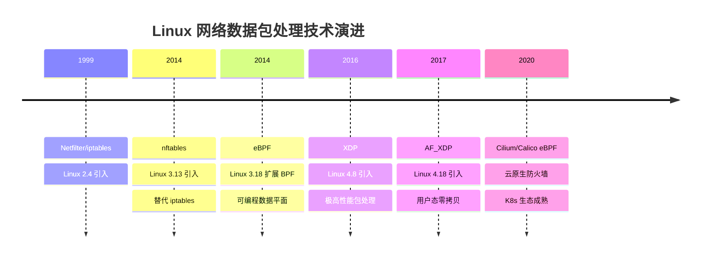

---

## 2. Linux 网络数据包处理架构

### 2.1 内核网络栈全景图

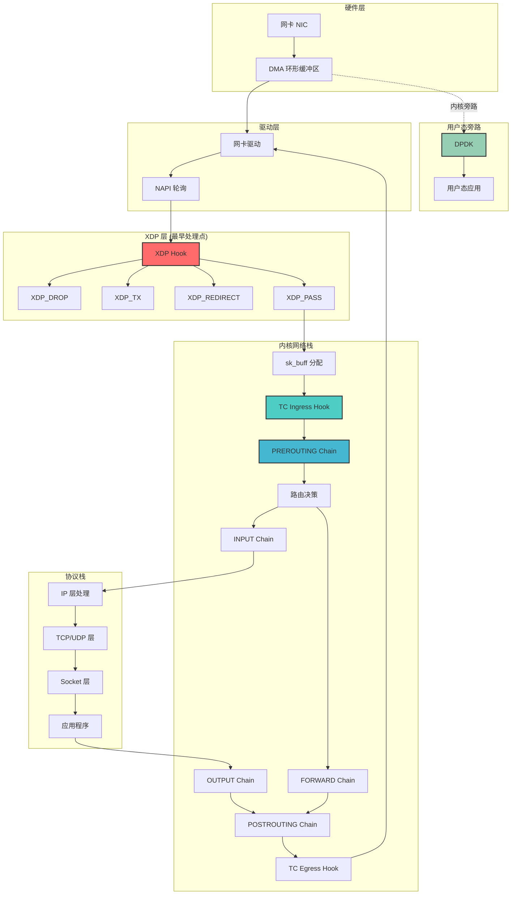

### 2.2 数据包处理钩子位置对比

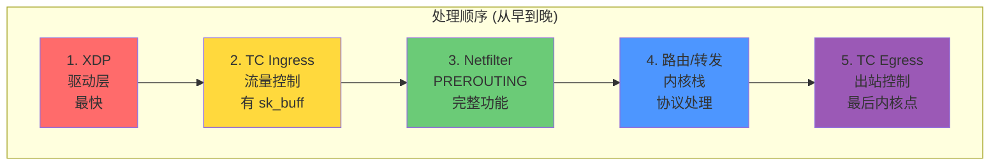

### 2.3 各技术钩子位置详图

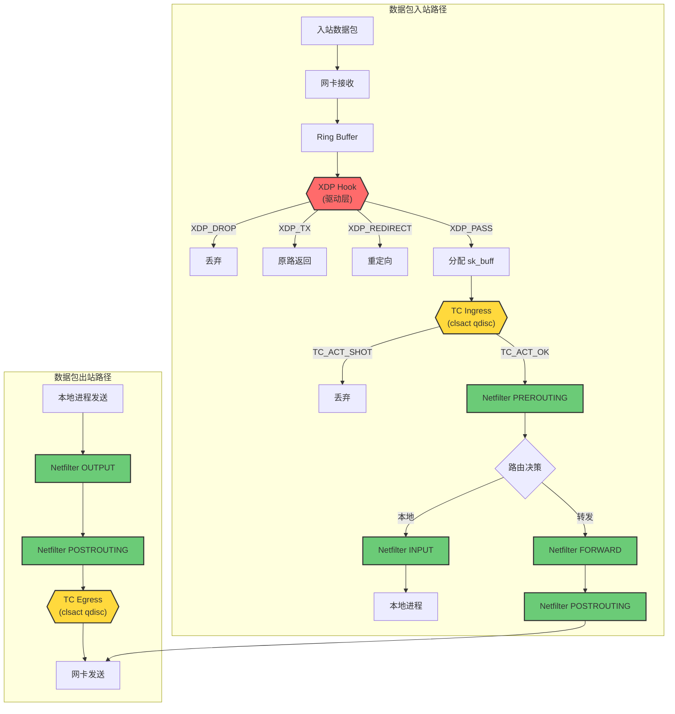

---

## 3. Netfilter/iptables/nftables

### 3.1 Netfilter 架构

Netfilter 是 Linux 内核中的包过滤框架，提供了多个钩子点用于在网络栈的不同位置处理数据包。

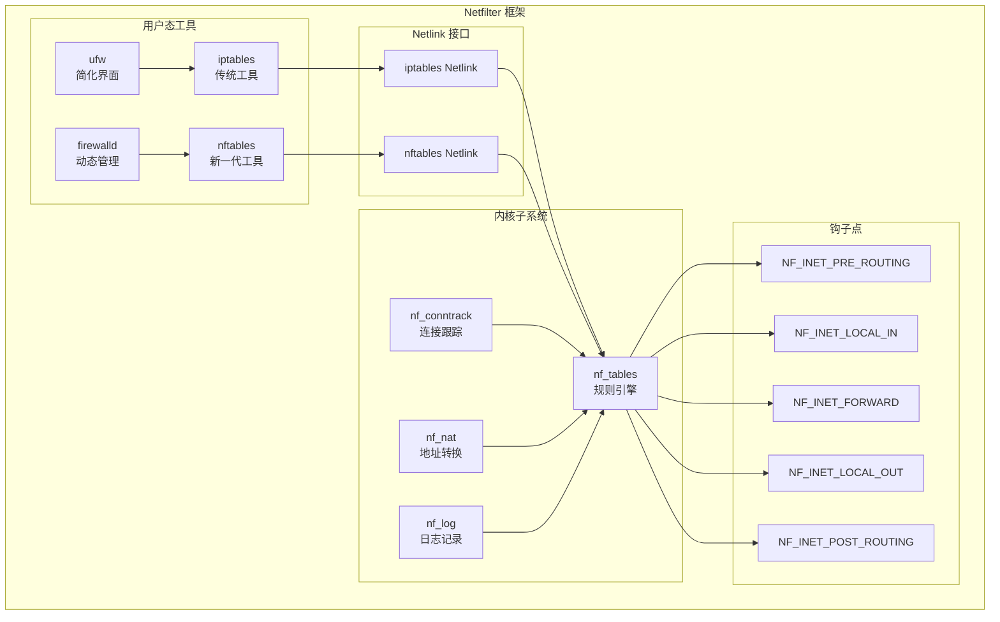

### 3.2 iptables vs nftables 对比

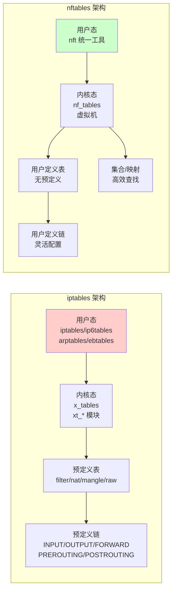

### 3.3 nftables 虚拟机工作原理

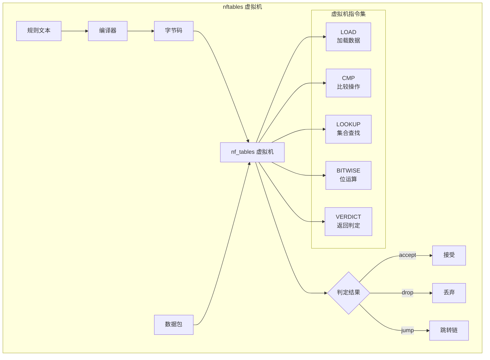

### 3.4 Netfilter 优缺点

| 优点 | 缺点 |
|------|------|
| 成熟稳定，文档丰富 | 规则线性匹配，O(n) 复杂度 |
| 功能全面（NAT、状态跟踪） | 大规则集性能下降明显 |
| 与内核网络栈深度集成 | 处理位置较晚，已消耗 CPU |
| 支持所有 Linux 发行版 | iptables 需要多个工具 |
| 连接跟踪能力强 | 每个包都需遍历规则 |

---

## 4. eBPF (Extended Berkeley Packet Filter)

### 4.1 eBPF 架构概览

eBPF 是一个运行在内核中的虚拟机，允许在不修改内核代码的情况下扩展内核功能。

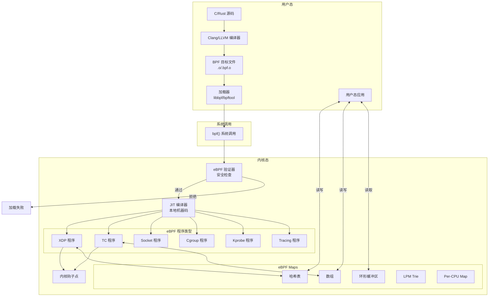

### 4.2 eBPF 验证器工作流程

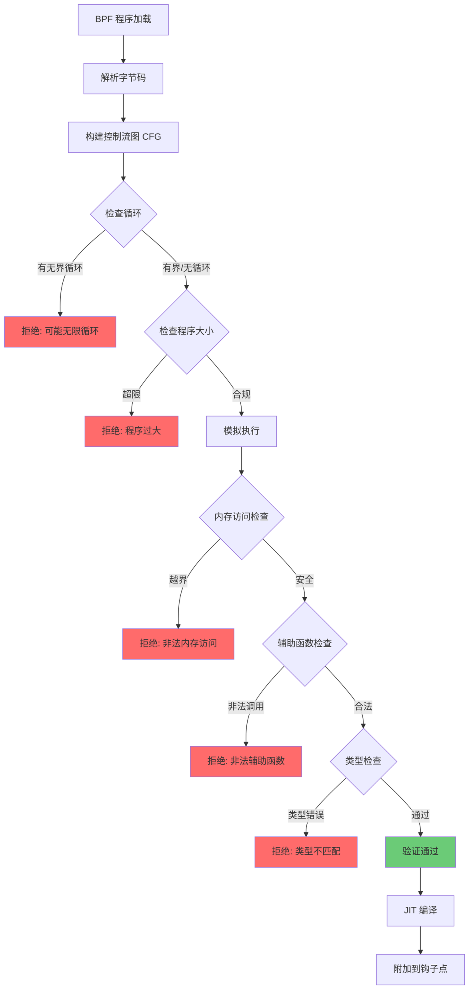

### 4.3 eBPF Maps 类型

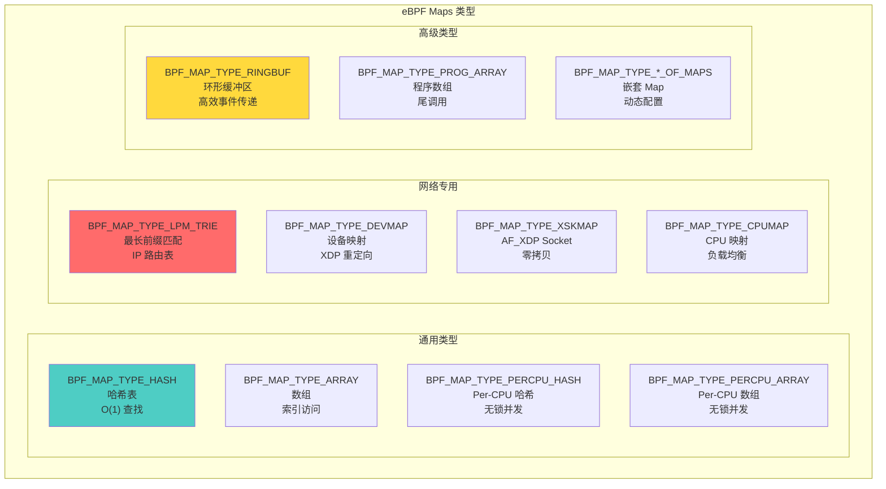

### 4.4 eBPF 防火墙实现示例

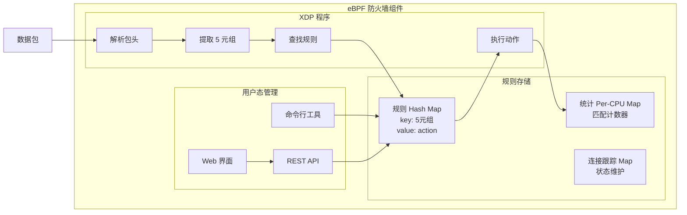

### 4.5 eBPF 优缺点

| 优点 | 缺点 |
|------|------|
| 可编程，灵活性极高 | 学习曲线陡峭 |
| JIT 编译，接近原生性能 | 验证器限制（循环、栈大小） |
| 安全（验证器保证） | 调试困难 |
| 动态加载，无需重启 | 需要较新内核（4.x+） |
| 丰富的 Map 类型 | 程序复杂度受限 |
| 可与内核栈协作 | CO-RE 需要 BTF 支持 |

---

## 5. XDP (eXpress Data Path)

### 5.1 XDP 工作原理

XDP 是 eBPF 的一种程序类型，在网卡驱动层处理数据包，是 Linux 中最早的包处理点。

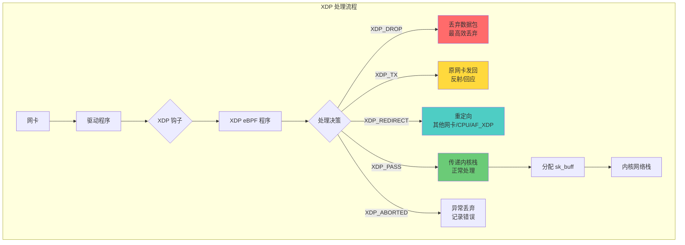

### 5.2 XDP 运行模式

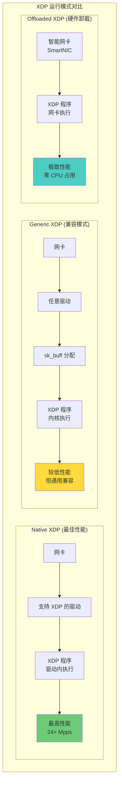

### 5.3 XDP 与 TC 的位置对比

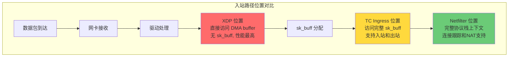

### 5.4 XDP 程序结构

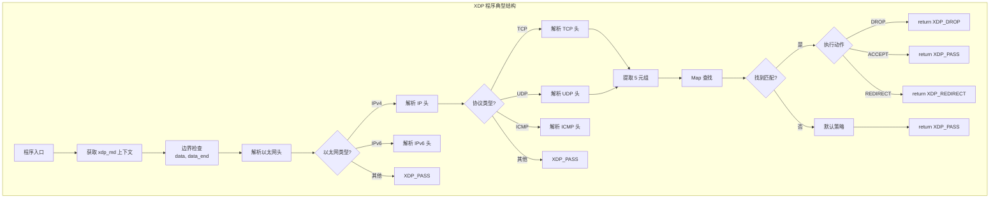

### 5.5 XDP 性能数据

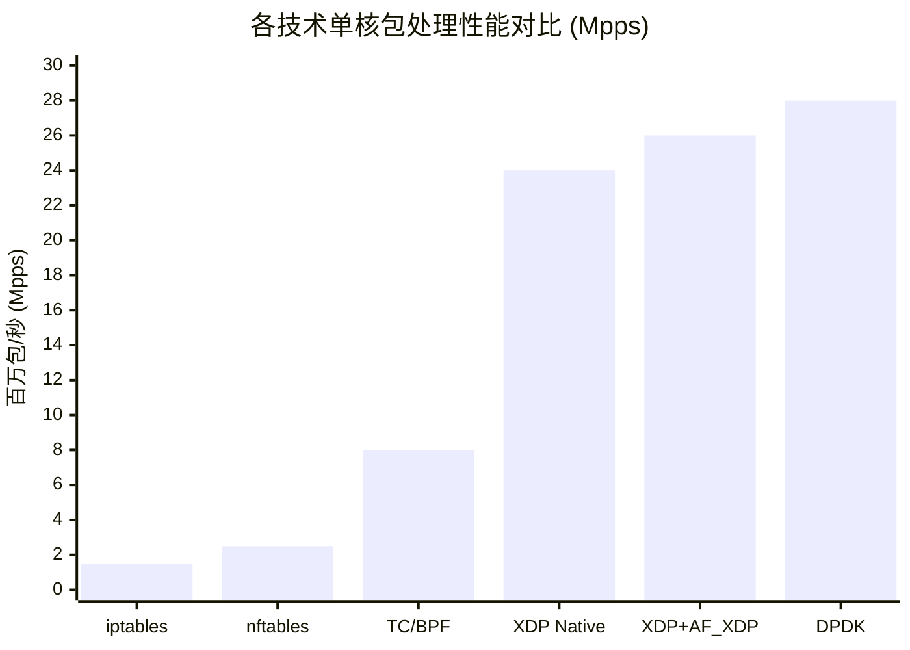

### 5.6 XDP 优缺点

| 优点 | 缺点 |
|------|------|
| 最早处理点，最高性能 | 只支持入站流量 |
| 单核 24+ Mpps | 功能受限（无连接跟踪） |
| 可与内核栈协作 | 需要驱动支持（Native） |
| 支持硬件卸载 | 无法访问完整 sk_buff |
| DDoS 防护理想选择 | 不支持分片包 |
| 低延迟 | 编程复杂度较高 |

---

## 6. TC/BPF (Traffic Control with BPF)

### 6.1 TC BPF 架构

TC (Traffic Control) 是 Linux 流量控制子系统，支持 eBPF 程序用于包分类和处理。

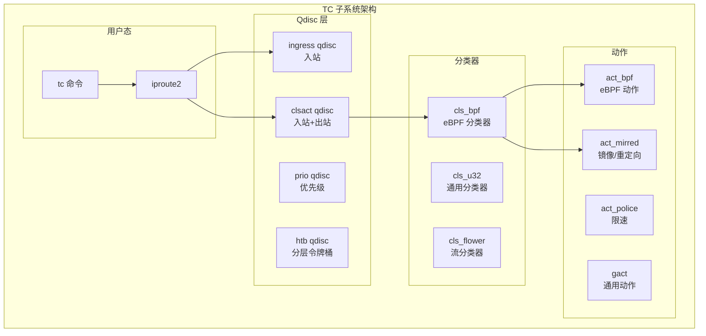

### 6.2 TC Ingress/Egress 钩子

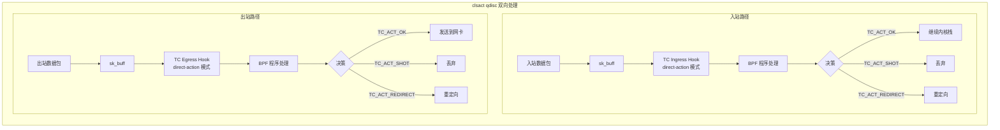

### 6.3 TC BPF vs XDP 功能对比

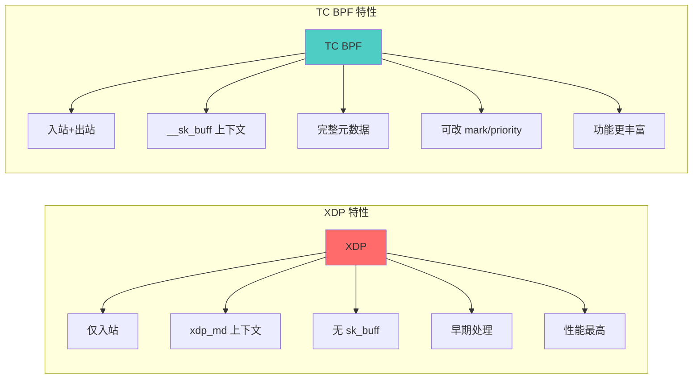

### 6.4 TC BPF 可访问的 sk_buff 字段

```mermaid
mindmap
  root((__sk_buff 结构))
    包基本信息
      len 包长度
      data 数据起始
      data_end 数据结束
      protocol 协议
    元数据
      mark 标记
      priority 优先级
      ingress_ifindex 入接口
      ifindex 接口索引
      tc_index TC 索引
      tc_classid 分类 ID
    隧道信息
      tunnel_key
      tunnel_id
    高级字段
      hash 哈希值
      napi_id NAPI ID
      cb[] 控制块
      tstamp 时间戳
```

### 6.5 TC BPF 优缺点

| 优点 | 缺点 |
|------|------|
| 支持入站和出站 | 性能低于 XDP |
| 访问完整 sk_buff | 处理位置较晚 |
| 可修改包元数据 | 编程复杂度较高 |
| 无需驱动支持 | 部分功能需要内核版本 |
| 与 TC 子系统集成 | 不如 XDP 适合 DDoS |

---

## 7. DPDK (Data Plane Development Kit)

### 7.1 DPDK 架构概览

DPDK 是一个用户态高性能包处理框架，通过内核旁路技术实现线速处理。

```mermaid
graph TB
    subgraph "传统内核处理"
        NIC1[网卡] --> DRV1[内核驱动]
        DRV1 --> IRQ1[中断处理]
        IRQ1 --> STACK1[内核网络栈]
        STACK1 --> SYSCALL1[系统调用]
        SYSCALL1 --> APP1[用户态应用]
    end

    subgraph "DPDK 处理"
        NIC2[网卡] --> UIO[UIO/VFIO 驱动]
        UIO --> HUGEPAGES[大页内存]
        HUGEPAGES --> PMD[Poll Mode Driver<br/>轮询模式驱动]
        PMD --> DPDK_APP[DPDK 应用<br/>用户态]
    end

    style STACK1 fill:#ffcccc
    style SYSCALL1 fill:#ffcccc
    style UIO fill:#ccffcc
    style PMD fill:#ccffcc
```

### 7.2 DPDK 核心组件

```mermaid
graph TB
    subgraph "DPDK 核心库"
        subgraph "环境抽象层 EAL"
            EAL[EAL<br/>Environment Abstraction Layer]
            MEMORY[内存管理<br/>Hugepages]
            CORE[核心管理<br/>CPU 亲和性]
            PCI[PCI 管理]
        end

        subgraph "数据平面库"
            MBUF[rte_mbuf<br/>包缓冲区]
            RING[rte_ring<br/>无锁队列]
            MEMPOOL[rte_mempool<br/>内存池]
            HASH[rte_hash<br/>哈希表]
            LPM[rte_lpm<br/>最长前缀匹配]
            ACL[rte_acl<br/>访问控制列表]
        end

        subgraph "PMD 驱动"
            PMD_E1000[e1000 PMD]
            PMD_IXGBE[ixgbe PMD]
            PMD_I40E[i40e PMD]
            PMD_MLX5[mlx5 PMD]
            PMD_VIRTIO[virtio PMD]
        end
    end

    EAL --> MEMORY
    EAL --> CORE
    EAL --> PCI

    MEMORY --> MBUF
    MEMORY --> MEMPOOL

    PCI --> PMD_E1000
    PCI --> PMD_IXGBE
    PCI --> PMD_I40E
    PCI --> PMD_MLX5
    PCI --> PMD_VIRTIO
```

### 7.3 DPDK 防火墙处理流程

```mermaid
flowchart TB
    subgraph "DPDK 防火墙应用"
        direction TB

        INIT[初始化 EAL] --> SETUP[配置网卡队列]
        SETUP --> MEMPOOL_INIT[创建内存池]

        MEMPOOL_INIT --> MAIN_LOOP[主处理循环]

        subgraph "主循环 (轮询模式)"
            MAIN_LOOP --> POLL[轮询 RX 队列]
            POLL --> BURST[批量收包<br/>rte_eth_rx_burst]
            BURST --> PROCESS[批量处理]

            subgraph "包处理流水线"
                PROCESS --> PARSE[解析包头]
                PARSE --> CLASSIFY[流量分类<br/>rte_acl]
                CLASSIFY --> LOOKUP[规则查找<br/>rte_hash]
                LOOKUP --> ACTION[执行动作]
            end

            ACTION --> TX[批量发包<br/>rte_eth_tx_burst]
            TX --> POLL
        end
    end

    style MAIN_LOOP fill:#ffd93d
    style BURST fill:#6bcb77
    style TX fill:#6bcb77
```

### 7.4 DPDK Run-to-Completion vs Pipeline 模型

```mermaid
graph TB
    subgraph "Run-to-Completion 模型"
        RTC_NIC[网卡] --> RTC_CORE[CPU Core 0]
        RTC_CORE --> RTC_RX[收包]
        RTC_RX --> RTC_PROCESS[处理]
        RTC_PROCESS --> RTC_TX[发包]
        RTC_TX --> RTC_NIC
    end

    subgraph "Pipeline 模型"
        PIPE_NIC[网卡] --> PIPE_RX[RX Core<br/>收包]
        PIPE_RX --> RING1[Ring 队列]
        RING1 --> PIPE_WORK1[Worker Core 1<br/>处理]
        RING1 --> PIPE_WORK2[Worker Core 2<br/>处理]
        PIPE_WORK1 --> RING2[Ring 队列]
        PIPE_WORK2 --> RING2
        RING2 --> PIPE_TX[TX Core<br/>发包]
        PIPE_TX --> PIPE_NIC
    end

    style RTC_CORE fill:#4ecdc4
    style PIPE_RX fill:#ff6b6b
    style PIPE_WORK1 fill:#ffd93d
    style PIPE_WORK2 fill:#ffd93d
    style PIPE_TX fill:#6bcb77
```

### 7.5 DPDK vs 内核网络栈

```mermaid
graph LR
    subgraph "内核网络栈"
        K1[中断驱动]
        K2[上下文切换]
        K3[sk_buff 分配]
        K4[协议栈处理]
        K5[系统调用开销]
    end

    subgraph "DPDK"
        D1[轮询模式]
        D2[用户态运行]
        D3[mbuf 预分配]
        D4[零拷贝]
        D5[批量处理]
    end

    K1 -.->|消除| D1
    K2 -.->|消除| D2
    K3 -.->|优化| D3
    K4 -.->|旁路| D4
    K5 -.->|避免| D5

    style K1 fill:#ffcccc
    style K2 fill:#ffcccc
    style K3 fill:#ffcccc
    style D1 fill:#ccffcc
    style D2 fill:#ccffcc
    style D3 fill:#ccffcc
```

### 7.6 DPDK 部署模式与阻断能力

> **重要说明**：DPDK "内核旁路"是指绕过内核网络栈，但 DPDK 应用**完全接管网卡**，可以决定数据包的命运。

```mermaid
graph TB
    subgraph "DPDK 部署模式"
        subgraph "串联模式 (Inline) - 可阻断"
            TRAFFIC1[外部流量] --> NIC1_IN[网卡 1<br/>入口]
            NIC1_IN --> DPDK1[DPDK 防火墙]
            DPDK1 -->|允许| NIC1_OUT[网卡 2<br/>出口]
            DPDK1 -->|拒绝| DROP1[丢弃]
            NIC1_OUT --> INTERNAL[内部网络]
        end

        subgraph "旁路模式 (Mirror) - 仅检测"
            TRAFFIC2[外部流量] --> SWITCH[交换机]
            SWITCH --> SERVER[目标服务器]
            SWITCH -->|镜像| NIC2[DPDK 网卡]
            NIC2 --> DPDK2[DPDK 检测]
            DPDK2 --> ALERT[告警]
        end

        subgraph "KNI 回注模式 - 与内核协作"
            TRAFFIC3[外部流量] --> NIC3[DPDK 网卡]
            NIC3 --> DPDK3[DPDK 预处理]
            DPDK3 -->|需内核处理| KNI[KNI 接口]
            KNI --> KERNEL[内核网络栈]
            DPDK3 -->|快速转发| NIC3_OUT[出口网卡]
        end
    end

    style DROP1 fill:#ff6b6b
    style ALERT fill:#ffd93d
    style KNI fill:#4ecdc4
```

**部署模式对比：**

| 部署模式 | 能否阻断 | 典型场景 | 说明 |
|----------|----------|----------|------|
| **串联 (Inline)** | ✅ 可以 | 防火墙、负载均衡 | 流量必经之路，完全控制 |
| **旁路镜像 (Mirror)** | ❌ 不能 | IDS 检测、流量分析 | 只收镜像流量，无法干预 |
| **KNI 回注** | ✅ 可以 | 混合架构 | 部分流量回内核处理 |

**关键限制：**
- DPDK 接管的网卡，**内核完全看不到流量**
- 无法与 iptables/nftables **同时工作于同一网卡**
- 若需内核功能（如 NAT），需通过 KNI/TAP 将流量送回内核

### 7.7 DPDK 优缺点

| 优点 | 缺点 |
|------|------|
| 最高性能，接近线速 | 完全绕过内核网络栈 |
| 零拷贝，批量处理 | 无法使用内核网络功能 |
| 可预测的低延迟 | 需要独占 CPU 核心 |
| 成熟的包处理库 | 开发复杂度高 |
| 串联部署可完全阻断流量 | 旁路部署只能检测不能阻断 |
| 支持多种网卡 | 安全性由应用自行保证 |
| 适合专用网络设备 | 不适合通用服务器 |

---

## 8. 各技术横向对比

### 8.1 综合对比表

| 特性 | iptables | nftables | eBPF/TC | XDP | DPDK |
|------|----------|----------|---------|-----|------|
| **处理位置** | 内核协议栈 | 内核协议栈 | TC 层 | 驱动层 | 用户态 |
| **性能** | ~1.5 Mpps | ~2.5 Mpps | ~8 Mpps | ~24 Mpps | ~28 Mpps |
| **延迟** | 高 | 中高 | 中 | 低 | 最低 |
| **灵活性** | 中 | 高 | 非常高 | 高 | 最高 |
| **学习曲线** | 低 | 中 | 高 | 高 | 最高 |
| **内核集成** | 完全 | 完全 | 完全 | 完全 | 无 |
| **连接跟踪** | 支持 | 支持 | 需自行实现 | 不支持 | 需自行实现 |
| **NAT** | 支持 | 支持 | 部分支持 | 不支持 | 需自行实现 |
| **出站过滤** | 支持 | 支持 | 支持 | 不支持 | 支持 |
| **动态更新** | 中等 | 快速 | 非常快 | 非常快 | 需重启 |
| **调试工具** | 丰富 | 丰富 | 中等 | 中等 | 有限 |
| **内核版本** | 2.4+ | 3.13+ | 4.1+ | 4.8+ | N/A |

### 8.2 性能对比图

```mermaid
quadrantChart
    title 防火墙技术定位矩阵
    x-axis 低性能 --> 高性能
    y-axis 低灵活性 --> 高灵活性
    quadrant-1 理想选择
    quadrant-2 灵活但慢
    quadrant-3 避免
    quadrant-4 快速但受限
    iptables: [0.2, 0.4]
    nftables: [0.35, 0.6]
    TC-BPF: [0.5, 0.75]
    XDP: [0.85, 0.7]
    DPDK: [0.95, 0.9]
```

### 8.3 适用场景决策树

```mermaid
flowchart TB
    START[选择防火墙技术] --> Q1{需要最高性能?}

    Q1 -->|是| Q2{可以独占 CPU?}
    Q2 -->|是| DPDK_REC[推荐 DPDK]
    Q2 -->|否| Q3{需要出站过滤?}

    Q3 -->|是| TC_REC[推荐 TC/BPF]
    Q3 -->|否| XDP_REC[推荐 XDP]

    Q1 -->|否| Q4{需要复杂规则?}
    Q4 -->|是| Q5{需要状态跟踪?}

    Q5 -->|是| NFT_REC[推荐 nftables]
    Q5 -->|否| EBPF_REC[推荐 eBPF]

    Q4 -->|否| Q6{运维复杂度要求?}
    Q6 -->|低| IPT_REC[推荐 iptables]
    Q6 -->|可接受| NFT_REC2[推荐 nftables]

    style DPDK_REC fill:#ff6b6b
    style XDP_REC fill:#ffd93d
    style TC_REC fill:#4ecdc4
    style NFT_REC fill:#6bcb77
    style EBPF_REC fill:#9b59b6
    style IPT_REC fill:#95a5a6
```

### 8.4 各技术典型应用场景

```mermaid
mindmap
  root((防火墙技术场景))
    iptables/nftables
      传统服务器防火墙
      中小规模部署
      需要 NAT 功能
      状态防火墙
    eBPF/TC
      容器网络策略
      服务网格
      L4 负载均衡
      可观测性
    XDP
      DDoS 防护
      负载均衡器
      数据包重定向
      高性能路由
    DPDK
      电信级防火墙
      专用安全设备
      高频交易网络
      运营商边界
```

---

## 9. 云原生防火墙实现

### 9.1 Cilium 架构

Cilium 是基于 eBPF 的云原生网络和安全解决方案。

```mermaid
graph TB
    subgraph "Cilium 架构"
        subgraph "控制平面"
            CILIUM_AGENT[Cilium Agent]
            CILIUM_OPERATOR[Cilium Operator]
            KVSTORE[(etcd/CRD)]
        end

        subgraph "数据平面 (eBPF)"
            XDP_LB[XDP 负载均衡]
            TC_POLICY[TC 网络策略]
            SOCK_LB[Socket LB]
            CGROUP_POLICY[Cgroup 策略]
        end

        subgraph "Kubernetes 集成"
            K8S_API[Kubernetes API]
            CNI[CNI Plugin]
            NETWORK_POLICY[NetworkPolicy]
            CILIUM_NP[CiliumNetworkPolicy]
        end

        subgraph "可观测性"
            HUBBLE[Hubble]
            PROMETHEUS[Prometheus Metrics]
            GRAFANA[Grafana Dashboard]
        end
    end

    K8S_API --> CILIUM_OPERATOR
    CILIUM_OPERATOR --> KVSTORE
    KVSTORE --> CILIUM_AGENT

    CILIUM_AGENT --> XDP_LB
    CILIUM_AGENT --> TC_POLICY
    CILIUM_AGENT --> SOCK_LB
    CILIUM_AGENT --> CGROUP_POLICY

    CNI --> CILIUM_AGENT
    NETWORK_POLICY --> CILIUM_AGENT
    CILIUM_NP --> CILIUM_AGENT

    XDP_LB --> HUBBLE
    TC_POLICY --> HUBBLE
    HUBBLE --> PROMETHEUS
    PROMETHEUS --> GRAFANA
```

### 9.2 Calico eBPF 模式

```mermaid
graph TB
    subgraph "Calico eBPF 数据平面"
        subgraph "传统模式 (iptables)"
            IPT_RULES[iptables 规则]
            CONNTRACK[连接跟踪]
            ROUTING[路由表]
        end

        subgraph "eBPF 模式"
            BPF_PROG[eBPF 程序]
            BPF_MAPS[eBPF Maps]
            TC_HOOK[TC Hook]
            XDP_HOOK[XDP Hook]
        end

        subgraph "性能对比"
            PERF_IPT["iptables<br/>O(n) 规则匹配"]
            PERF_BPF["eBPF<br/>O(1) 哈希查找"]
        end
    end

    style IPT_RULES fill:#ffcccc
    style BPF_PROG fill:#ccffcc
    style PERF_IPT fill:#ffcccc
    style PERF_BPF fill:#ccffcc
```

---

## 10. 场景分析：5元组过滤与应用流量统计

### 10.1 需求描述

| 需求 | 描述 | 技术挑战 |
|------|------|----------|
| **5元组拦截/放行** | 基于源IP、目的IP、源端口、目的端口、协议进行过滤 | 高效规则匹配 |
| **应用流量统计** | 统计每个进程/应用的网络流量使用情况 | 需要关联数据包与进程 |

### 10.2 各技术能力分析

```mermaid
graph TB
    subgraph "数据包处理层级与可见信息"
        direction TB

        subgraph "XDP/DPDK 层"
            XDP_INFO["可见: 以太网帧, IP头<br/>无进程信息"]
        end

        subgraph "TC/Netfilter 层"
            TC_INFO["可见: sk_buff, 5元组<br/>无直接进程信息"]
        end

        subgraph "Socket/Cgroup 层"
            SOCK_INFO["可见: Socket, 5元组<br/>PID, 进程名, Cgroup ID"]
        end

        subgraph "应用层"
            APP_INFO["可见: 完整应用上下文"]
        end

        XDP_INFO --> TC_INFO --> SOCK_INFO --> APP_INFO
    end

    style XDP_INFO fill:#ffcccc
    style TC_INFO fill:#fff3cd
    style SOCK_INFO fill:#ccffcc
```

### 10.3 技术方案对比

| 技术 | 5元组过滤 | 应用流量统计 | 性能 | 复杂度 | 推荐度 |
|------|-----------|--------------|------|--------|--------|
| **iptables** | ✅ 支持 | ❌ 不支持 | 低 | 低 | ⭐⭐ |
| **nftables** | ✅ 支持 | ❌ 不支持 | 中 | 低 | ⭐⭐⭐ |
| **XDP** | ✅ 高性能 | ❌ 无法获取进程 | 最高 | 高 | ⭐⭐ |
| **TC/BPF** | ✅ 支持 | ⚠️ 需配合 cgroup | 高 | 中 | ⭐⭐⭐ |
| **Cgroup eBPF** | ✅ 支持 | ✅ **原生支持** | 高 | 中 | ⭐⭐⭐⭐⭐ |
| **DPDK** | ✅ 支持 | ❌ 完全隔离 | 最高 | 最高 | ⭐ |

### 10.4 eBPF Cgroup 方案详解（推荐）

eBPF 提供了 **cgroup 级别的钩子**，可以同时实现5元组过滤和应用流量统计。

```mermaid
graph TB
    subgraph "eBPF Cgroup 方案架构"
        subgraph "用户态管理"
            MANAGER[流量管理器]
            RULE_CFG[规则配置]
            STATS_READER[统计读取器]
        end

        subgraph "eBPF Maps 内核"
            RULES_MAP["规则 Map<br/>key: 5元组, value: action"]
            STATS_MAP["统计 Map<br/>key: cgroup_id+5元组"]
            APP_MAP["应用映射 Map<br/>key: cgroup_id"]
        end

        subgraph "eBPF 程序 (内核)"
            CGROUP_INGRESS["cgroup/skb ingress<br/>入站流量处理"]
            CGROUP_EGRESS["cgroup/skb egress<br/>出站流量处理"]
            SOCK_OPS["sockops<br/>连接跟踪"]
        end

        subgraph "系统 Cgroup"
            CGROUP_ROOT["/sys/fs/cgroup"]
            CGROUP_APP1["app1.service"]
            CGROUP_APP2["app2.service"]
            CGROUP_DOCKER["docker/container_id"]
        end
    end

    MANAGER --> RULE_CFG
    RULE_CFG --> RULES_MAP
    STATS_READER --> STATS_MAP
    STATS_READER --> APP_MAP

    CGROUP_INGRESS --> RULES_MAP
    CGROUP_INGRESS --> STATS_MAP
    CGROUP_EGRESS --> RULES_MAP
    CGROUP_EGRESS --> STATS_MAP
    SOCK_OPS --> APP_MAP

    CGROUP_APP1 --> CGROUP_INGRESS
    CGROUP_APP2 --> CGROUP_INGRESS
    CGROUP_DOCKER --> CGROUP_INGRESS

    style CGROUP_INGRESS fill:#6bcb77
    style CGROUP_EGRESS fill:#6bcb77
    style STATS_MAP fill:#4ecdc4
```

### 10.5 Cgroup eBPF 程序类型

```mermaid
graph LR
    subgraph "适用的 eBPF 程序类型"
        subgraph "流量过滤与统计"
            CGROUP_SKB["CGROUP_SKB<br/>附加到cgroup<br/>入站出站过滤"]
        end

        subgraph "Socket 级控制"
            CGROUP_SOCK["CGROUP_SOCK<br/>Socket创建释放<br/>获取进程信息"]

            CGROUP_SOCKADDR["CGROUP_SOCK_ADDR<br/>connect/bind拦截<br/>透明代理"]
        end

        subgraph "连接跟踪"
            SOCK_OPS_PROG["SOCK_OPS<br/>TCP连接事件<br/>RTT和拥塞信息"]
        end
    end

    style CGROUP_SKB fill:#6bcb77
    style CGROUP_SOCK fill:#4ecdc4
    style SOCK_OPS_PROG fill:#ffd93d
```

### 10.6 数据流与处理流程

```mermaid
sequenceDiagram
    participant App as 应用进程
    participant Cgroup as Cgroup
    participant eBPF as eBPF 程序
    participant Maps as eBPF Maps
    participant Manager as 管理器

    Note over App,Manager: 出站流量处理

    App->>Cgroup: 发送数据包
    Cgroup->>eBPF: 触发 cgroup/skb egress

    eBPF->>eBPF: 1. 提取 5 元组
    eBPF->>eBPF: 2. 获取 cgroup_id
    eBPF->>Maps: 3. 查询规则 Map

    alt 规则匹配: 拒绝
        Maps-->>eBPF: action = DROP
        eBPF-->>Cgroup: 返回 0 (丢弃)
    else 规则匹配: 允许
        Maps-->>eBPF: action = ALLOW
        eBPF->>Maps: 4. 更新统计 Map<br/>(bytes += pkt_len)
        eBPF-->>Cgroup: 返回 1 (放行)
        Cgroup->>App: 发送成功
    end

    Note over App,Manager: 统计查询

    Manager->>Maps: 读取统计 Map
    Maps-->>Manager: 返回各 cgroup 流量数据
    Manager->>Manager: 关联 cgroup_id 到应用名
```

### 10.7 实现示例伪代码

```mermaid
graph TB
    subgraph "eBPF 程序结构"
        CODE["
// 规则 Map: 5元组 -> 动作
struct bpf_map rules_map (HASH, max_entries=10000)

// 统计 Map: (cgroup_id, 5元组) -> 统计
struct bpf_map stats_map (PERCPU_HASH, max_entries=100000)

SEC('cgroup_skb/egress')
int egress_filter(struct __sk_buff *skb) {
    // 1. 提取 5 元组
    struct five_tuple key = extract_tuple(skb);

    // 2. 查询规则
    int *action = bpf_map_lookup(&rules_map, &key);
    if (action && *action == DROP)
        return 0;  // 丢弃

    // 3. 获取 cgroup ID
    u64 cgroup_id = bpf_skb_cgroup_id(skb);

    // 4. 更新统计
    struct stats_key skey = {cgroup_id, key};
    struct stats_val *val = bpf_map_lookup(&stats_map, &skey);
    if (val) {
        val->bytes += skb->len;
        val->packets += 1;
    }

    return 1;  // 放行
}
        "]
    end
```

### 10.8 方案对比与推荐

```mermaid
graph TB
    subgraph "方案选择决策"
        START[需求: 5元组过滤 + 应用统计] --> Q1{需要容器/K8s 支持?}

        Q1 -->|是| CILIUM["方案A: Cilium<br/>开箱即用, K8s原生<br/>强烈推荐"]

        Q1 -->|否| Q2{追求极简?}

        Q2 -->|是| NFT_SS["方案B: nftables+nethogs<br/>简单但工具分离<br/>一般推荐"]

        Q2 -->|否| CUSTOM["方案C: 自研eBPF Cgroup<br/>完全可控, 需开发<br/>推荐"]
    end

    style CILIUM fill:#6bcb77
    style CUSTOM fill:#4ecdc4
    style NFT_SS fill:#ffd93d
```

### 10.9 推荐方案总结

| 场景 | 推荐方案 | 原因 |
|------|----------|------|
| **Kubernetes 环境** | Cilium | 原生支持 NetworkPolicy + Hubble 流量统计 |
| **单机 Linux 服务器** | eBPF Cgroup 自研 | 统一架构，性能好，完全可控 |
| **快速实现/原型** | nftables + bpftrace | 现有工具组合，快速验证 |
| **传统运维环境** | nftables + nethogs/iftop | 无需开发，工具成熟 |

### 10.10 为什么不推荐 XDP/DPDK

```mermaid
graph TB
    subgraph "XDP/DPDK 的局限性"
        subgraph "XDP"
            XDP_LIMIT["XDP 局限"]
            XDP_USE["XDP 适合场景"]
        end

        subgraph "DPDK"
            DPDK_LIMIT["DPDK 局限"]
            DPDK_USE["DPDK 适合场景"]
        end
    end

    style XDP_LIMIT fill:#ffcccc
    style DPDK_LIMIT fill:#ffcccc
    style XDP_USE fill:#ccffcc
    style DPDK_USE fill:#ccffcc
```

**XDP 局限：**
- 处理位置太早，无法获取 socket 信息
- 不知道是哪个进程
- 只有入站，无出站

**XDP 适合场景：**
- DDoS 防护、负载均衡、简单黑白名单

**DPDK 局限：**
- 完全绕过内核，与系统进程隔离
- 无法关联应用，开发复杂度极高

**DPDK 适合场景：**
- 专用网络设备、电信级网关、不需要应用关联

**关键结论**：要实现"应用级流量统计"，必须在 **Socket/Cgroup 层** 工作，因为只有这一层才能获取进程信息。XDP 和 DPDK 处理位置太底层，数据包还没有关联到具体进程。

---

## 11. 防火墙架构设计建议

### 11.1 高性能防火墙分层架构

```mermaid
graph TB
    subgraph "高性能防火墙分层设计"
        subgraph "第一层: XDP 快速过滤"
            XDP_LAYER["XDP层: DDoS防护<br/>黑白名单, 24+Mpps"]
        end

        subgraph "第二层: TC/BPF 精细控制"
            TC_LAYER["TC层: L4规则<br/>流量标记, 出站过滤"]
        end

        subgraph "第三层: Netfilter 高级功能"
            NF_LAYER["Netfilter层: 连接跟踪<br/>NAT, 状态管理"]
        end

        subgraph "第四层: 用户态处理"
            USER_LAYER["用户态: 深度检测<br/>日志分析, 策略引擎"]
        end
    end

    PKT_IN[入站流量] --> XDP_LAYER
    XDP_LAYER -->|通过| TC_LAYER
    XDP_LAYER -->|丢弃| DROP1[丢弃]

    TC_LAYER -->|通过| NF_LAYER
    TC_LAYER -->|丢弃| DROP2[丢弃]

    NF_LAYER -->|通过| USER_LAYER
    NF_LAYER -->|丢弃| DROP3[丢弃]

    USER_LAYER --> APP[应用程序]

    style XDP_LAYER fill:#ff6b6b
    style TC_LAYER fill:#ffd93d
    style NF_LAYER fill:#4ecdc4
    style USER_LAYER fill:#6bcb77
```

### 11.2 防火墙组件架构

```mermaid
graph TB
    subgraph "防火墙系统组件架构"
        subgraph "管理平面"
            WEB_UI[Web 管理界面]
            REST_API[REST API]
            CLI[命令行接口]
            CONFIG_MGR[配置管理器]
        end

        subgraph "控制平面"
            RULE_ENGINE[规则引擎]
            POLICY_COMPILER[策略编译器]
            RULE_LOADER[规则加载器]
            STATE_SYNC[状态同步]
        end

        subgraph "数据平面"
            XDP_MOD[XDP 模块]
            TC_MOD[TC/BPF 模块]
            NF_MOD[Netfilter 模块]
            CONNTRACK[连接跟踪表]
        end

        subgraph "监控平面"
            METRICS[指标收集]
            LOGGING[日志系统]
            ALERTING[告警系统]
            DASHBOARD[监控面板]
        end

        subgraph "存储"
            RULE_DB[(规则数据库)]
            LOG_DB[(日志存储)]
            CONFIG_DB[(配置存储)]
        end
    end

    WEB_UI --> REST_API
    CLI --> REST_API
    REST_API --> CONFIG_MGR
    CONFIG_MGR --> RULE_ENGINE

    RULE_ENGINE --> POLICY_COMPILER
    POLICY_COMPILER --> RULE_LOADER

    RULE_LOADER --> XDP_MOD
    RULE_LOADER --> TC_MOD
    RULE_LOADER --> NF_MOD

    XDP_MOD --> METRICS
    TC_MOD --> METRICS
    NF_MOD --> METRICS

    METRICS --> LOGGING
    LOGGING --> LOG_DB
    METRICS --> ALERTING
    METRICS --> DASHBOARD

    CONFIG_MGR --> CONFIG_DB
    RULE_ENGINE --> RULE_DB
```

### 11.3 规则处理流程

```mermaid
sequenceDiagram
    participant Admin as 管理员
    participant API as REST API
    participant Engine as 规则引擎
    participant Compiler as 编译器
    participant Loader as 加载器
    participant XDP as XDP 模块
    participant TC as TC 模块
    participant NF as Netfilter

    Admin->>API: 提交防火墙规则
    API->>Engine: 验证规则语法
    Engine->>Engine: 规则冲突检测
    Engine->>Compiler: 编译规则

    alt XDP 规则
        Compiler->>Compiler: 生成 XDP BPF 字节码
        Compiler->>Loader: 加载 XDP 程序
        Loader->>XDP: 附加到网卡
        XDP-->>Loader: 加载成功
    else TC 规则
        Compiler->>Compiler: 生成 TC BPF 字节码
        Compiler->>Loader: 加载 TC 程序
        Loader->>TC: 附加到 clsact qdisc
        TC-->>Loader: 加载成功
    else Netfilter 规则
        Compiler->>Compiler: 生成 nft 规则
        Compiler->>Loader: 加载 nft 规则
        Loader->>NF: 添加到 nftables
        NF-->>Loader: 加载成功
    end

    Loader-->>Engine: 加载完成
    Engine-->>API: 规则生效
    API-->>Admin: 返回成功
```

---

## 12. 技术选型建议

### 12.1 场景匹配推荐

| 应用场景 | 推荐技术 | 原因 |
|----------|----------|------|
| **DDoS 防护** | XDP | 最早丢弃点，最高性能 |
| **容器网络策略** | Cilium (eBPF) | 云原生，动态更新 |
| **传统服务器防火墙** | nftables | 功能全面，易维护 |
| **L4 负载均衡** | XDP + eBPF | 高性能转发 |
| **应用层防火墙** | Netfilter + Userspace | 深度检测能力 |
| **电信级网关** | DPDK | 线速处理要求 |
| **边缘计算网关** | XDP + TC/BPF | 性能与功能平衡 |
| **Kubernetes 网络** | Cilium/Calico | 生态集成 |

### 12.2 IDPS 系统防火墙建议

针对入侵检测防御系统 (IDPS)，建议采用分层架构：

```mermaid
graph TB
    subgraph "IDPS 防火墙架构建议"
        subgraph "推荐方案: XDP + nftables 混合"
            XDP_FILTER["XDP预过滤<br/>恶意IP快速丢弃"]

            NFT_MAIN["nftables主过滤<br/>状态跟踪, NAT"]

            SURICATA["Suricata IDS<br/>深度包检测, 告警"]
        end

        subgraph "数据流"
            TRAFFIC[网络流量]
            PASS_1[XDP 通过]
            PASS_2[nftables 通过]
            DROP_1[XDP 丢弃]
            DROP_2[nftables 丢弃]
            ALERT[告警日志]
        end
    end

    TRAFFIC --> XDP_FILTER
    XDP_FILTER -->|恶意| DROP_1
    XDP_FILTER -->|正常| PASS_1
    PASS_1 --> NFT_MAIN
    NFT_MAIN -->|拒绝| DROP_2
    NFT_MAIN -->|允许| PASS_2
    PASS_2 --> SURICATA
    SURICATA --> ALERT

    style XDP_FILTER fill:#ff6b6b
    style NFT_MAIN fill:#4ecdc4
    style SURICATA fill:#6bcb77
```

### 12.3 实施路线建议

```mermaid
gantt
    title 防火墙实施路线
    dateFormat  YYYY-MM-DD

    section 第一阶段 - 基础
    nftables 基础防火墙部署    :a1, 2024-01-01, 14d
    基本规则配置              :a2, after a1, 7d
    日志和监控集成            :a3, after a2, 7d

    section 第二阶段 - 增强
    XDP 预过滤研发            :b1, after a3, 21d
    黑名单快速丢弃            :b2, after b1, 7d
    DDoS 缓解能力            :b3, after b2, 14d

    section 第三阶段 - 高级
    eBPF 自定义规则           :c1, after b3, 21d
    TC/BPF 出站过滤          :c2, after c1, 14d
    动态规则更新              :c3, after c2, 14d

    section 第四阶段 - 优化
    性能调优                  :d1, after c3, 14d
    高可用部署                :d2, after d1, 14d
    全面测试                  :d3, after d2, 7d
```

---

## 13. 总结

### 13.1 关键结论

1. **性能排序**: DPDK > XDP > TC/BPF > nftables > iptables

2. **功能完整性排序**: nftables > iptables > TC/BPF > XDP > DPDK

3. **推荐选择**:
   - 高性能要求 + 简单规则 → **XDP**
   - 云原生环境 → **Cilium/Calico (eBPF)**
   - 传统服务器 → **nftables**
   - 电信级设备 → **DPDK**

4. **最佳实践**: 采用分层架构，结合多种技术优势
   - XDP 做第一层快速过滤
   - TC/BPF 或 nftables 做精细控制
   - Netfilter 提供高级功能（NAT、状态跟踪）

### 13.2 技术发展趋势

```mermaid
graph LR
    subgraph "技术演进方向"
        PAST[过去<br/>iptables<br/>单一技术] --> PRESENT[现在<br/>nftables + eBPF<br/>混合架构]
        PRESENT --> FUTURE[未来<br/>全 eBPF<br/>可编程数据平面]
    end

    style PAST fill:#95a5a6
    style PRESENT fill:#3498db
    style FUTURE fill:#2ecc71
```

---

## 参考资料

- [Red Hat - Getting started with XDP and eBPF](https://docs.redhat.com/en/documentation/red_hat_enterprise_linux/10/html/configuring_firewalls_and_packet_filters/getting-started-with-xdp-and-ebpf)
- [nftables wiki - Main differences with iptables](https://wiki.nftables.org/wiki-nftables/index.php/Main_differences_with_iptables)
- [eBPF and XDP for Processing Packets at Bare-metal Speed](https://sematext.com/blog/ebpf-and-xdp-for-processing-packets-at-bare-metal-speed/)
- [DPDK Official Documentation](https://www.dpdk.org/about/)
- [Cilium Documentation](https://docs.cilium.io/)
- [Calico eBPF Documentation](https://docs.tigera.io/calico/latest/about/kubernetes-training/about-ebpf)
- [Performance Implications of Packet Filtering with Linux eBPF](https://www.net.in.tum.de/fileadmin/bibtex/publications/papers/ITC30-Packet-Filtering-eBPF-XDP.pdf)
- [Understanding tc "direct action" mode for BPF](https://qmonnet.github.io/whirl-offload/2020/04/11/tc-bpf-direct-action/)
- [iximiuz Labs - Hands-On with XDP](https://labs.iximiuz.com/tutorials/ebpf-xdp-fundamentals-6342d24e)
- [GitHub - dpdk-firewall](https://github.com/poupas/dpdk-firewall)
