# eBPF 技术深度探索

## 1. 概述

### 1.1 什么是 eBPF

eBPF (Extended Berkeley Packet Filter) 是一个运行在 Linux 内核中的**轻量级虚拟机**，允许在不修改内核源码或加载内核模块的情况下，安全地扩展内核功能。

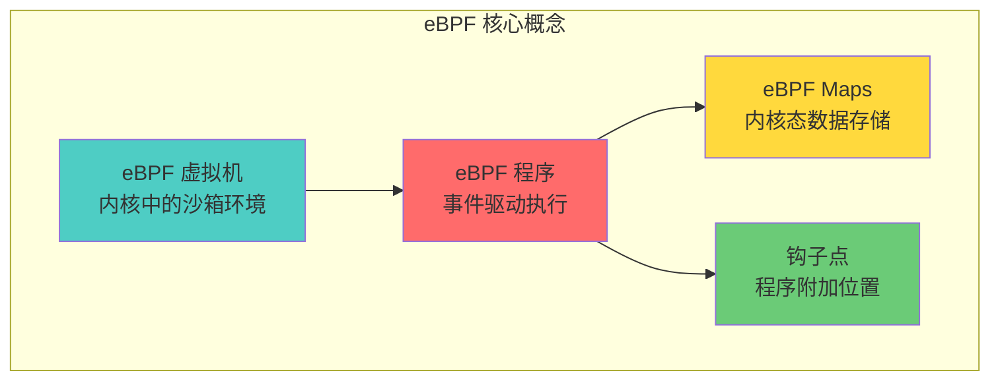
```mermaid
graph TB
    subgraph "eBPF 核心概念"
        VM["eBPF 虚拟机<br/>内核中的沙箱环境"]
        PROG["eBPF 程序<br/>事件驱动执行"]
        MAPS["eBPF Maps<br/>内核态数据存储"]
        HOOKS["钩子点<br/>程序附加位置"]
    end

    VM --> PROG
    PROG --> MAPS
    PROG --> HOOKS

    style VM fill:#4ecdc4
    style PROG fill:#ff6b6b
    style MAPS fill:#ffd93d
    style HOOKS fill:#6bcb77
```

### 1.2 eBPF 发展历程

| 版本 | 内核版本 | 里程碑 |
|------|----------|--------|
| cBPF | 2.1 (1997) | 经典 BPF，仅用于包过滤 |
| eBPF 基础 | 3.18 (2014) | 扩展指令集，Maps 支持 |
| kprobe | 4.1 (2015) | 内核函数动态跟踪 |
| XDP | 4.8 (2016) | 高性能网络数据路径 |
| Cgroup | 4.10 (2017) | 容器级别控制 |
| BTF | 4.18 (2018) | 类型信息，CO-RE 支持 |
| LSM | 5.7 (2020) | 安全模块钩子 |
| Ringbuf | 5.8 (2020) | 高效事件传递 |

### 1.3 eBPF 核心架构

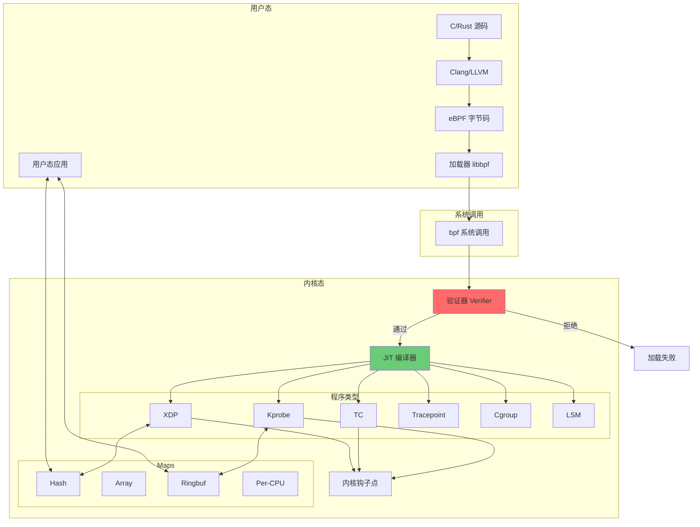
```mermaid
graph TB
    subgraph "用户态"
        SOURCE["C/Rust 源码"]
        CLANG["Clang/LLVM"]
        BYTECODE["eBPF 字节码"]
        LOADER["加载器 libbpf"]
        USERAPP["用户态应用"]
    end

    subgraph "系统调用"
        BPF_SYSCALL["bpf 系统调用"]
    end

    subgraph "内核态"
        VERIFIER["验证器 Verifier"]
        JIT["JIT 编译器"]

        subgraph "程序类型"
            XDP_P["XDP"]
            TC_P["TC"]
            KPROBE_P["Kprobe"]
            TRACE_P["Tracepoint"]
            CGROUP_P["Cgroup"]
            LSM_P["LSM"]
        end

        subgraph "Maps"
            HASH["Hash"]
            ARRAY["Array"]
            RINGBUF["Ringbuf"]
            PERCPU["Per-CPU"]
        end

        HOOKS_K["内核钩子点"]
    end

    SOURCE --> CLANG
    CLANG --> BYTECODE
    BYTECODE --> LOADER
    LOADER --> BPF_SYSCALL

    BPF_SYSCALL --> VERIFIER
    VERIFIER -->|通过| JIT
    VERIFIER -->|拒绝| REJECT[加载失败]

    JIT --> XDP_P
    JIT --> TC_P
    JIT --> KPROBE_P
    JIT --> TRACE_P
    JIT --> CGROUP_P
    JIT --> LSM_P

    XDP_P --> HOOKS_K
    TC_P --> HOOKS_K
    KPROBE_P --> HOOKS_K

    USERAPP <--> HASH
    USERAPP <--> RINGBUF
    XDP_P <--> HASH
    KPROBE_P <--> RINGBUF

    style VERIFIER fill:#ff6b6b
    style JIT fill:#6bcb77
```

---

## 2. eBPF 程序生命周期

### 2.1 编译加载流程

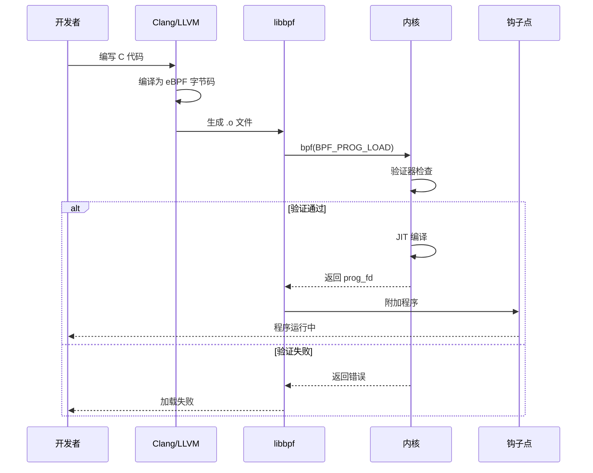
```mermaid
sequenceDiagram
    participant Dev as 开发者
    participant Clang as Clang/LLVM
    participant Loader as libbpf
    participant Kernel as 内核
    participant Hook as 钩子点

    Dev->>Clang: 编写 C 代码
    Clang->>Clang: 编译为 eBPF 字节码
    Clang->>Loader: 生成 .o 文件

    Loader->>Kernel: bpf(BPF_PROG_LOAD)
    Kernel->>Kernel: 验证器检查

    alt 验证通过
        Kernel->>Kernel: JIT 编译
        Kernel-->>Loader: 返回 prog_fd
        Loader->>Hook: 附加程序
        Hook-->>Dev: 程序运行中
    else 验证失败
        Kernel-->>Loader: 返回错误
        Loader-->>Dev: 加载失败
    end
```

### 2.2 验证器工作原理

eBPF 验证器是保证安全性的核心组件，执行静态代码分析。

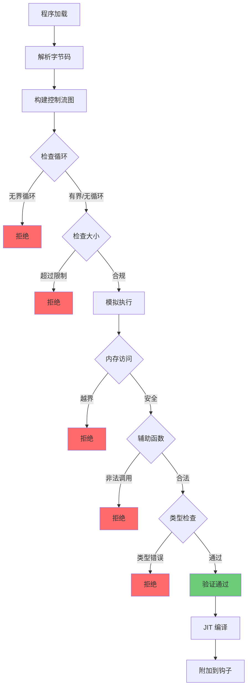
```mermaid
flowchart TB
    START[程序加载] --> PARSE[解析字节码]
    PARSE --> CFG[构建控制流图]

    CFG --> CHK_LOOP{检查循环}
    CHK_LOOP -->|无界循环| REJ1[拒绝]
    CHK_LOOP -->|有界/无循环| CHK_SIZE{检查大小}

    CHK_SIZE -->|超过限制| REJ2[拒绝]
    CHK_SIZE -->|合规| SIMULATE[模拟执行]

    SIMULATE --> CHK_MEM{内存访问}
    CHK_MEM -->|越界| REJ3[拒绝]
    CHK_MEM -->|安全| CHK_HELPER{辅助函数}

    CHK_HELPER -->|非法调用| REJ4[拒绝]
    CHK_HELPER -->|合法| CHK_TYPE{类型检查}

    CHK_TYPE -->|类型错误| REJ5[拒绝]
    CHK_TYPE -->|通过| PASS[验证通过]

    PASS --> JIT_COMPILE[JIT 编译]
    JIT_COMPILE --> ATTACH[附加到钩子]

    style REJ1 fill:#ff6b6b
    style REJ2 fill:#ff6b6b
    style REJ3 fill:#ff6b6b
    style REJ4 fill:#ff6b6b
    style REJ5 fill:#ff6b6b
    style PASS fill:#6bcb77
```

**验证器检查项：**

| 检查项 | 说明 |
|--------|------|
| 循环边界 | 必须有界或展开，防止内核挂起 |
| 程序大小 | 指令数限制（100万条） |
| 栈大小 | 最大 512 字节 |
| 内存访问 | 必须在边界内，指针有效 |
| 辅助函数 | 只能调用白名单中的函数 |
| 类型安全 | 指针类型必须匹配 |

---

## 3. eBPF 程序类型总览

### 3.1 程序类型分类

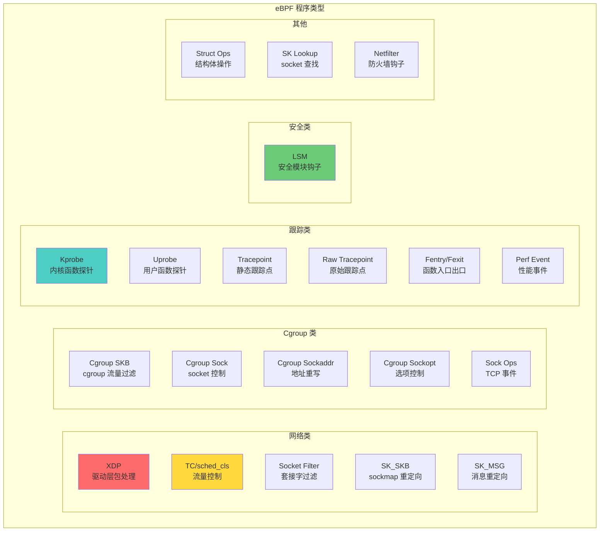
```mermaid
graph TB
    subgraph "eBPF 程序类型"
        subgraph "网络类"
            XDP["XDP<br/>驱动层包处理"]
            TC["TC/sched_cls<br/>流量控制"]
            SOCK_FILTER["Socket Filter<br/>套接字过滤"]
            SK_SKB["SK_SKB<br/>sockmap 重定向"]
            SK_MSG["SK_MSG<br/>消息重定向"]
        end

        subgraph "Cgroup 类"
            CGROUP_SKB["Cgroup SKB<br/>cgroup 流量过滤"]
            CGROUP_SOCK["Cgroup Sock<br/>socket 控制"]
            CGROUP_SOCKADDR["Cgroup Sockaddr<br/>地址重写"]
            CGROUP_SOCKOPT["Cgroup Sockopt<br/>选项控制"]
            SOCK_OPS["Sock Ops<br/>TCP 事件"]
        end

        subgraph "跟踪类"
            KPROBE["Kprobe<br/>内核函数探针"]
            UPROBE["Uprobe<br/>用户函数探针"]
            TRACEPOINT["Tracepoint<br/>静态跟踪点"]
            RAW_TP["Raw Tracepoint<br/>原始跟踪点"]
            FENTRY["Fentry/Fexit<br/>函数入口出口"]
            PERF["Perf Event<br/>性能事件"]
        end

        subgraph "安全类"
            LSM["LSM<br/>安全模块钩子"]
        end

        subgraph "其他"
            STRUCT_OPS["Struct Ops<br/>结构体操作"]
            SK_LOOKUP["SK Lookup<br/>socket 查找"]
            NETFILTER["Netfilter<br/>防火墙钩子"]
        end
    end

    style XDP fill:#ff6b6b
    style TC fill:#ffd93d
    style KPROBE fill:#4ecdc4
    style LSM fill:#6bcb77
```

### 3.2 程序类型对比表

| 程序类型 | 附加点 | 上下文 | 主要用途 | 内核版本 |
|----------|--------|--------|----------|----------|
| XDP | 网卡驱动 | xdp_md | 高性能包处理 | 4.8+ |
| TC | TC qdisc | __sk_buff | 流量控制 | 4.1+ |
| Socket Filter | socket | __sk_buff | 包过滤 | 3.19+ |
| Cgroup SKB | cgroup | __sk_buff | 容器流量控制 | 4.10+ |
| Cgroup Sock | cgroup | bpf_sock | socket 控制 | 4.10+ |
| Sock Ops | cgroup | bpf_sock_ops | TCP 参数调优 | 4.13+ |
| Kprobe | 内核函数 | pt_regs | 内核跟踪 | 4.1+ |
| Uprobe | 用户函数 | pt_regs | 应用跟踪 | 4.1+ |
| Tracepoint | 静态点 | 特定结构 | 稳定跟踪 | 4.7+ |
| Fentry/Fexit | BTF 函数 | 函数参数 | 低开销跟踪 | 5.5+ |
| LSM | 安全钩子 | 特定结构 | 安全策略 | 5.7+ |
| Perf Event | perf | bpf_perf_event_data | 性能分析 | 4.9+ |

---

## 4. XDP (eXpress Data Path)

### 4.1 XDP 原理

XDP 是 Linux 网络栈中**最早的包处理点**，在网卡驱动层执行，数据包还未分配 `sk_buff`。

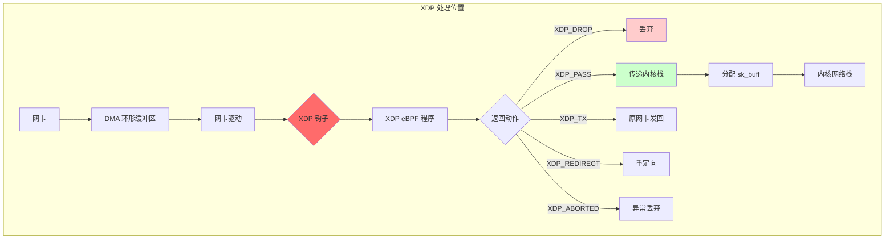
```mermaid
graph TB
    subgraph "XDP 处理位置"
        NIC[网卡] --> DMA[DMA 环形缓冲区]
        DMA --> DRIVER[网卡驱动]
        DRIVER --> XDP_HOOK{XDP 钩子}

        XDP_HOOK --> XDP_PROG[XDP eBPF 程序]

        XDP_PROG --> ACTION{返回动作}
        ACTION -->|XDP_DROP| DROP[丢弃]
        ACTION -->|XDP_PASS| PASS[传递内核栈]
        ACTION -->|XDP_TX| TX[原网卡发回]
        ACTION -->|XDP_REDIRECT| REDIRECT[重定向]
        ACTION -->|XDP_ABORTED| ABORT[异常丢弃]

        PASS --> SKB[分配 sk_buff]
        SKB --> NETSTACK[内核网络栈]
    end

    style XDP_HOOK fill:#ff6b6b
    style DROP fill:#ffcccc
    style PASS fill:#ccffcc
```

### 4.2 XDP 运行模式

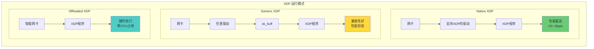
```mermaid
graph LR
    subgraph "XDP 运行模式"
        subgraph "Native XDP"
            N_NIC[网卡] --> N_DRV[支持XDP的驱动]
            N_DRV --> N_XDP[XDP程序]
            N_XDP --> N_PERF["性能最高<br/>24+ Mpps"]
        end

        subgraph "Generic XDP"
            G_NIC[网卡] --> G_DRV[任意驱动]
            G_DRV --> G_SKB[sk_buff]
            G_SKB --> G_XDP[XDP程序]
            G_XDP --> G_PERF["兼容性好<br/>性能较低"]
        end

        subgraph "Offloaded XDP"
            O_NIC[智能网卡] --> O_XDP[XDP程序]
            O_XDP --> O_PERF["硬件执行<br/>零CPU占用"]
        end
    end

    style N_PERF fill:#6bcb77
    style G_PERF fill:#ffd93d
    style O_PERF fill:#4ecdc4
```

### 4.3 XDP 上下文结构

```c
struct xdp_md {
    __u32 data;           // 数据包起始位置
    __u32 data_end;       // 数据包结束位置
    __u32 data_meta;      // 元数据区域
    __u32 ingress_ifindex; // 入站接口索引
    __u32 rx_queue_index;  // 接收队列索引
    __u32 egress_ifindex;  // 出站接口（重定向时）
};
```

### 4.4 XDP 程序示例流程

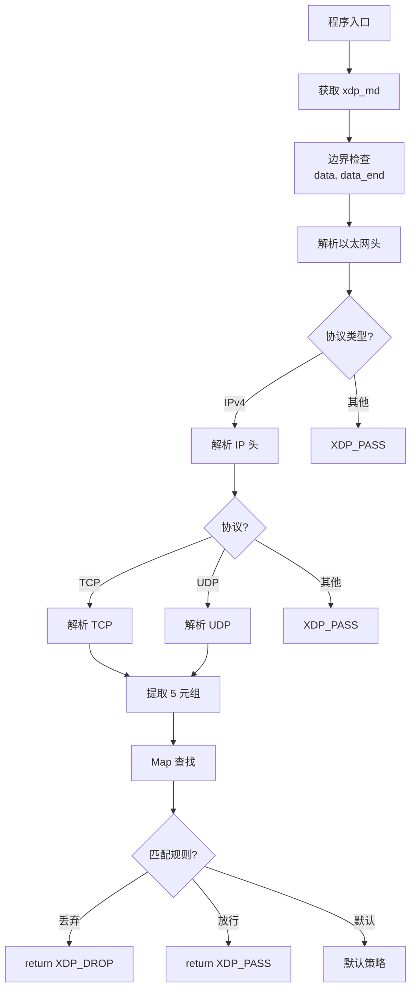
```mermaid
flowchart TB
    START[程序入口] --> CTX[获取 xdp_md]
    CTX --> BOUNDS["边界检查<br/>data, data_end"]

    BOUNDS --> PARSE_ETH[解析以太网头]
    PARSE_ETH --> CHK_ETH{协议类型?}

    CHK_ETH -->|IPv4| PARSE_IP[解析 IP 头]
    CHK_ETH -->|其他| PASS1[XDP_PASS]

    PARSE_IP --> CHK_PROTO{协议?}
    CHK_PROTO -->|TCP| PARSE_TCP[解析 TCP]
    CHK_PROTO -->|UDP| PARSE_UDP[解析 UDP]
    CHK_PROTO -->|其他| PASS2[XDP_PASS]

    PARSE_TCP --> EXTRACT[提取 5 元组]
    PARSE_UDP --> EXTRACT

    EXTRACT --> LOOKUP[Map 查找]
    LOOKUP --> FOUND{匹配规则?}

    FOUND -->|丢弃| XDP_DROP[return XDP_DROP]
    FOUND -->|放行| XDP_PASS[return XDP_PASS]
    FOUND -->|默认| DEFAULT[默认策略]
```

### 4.5 XDP 使用场景

| 场景 | 说明 | 动作 |
|------|------|------|
| **DDoS 防护** | 快速丢弃恶意流量 | XDP_DROP |
| **负载均衡** | 转发到后端服务器 | XDP_TX / XDP_REDIRECT |
| **包计数/采样** | 统计后放行 | XDP_PASS |
| **流量镜像** | 复制到另一接口 | XDP_REDIRECT |

### 4.6 XDP 优缺点

| 优点 | 缺点 |
|------|------|
| 最高性能（24+ Mpps） | 只支持入站流量 |
| 最早处理点 | 无 sk_buff，功能受限 |
| 支持硬件卸载 | 需要驱动支持（Native） |
| 低延迟 | 不支持分片包 |

---

## 5. TC (Traffic Control)

### 5.1 TC BPF 原理

TC BPF 在流量控制层运行，比 XDP 晚但有完整的 `sk_buff` 访问能力，**同时支持入站和出站**。

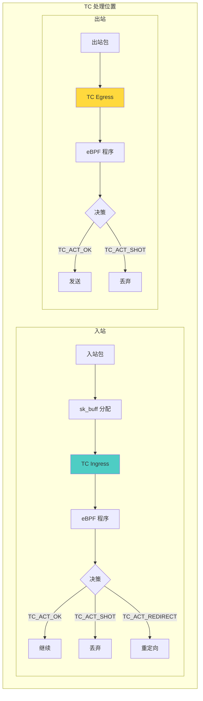
```mermaid
graph TB
    subgraph "TC 处理位置"
        subgraph "入站"
            PKT_IN[入站包] --> SKB_IN[sk_buff 分配]
            SKB_IN --> TC_INGRESS[TC Ingress]
            TC_INGRESS --> BPF_IN[eBPF 程序]
            BPF_IN --> DEC_IN{决策}
            DEC_IN -->|TC_ACT_OK| CONTINUE_IN[继续]
            DEC_IN -->|TC_ACT_SHOT| DROP_IN[丢弃]
            DEC_IN -->|TC_ACT_REDIRECT| REDIR_IN[重定向]
        end

        subgraph "出站"
            PKT_OUT[出站包] --> TC_EGRESS[TC Egress]
            TC_EGRESS --> BPF_OUT[eBPF 程序]
            BPF_OUT --> DEC_OUT{决策}
            DEC_OUT -->|TC_ACT_OK| CONTINUE_OUT[发送]
            DEC_OUT -->|TC_ACT_SHOT| DROP_OUT[丢弃]
        end
    end

    style TC_INGRESS fill:#4ecdc4
    style TC_EGRESS fill:#ffd93d
```

### 5.2 TC 返回值

| 返回值 | 数值 | 说明 |
|--------|------|------|
| TC_ACT_OK | 0 | 继续正常处理 |
| TC_ACT_SHOT | 2 | 丢弃数据包 |
| TC_ACT_STOLEN | 4 | 程序已处理，不再处理 |
| TC_ACT_REDIRECT | 7 | 重定向到其他接口 |
| TC_ACT_PIPE | 3 | 继续下一个 action |

### 5.3 __sk_buff 上下文

TC BPF 程序可访问丰富的 sk_buff 信息：

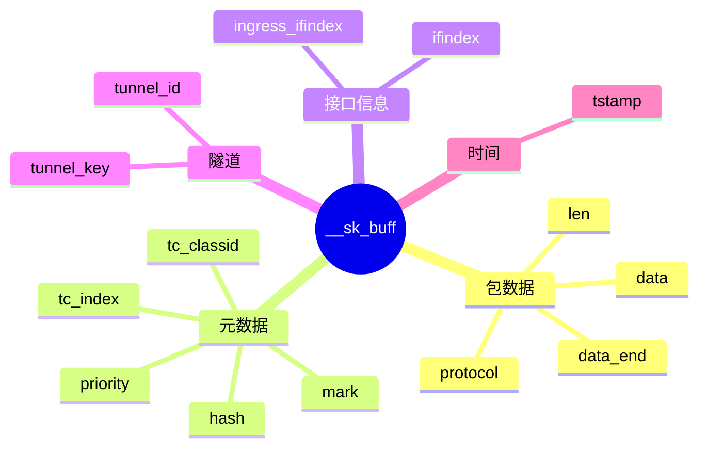
```mermaid
mindmap
  root(("__sk_buff"))
    包数据
      data
      data_end
      len
      protocol
    元数据
      mark
      priority
      tc_index
      tc_classid
      hash
    接口信息
      ifindex
      ingress_ifindex
    隧道
      tunnel_key
      tunnel_id
    时间
      tstamp
```

### 5.4 XDP vs TC 对比

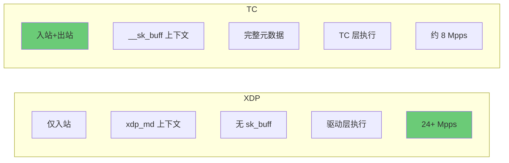
```mermaid
graph LR
    subgraph "XDP"
        XDP_F1[仅入站]
        XDP_F2[xdp_md 上下文]
        XDP_F3[无 sk_buff]
        XDP_F4[驱动层执行]
        XDP_F5[24+ Mpps]
    end

    subgraph "TC"
        TC_F1[入站+出站]
        TC_F2[__sk_buff 上下文]
        TC_F3[完整元数据]
        TC_F4[TC 层执行]
        TC_F5[约 8 Mpps]
    end

    style XDP_F5 fill:#6bcb77
    style TC_F1 fill:#6bcb77
```

### 5.5 TC 使用场景

| 场景 | 说明 |
|------|------|
| **出站流量控制** | XDP 无法做到 |
| **流量标记** | 设置 skb->mark |
| **容器网络** | Pod 间流量策略 |
| **带宽限制** | 配合 TC qdisc |
| **隧道封装** | VXLAN、GRE 等 |

---

## 6. Socket 程序

### 6.1 Socket Filter

最早的 BPF 用途，用于套接字级别的包过滤。

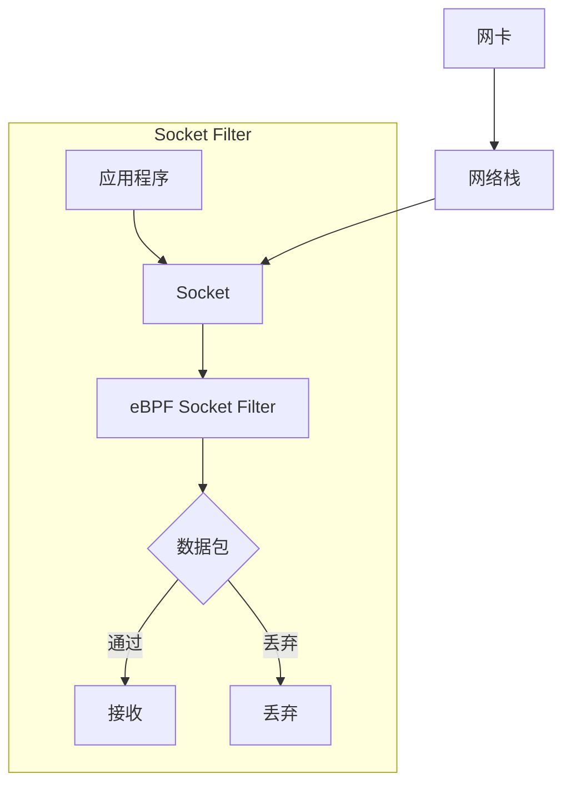
```mermaid
graph TB
    subgraph "Socket Filter"
        APP[应用程序] --> SOCKET[Socket]
        SOCKET --> FILTER[eBPF Socket Filter]
        FILTER --> PKT{数据包}
        PKT -->|通过| RECV[接收]
        PKT -->|丢弃| DROP[丢弃]
    end

    NIC[网卡] --> NETSTACK[网络栈] --> SOCKET
```

**典型应用**：tcpdump 使用 socket filter 实现包过滤。

### 6.2 SK_SKB 和 SK_MSG

用于 sockmap 实现高效的 socket 间数据传输。

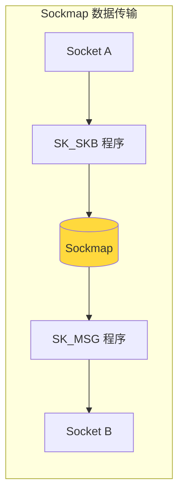
```mermaid
graph LR
    subgraph "Sockmap 数据传输"
        SOCK_A[Socket A] --> SK_SKB[SK_SKB 程序]
        SK_SKB --> SOCKMAP[(Sockmap)]
        SOCKMAP --> SK_MSG[SK_MSG 程序]
        SK_MSG --> SOCK_B[Socket B]
    end

    style SOCKMAP fill:#ffd93d
```

**使用场景**：
- Service Mesh sidecar 加速
- L7 代理绕过内核栈
- Socket 层负载均衡

### 6.3 SK_LOOKUP

用于自定义 socket 查找逻辑。

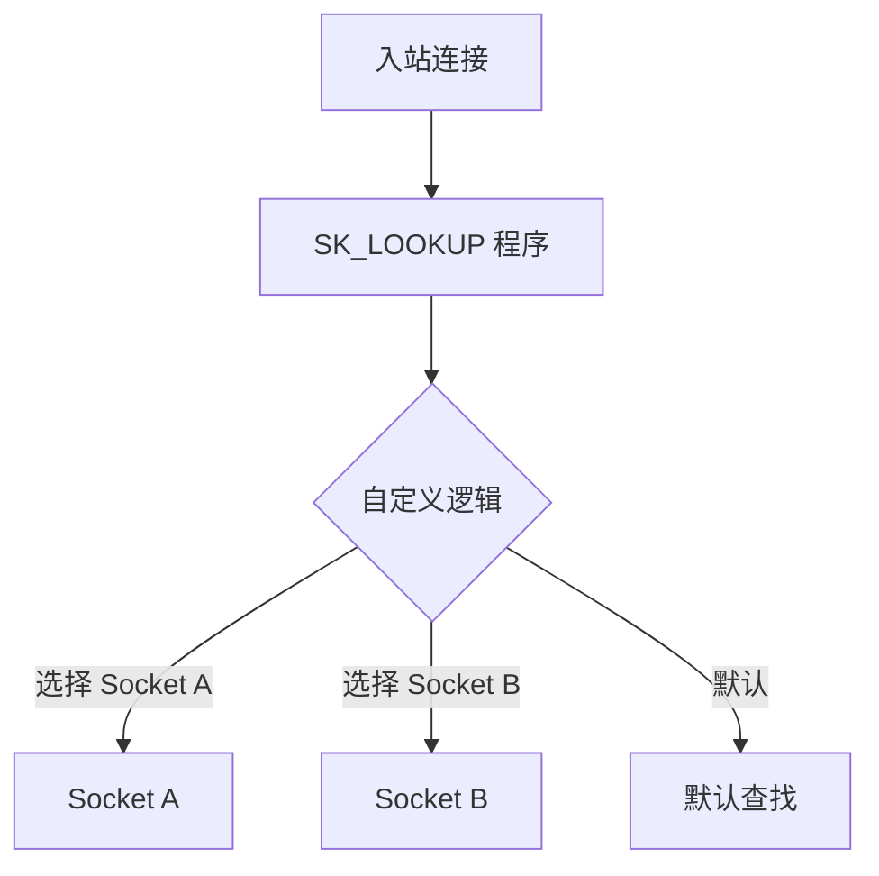
```mermaid
flowchart TB
    PKT[入站连接] --> LOOKUP[SK_LOOKUP 程序]
    LOOKUP --> CUSTOM{自定义逻辑}
    CUSTOM -->|选择 Socket A| SOCK_A[Socket A]
    CUSTOM -->|选择 Socket B| SOCK_B[Socket B]
    CUSTOM -->|默认| DEFAULT[默认查找]
```

**使用场景**：
- 单端口多服务
- 自定义负载均衡
- 连接迁移

---

## 7. Cgroup 程序

### 7.1 Cgroup 程序类型

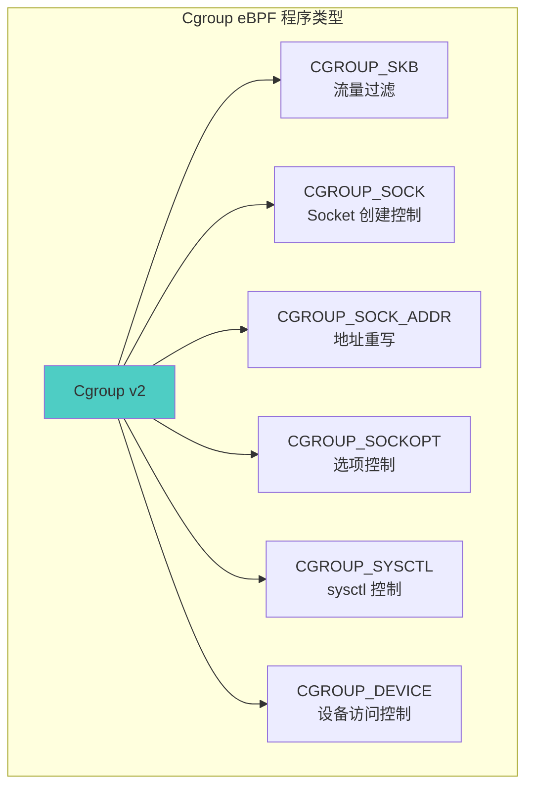
```mermaid
graph TB
    subgraph "Cgroup eBPF 程序类型"
        CGROUP[Cgroup v2]

        CGROUP --> SKB["CGROUP_SKB<br/>流量过滤"]
        CGROUP --> SOCK["CGROUP_SOCK<br/>Socket 创建控制"]
        CGROUP --> SOCKADDR["CGROUP_SOCK_ADDR<br/>地址重写"]
        CGROUP --> SOCKOPT["CGROUP_SOCKOPT<br/>选项控制"]
        CGROUP --> SYSCTL["CGROUP_SYSCTL<br/>sysctl 控制"]
        CGROUP --> DEVICE["CGROUP_DEVICE<br/>设备访问控制"]
    end

    style CGROUP fill:#4ecdc4
```

### 7.2 CGROUP_SKB

用于 cgroup 级别的流量过滤和统计。

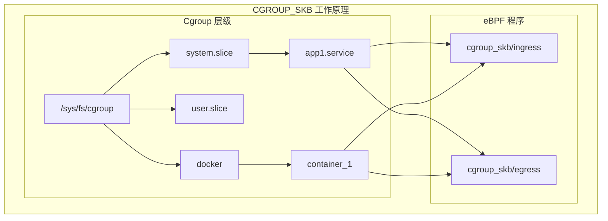
```mermaid
graph TB
    subgraph "CGROUP_SKB 工作原理"
        subgraph "Cgroup 层级"
            ROOT["/sys/fs/cgroup"]
            ROOT --> SYS["system.slice"]
            ROOT --> USER["user.slice"]
            ROOT --> DOCKER["docker"]

            SYS --> APP1["app1.service"]
            DOCKER --> CONT1["container_1"]
        end

        subgraph "eBPF 程序"
            INGRESS["cgroup_skb/ingress"]
            EGRESS["cgroup_skb/egress"]
        end

        APP1 --> INGRESS
        APP1 --> EGRESS
        CONT1 --> INGRESS
        CONT1 --> EGRESS
    end
```

**功能**：
- 按 cgroup 过滤流量
- 获取 cgroup_id 关联应用
- 流量统计和限制

**返回值**：
- `0` - 丢弃
- `1` - 放行
- `2` - 丢弃 + 标记拥塞
- `3` - 放行 + 标记拥塞

### 7.3 CGROUP_SOCK_ADDR

用于拦截和修改 connect/bind 操作。

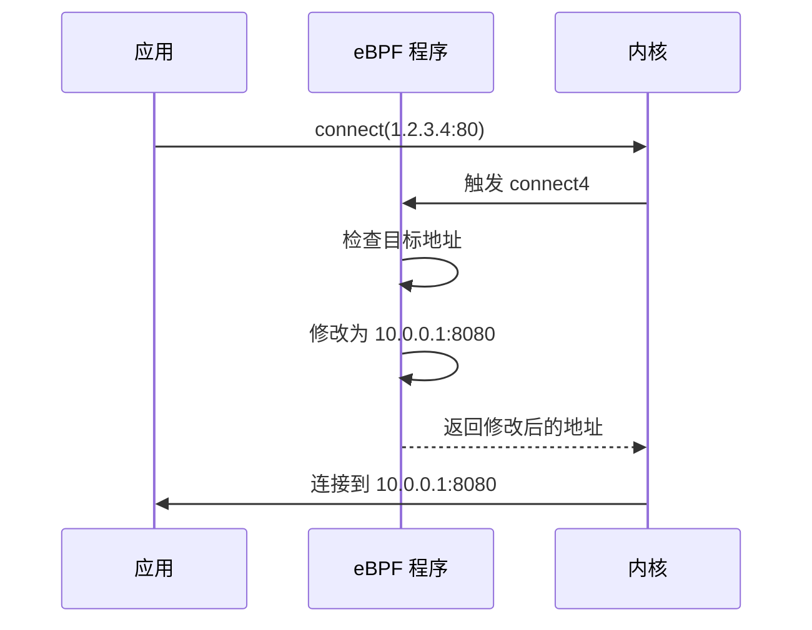
```mermaid
sequenceDiagram
    participant App as 应用
    participant BPF as eBPF 程序
    participant Kernel as 内核

    App->>Kernel: connect(1.2.3.4:80)
    Kernel->>BPF: 触发 connect4

    BPF->>BPF: 检查目标地址
    BPF->>BPF: 修改为 10.0.0.1:8080

    BPF-->>Kernel: 返回修改后的地址
    Kernel->>App: 连接到 10.0.0.1:8080
```

**使用场景**：
- 透明代理
- Service Mesh
- 出站流量劫持

### 7.4 SOCK_OPS

用于 TCP 连接事件和参数调优。

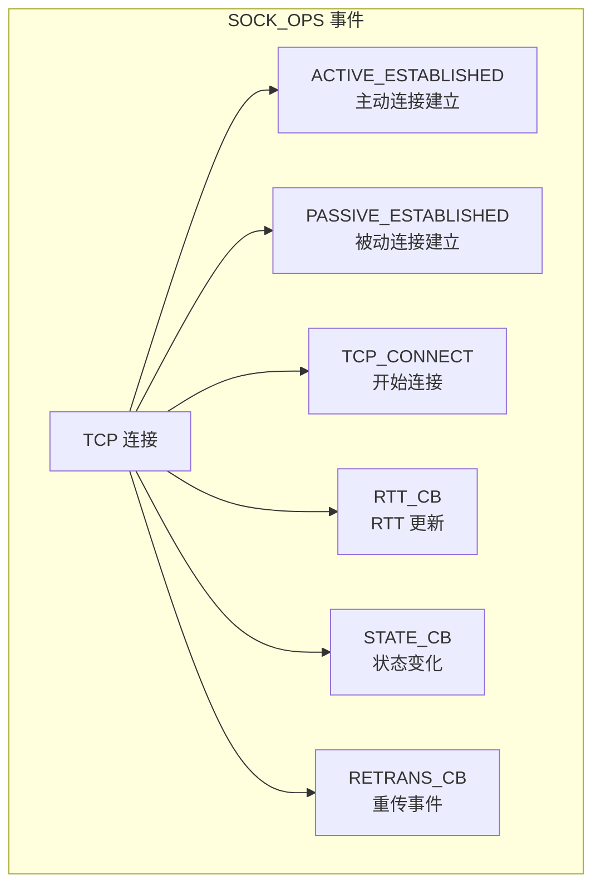
```mermaid
graph TB
    subgraph "SOCK_OPS 事件"
        TCP[TCP 连接]

        TCP --> ACTIVE["ACTIVE_ESTABLISHED<br/>主动连接建立"]
        TCP --> PASSIVE["PASSIVE_ESTABLISHED<br/>被动连接建立"]
        TCP --> CONNECT["TCP_CONNECT<br/>开始连接"]
        TCP --> RTT["RTT_CB<br/>RTT 更新"]
        TCP --> STATE["STATE_CB<br/>状态变化"]
        TCP --> RETRANS["RETRANS_CB<br/>重传事件"]
    end
```

**使用场景**：
- TCP 参数调优（拥塞控制、窗口大小）
- 连接跟踪
- 性能监控

---

## 8. 跟踪程序 (Tracing)

### 8.1 跟踪程序类型对比

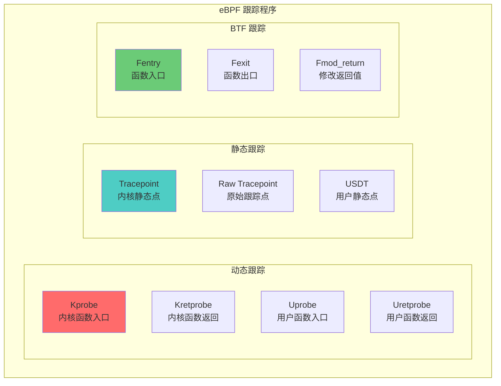
```mermaid
graph TB
    subgraph "eBPF 跟踪程序"
        subgraph "动态跟踪"
            KPROBE["Kprobe<br/>内核函数入口"]
            KRETPROBE["Kretprobe<br/>内核函数返回"]
            UPROBE["Uprobe<br/>用户函数入口"]
            URETPROBE["Uretprobe<br/>用户函数返回"]
        end

        subgraph "静态跟踪"
            TRACEPOINT["Tracepoint<br/>内核静态点"]
            RAW_TP["Raw Tracepoint<br/>原始跟踪点"]
            USDT["USDT<br/>用户静态点"]
        end

        subgraph "BTF 跟踪"
            FENTRY["Fentry<br/>函数入口"]
            FEXIT["Fexit<br/>函数出口"]
            FMOD_RET["Fmod_return<br/>修改返回值"]
        end
    end

    style KPROBE fill:#ff6b6b
    style TRACEPOINT fill:#4ecdc4
    style FENTRY fill:#6bcb77
```

### 8.2 Kprobe/Kretprobe

动态附加到任意内核函数。

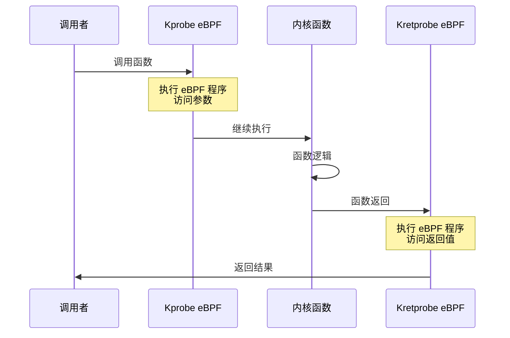
```mermaid
sequenceDiagram
    participant Caller as 调用者
    participant Kprobe as Kprobe eBPF
    participant Func as 内核函数
    participant Kret as Kretprobe eBPF

    Caller->>Kprobe: 调用函数
    Note over Kprobe: 执行 eBPF 程序<br/>访问参数
    Kprobe->>Func: 继续执行
    Func->>Func: 函数逻辑
    Func->>Kret: 函数返回
    Note over Kret: 执行 eBPF 程序<br/>访问返回值
    Kret->>Caller: 返回结果
```

**特点**：
- 可附加到几乎任何内核函数
- 不稳定，可能因内核版本变化而失效
- 有一定性能开销

### 8.3 Tracepoint

附加到内核预定义的静态跟踪点。

```mermaid
graph TB
    subgraph "Tracepoint 类别"
        SCHED["sched:*<br/>调度器"]
        SYSCALL["syscalls:*<br/>系统调用"]
        NET["net:*<br/>网络"]
        BLOCK["block:*<br/>块设备"]
        IRQ["irq:*<br/>中断"]
        SIGNAL["signal:*<br/>信号"]
    end

    subgraph "示例"
        SCHED --> SCHED_SWITCH["sched:sched_switch"]
        SYSCALL --> SYS_ENTER["syscalls:sys_enter_open"]
        NET --> NET_RX["net:netif_receive_skb"]
    end
```

**优点**：
- ABI 稳定
- 跨内核版本兼容
- 低开销

### 8.4 Fentry/Fexit

基于 BTF 的新一代函数跟踪，零开销（使用 BPF 蹦床）。

```mermaid
graph LR
    subgraph "Fentry vs Kprobe"
        subgraph "Kprobe"
            K1["断点机制"]
            K2["int3 中断"]
            K3["较高开销"]
            K4["无需 BTF"]
        end

        subgraph "Fentry"
            F1["蹦床机制"]
            F2["直接调用"]
            F3["接近零开销"]
            F4["需要 BTF"]
        end
    end

    style K3 fill:#ffcccc
    style F3 fill:#ccffcc
```

**Fexit 的优势**：
- 可同时访问输入参数和返回值
- 无需用 Map 存储参数（Kretprobe 需要）

### 8.5 Uprobe

用户空间函数跟踪。

```mermaid
graph TB
    subgraph "Uprobe 工作原理"
        BINARY[用户程序]
        SYMBOL[符号表查找]
        UPROBE_HOOK[Uprobe 断点]
        BPF_PROG[eBPF 程序]

        BINARY --> SYMBOL
        SYMBOL --> UPROBE_HOOK
        UPROBE_HOOK --> BPF_PROG
    end

    subgraph "常见附加点"
        SSL["SSL_read/SSL_write<br/>TLS 解密"]
        HTTP["http.handler<br/>Go HTTP 处理"]
        MALLOC["malloc/free<br/>内存分析"]
    end
```

**使用场景**：
- 应用性能分析
- TLS 流量可见性
- 语言运行时跟踪

---

## 9. LSM (Linux Security Module)

### 9.1 LSM BPF 原理

LSM BPF 允许附加 eBPF 程序到 Linux 安全模块钩子，实现可编程的访问控制。

```mermaid
graph TB
    subgraph "LSM BPF 架构"
        SYSCALL[系统调用] --> LSM_HOOK{LSM 钩子}

        LSM_HOOK --> SELINUX[SELinux]
        LSM_HOOK --> APPARMOR[AppArmor]
        LSM_HOOK --> BPF_LSM[BPF LSM]

        BPF_LSM --> BPF_PROG[eBPF 程序]
        BPF_PROG --> DECISION{决策}

        DECISION -->|允许| ALLOW[返回 0]
        DECISION -->|拒绝| DENY[返回 -EPERM]
    end

    style BPF_LSM fill:#6bcb77
```

### 9.2 常用 LSM 钩子

| 钩子 | 说明 | 场景 |
|------|------|------|
| file_open | 文件打开 | 文件访问控制 |
| socket_create | 创建套接字 | 网络限制 |
| socket_connect | 连接操作 | 出站控制 |
| bprm_check_security | 程序执行 | 执行控制 |
| task_alloc | 进程创建 | 进程限制 |

### 9.3 LSM vs 其他安全机制

```mermaid
graph TB
    subgraph "安全机制对比"
        subgraph "SELinux/AppArmor"
            SA1["静态策略"]
            SA2["配置文件"]
            SA3["需要重载"]
        end

        subgraph "Seccomp BPF"
            SC1["系统调用过滤"]
            SC2["cBPF 程序"]
            SC3["受限功能"]
        end

        subgraph "LSM BPF"
            LB1["动态策略"]
            LB2["eBPF 程序"]
            LB3["丰富上下文"]
            LB4["可与 SELinux 共存"]
        end
    end

    style LB1 fill:#6bcb77
    style LB2 fill:#6bcb77
```

---

## 10. eBPF Maps

### 10.1 Map 类型总览

```mermaid
graph TB
    subgraph "eBPF Map 类型"
        subgraph "通用类型"
            HASH["HASH<br/>键值哈希表"]
            ARRAY["ARRAY<br/>索引数组"]
            PERCPU_HASH["PERCPU_HASH<br/>Per-CPU 哈希"]
            PERCPU_ARRAY["PERCPU_ARRAY<br/>Per-CPU 数组"]
            LRU_HASH["LRU_HASH<br/>LRU 淘汰"]
        end

        subgraph "网络专用"
            DEVMAP["DEVMAP<br/>设备映射"]
            XSKMAP["XSKMAP<br/>AF_XDP"]
            SOCKMAP["SOCKMAP<br/>Socket 映射"]
            CPUMAP["CPUMAP<br/>CPU 重定向"]
        end

        subgraph "高级类型"
            RINGBUF["RINGBUF<br/>环形缓冲区"]
            PERF_ARRAY["PERF_EVENT_ARRAY<br/>事件数组"]
            PROG_ARRAY["PROG_ARRAY<br/>尾调用"]
            LPM_TRIE["LPM_TRIE<br/>最长前缀匹配"]
        end

        subgraph "存储类型"
            INODE_STORAGE["INODE_STORAGE<br/>文件存储"]
            TASK_STORAGE["TASK_STORAGE<br/>进程存储"]
            SK_STORAGE["SK_STORAGE<br/>Socket 存储"]
        end
    end

    style HASH fill:#ff6b6b
    style RINGBUF fill:#6bcb77
    style LPM_TRIE fill:#4ecdc4
```

### 10.2 常用 Map 类型详解

| Map 类型 | 查找复杂度 | 使用场景 |
|----------|------------|----------|
| HASH | O(1) | 通用键值存储 |
| ARRAY | O(1) | 固定大小配置 |
| PERCPU_HASH | O(1) | 高并发计数器 |
| LPM_TRIE | O(k) | IP 路由表 |
| RINGBUF | - | 事件传递 |
| PERF_EVENT_ARRAY | - | 采样数据 |
| SOCKMAP | O(1) | Socket 重定向 |

### 10.3 Ringbuf vs Perf Event Array

```mermaid
graph LR
    subgraph "Perf Event Array"
        PE1["Per-CPU 缓冲区"]
        PE2["事件可能乱序"]
        PE3["需要 wakeup"]
        PE4["内核 < 5.8"]
    end

    subgraph "Ringbuf"
        RB1["单一共享缓冲区"]
        RB2["保持事件顺序"]
        RB3["更高效"]
        RB4["内核 >= 5.8 推荐"]
    end

    style RB1 fill:#6bcb77
    style RB2 fill:#6bcb77
```

### 10.4 Map 操作

```mermaid
flowchart TB
    subgraph "内核态操作"
        K_LOOKUP["bpf_map_lookup_elem"]
        K_UPDATE["bpf_map_update_elem"]
        K_DELETE["bpf_map_delete_elem"]
    end

    subgraph "用户态操作"
        U_LOOKUP["bpf_map_lookup_elem_fd"]
        U_UPDATE["bpf_map_update_elem_fd"]
        U_DELETE["bpf_map_delete_elem_fd"]
        U_GET_NEXT["bpf_map_get_next_key"]
    end

    MAP[(eBPF Map)]

    K_LOOKUP --> MAP
    K_UPDATE --> MAP
    K_DELETE --> MAP

    U_LOOKUP --> MAP
    U_UPDATE --> MAP
    U_DELETE --> MAP
    U_GET_NEXT --> MAP
```

---

## 11. eBPF 辅助函数

### 11.1 辅助函数分类

```mermaid
graph TB
    subgraph "eBPF 辅助函数"
        subgraph "Map 操作"
            MAP_LOOKUP["bpf_map_lookup_elem"]
            MAP_UPDATE["bpf_map_update_elem"]
            MAP_DELETE["bpf_map_delete_elem"]
        end

        subgraph "包操作"
            SKB_STORE["bpf_skb_store_bytes"]
            SKB_LOAD["bpf_skb_load_bytes"]
            CSUM["bpf_l3/l4_csum_replace"]
            REDIRECT["bpf_redirect"]
        end

        subgraph "跟踪"
            GET_PID["bpf_get_current_pid_tgid"]
            GET_COMM["bpf_get_current_comm"]
            PROBE_READ["bpf_probe_read"]
            GET_TIME["bpf_ktime_get_ns"]
        end

        subgraph "输出"
            PERF_EVENT["bpf_perf_event_output"]
            RINGBUF_OUT["bpf_ringbuf_output"]
            TRACE_PRINT["bpf_trace_printk"]
        end

        subgraph "Cgroup"
            GET_CGROUP["bpf_skb_cgroup_id"]
            GET_ANCESTOR["bpf_get_current_ancestor_cgroup_id"]
        end
    end
```

### 11.2 常用辅助函数

| 函数 | 说明 | 程序类型 |
|------|------|----------|
| `bpf_map_lookup_elem` | Map 查找 | 所有 |
| `bpf_map_update_elem` | Map 更新 | 所有 |
| `bpf_get_current_pid_tgid` | 获取 PID/TGID | 跟踪类 |
| `bpf_get_current_comm` | 获取进程名 | 跟踪类 |
| `bpf_probe_read` | 读取内存 | 跟踪类 |
| `bpf_ktime_get_ns` | 获取时间戳 | 所有 |
| `bpf_redirect` | 包重定向 | XDP/TC |
| `bpf_skb_cgroup_id` | 获取 cgroup ID | TC/Cgroup |
| `bpf_ringbuf_output` | 输出到 ringbuf | 所有 |
| `bpf_tail_call` | 尾调用 | 部分 |

---

## 12. 开发工具链

### 12.1 工具生态

```mermaid
graph TB
    subgraph "eBPF 开发工具链"
        subgraph "编译器"
            CLANG["Clang/LLVM"]
            GCC_BPF["GCC BPF"]
        end

        subgraph "加载库"
            LIBBPF["libbpf (C)"]
            CILIUM_GO["cilium/ebpf (Go)"]
            AYA["Aya (Rust)"]
            LIBBPF_RS["libbpf-rs (Rust)"]
        end

        subgraph "高级框架"
            BCC["BCC"]
            BPFTRACE["bpftrace"]
            LIBBPF_BOOTSTRAP["libbpf-bootstrap"]
        end

        subgraph "调试工具"
            BPFTOOL["bpftool"]
            STRACE_BPF["strace"]
            PERF["perf"]
        end
    end

    CLANG --> LIBBPF
    CLANG --> CILIUM_GO
    CLANG --> AYA

    LIBBPF --> BCC
    LIBBPF --> BPFTRACE

    style LIBBPF fill:#6bcb77
    style BPFTRACE fill:#4ecdc4
```

### 12.2 开发方式对比

| 方式 | 语言 | 难度 | 性能 | 适用场景 |
|------|------|------|------|----------|
| BCC | Python+C | 低 | 中 | 快速原型 |
| bpftrace | DSL | 最低 | 中 | 一次性跟踪 |
| libbpf | C | 高 | 最高 | 生产环境 |
| cilium/ebpf | Go | 中 | 高 | Go 项目 |
| Aya | Rust | 中 | 高 | Rust 项目 |

### 12.3 CO-RE (Compile Once - Run Everywhere)

```mermaid
graph TB
    subgraph "传统方式"
        T_SRC[源码] --> T_COMPILE[编译]
        T_COMPILE --> T_BIN[二进制]
        T_BIN --> T_KERNEL{内核版本}
        T_KERNEL -->|不匹配| T_FAIL[失败]
        T_KERNEL -->|匹配| T_RUN[运行]
    end

    subgraph "CO-RE 方式"
        C_SRC[源码 + BTF] --> C_COMPILE[编译]
        C_COMPILE --> C_BIN[二进制 + 重定位信息]
        C_BIN --> C_LOADER[libbpf 加载器]
        C_LOADER --> C_BTF[读取目标 BTF]
        C_BTF --> C_RELOCATE[重定位调整]
        C_RELOCATE --> C_RUN[运行]
    end

    style T_FAIL fill:#ffcccc
    style C_RUN fill:#ccffcc
```

**CO-RE 优势**：
- 无需目标机器的内核头文件
- 跨内核版本兼容
- 减小分发体积

---

## 13. 实际应用案例

### 13.1 可观测性

```mermaid
graph TB
    subgraph "eBPF 可观测性栈"
        subgraph "数据采集"
            KPROBE_D["Kprobe<br/>内核函数"]
            UPROBE_D["Uprobe<br/>应用函数"]
            TP_D["Tracepoint<br/>静态事件"]
            TC_D["TC<br/>网络流量"]
        end

        subgraph "数据传输"
            RINGBUF_D["Ringbuf"]
            PERF_D["Perf Buffer"]
        end

        subgraph "用户态处理"
            AGENT["采集 Agent"]
            STORAGE["存储后端"]
            UI["可视化"]
        end
    end

    KPROBE_D --> RINGBUF_D
    UPROBE_D --> RINGBUF_D
    TP_D --> PERF_D
    TC_D --> PERF_D

    RINGBUF_D --> AGENT
    PERF_D --> AGENT
    AGENT --> STORAGE
    STORAGE --> UI
```

**典型项目**：Pixie、Parca、Pyroscope

### 13.2 网络

```mermaid
graph TB
    subgraph "eBPF 网络应用"
        subgraph "负载均衡"
            LB_XDP["XDP 负载均衡<br/>Katran、Cilium"]
        end

        subgraph "服务网格"
            MESH_TC["TC Socket 加速<br/>Cilium"]
            MESH_SOCKMAP["Sockmap 绕过<br/>内核栈"]
        end

        subgraph "容器网络"
            CNI_TC["TC 策略执行"]
            CNI_CGROUP["Cgroup 流量隔离"]
        end
    end
```

**典型项目**：Cilium、Calico、Katran

### 13.3 安全

```mermaid
graph TB
    subgraph "eBPF 安全应用"
        subgraph "运行时安全"
            FALCO["Falco<br/>异常检测"]
            TETRAGON["Tetragon<br/>策略执行"]
        end

        subgraph "网络安全"
            FW["eBPF 防火墙"]
            IDS["流量检测"]
        end

        subgraph "访问控制"
            LSM_SEC["LSM BPF<br/>权限控制"]
        end
    end
```

**典型项目**：Falco、Tetragon、Tracee

---

## 14. 使用场景总结

### 14.1 程序类型选择指南

```mermaid
flowchart TB
    START[选择 eBPF 程序类型] --> Q1{目标是什么?}

    Q1 -->|网络包处理| Q2{需要最高性能?}
    Q2 -->|是| XDP_R["XDP<br/>驱动层处理"]
    Q2 -->|否| Q3{需要出站控制?}
    Q3 -->|是| TC_R["TC<br/>入站+出站"]
    Q3 -->|否| XDP_R

    Q1 -->|容器流量控制| CGROUP_R["Cgroup SKB<br/>按容器过滤"]

    Q1 -->|应用流量统计| Q4{需要进程信息?}
    Q4 -->|是| CGROUP_R2["Cgroup SKB<br/>获取cgroup_id"]
    Q4 -->|否| TC_R2["TC<br/>通用统计"]

    Q1 -->|内核跟踪| Q5{需要稳定性?}
    Q5 -->|是| TP_R["Tracepoint<br/>ABI稳定"]
    Q5 -->|否| Q6{需要低开销?}
    Q6 -->|是| FENTRY_R["Fentry/Fexit<br/>零开销"]
    Q6 -->|否| KPROBE_R["Kprobe<br/>灵活"]

    Q1 -->|应用跟踪| UPROBE_R["Uprobe<br/>用户函数"]

    Q1 -->|安全策略| LSM_R["LSM<br/>访问控制"]

    style XDP_R fill:#ff6b6b
    style TC_R fill:#ffd93d
    style CGROUP_R fill:#4ecdc4
    style TP_R fill:#6bcb77
    style LSM_R fill:#9b59b6
```

### 14.2 综合对比

| 场景 | 推荐类型 | 原因 |
|------|----------|------|
| DDoS 防护 | XDP | 最早丢弃点 |
| L4 负载均衡 | XDP | 高性能转发 |
| 容器网络策略 | TC + Cgroup | 入站出站 + 容器隔离 |
| 应用流量统计 | Cgroup SKB | 获取进程关联 |
| 性能分析 | Fentry + Perf | 低开销采样 |
| 安全审计 | Tracepoint | 稳定可靠 |
| 运行时防护 | LSM + Kprobe | 阻断 + 检测 |
| TLS 可见性 | Uprobe | SSL 库跟踪 |

---

## 15. 参考资料

- [eBPF.io - What is eBPF](https://ebpf.io/what-is-ebpf/)
- [eBPF Docs - Program Types](https://docs.ebpf.io/linux/program-type/)
- [eBPF Docs - Map Types](https://docs.ebpf.io/linux/map-type/)
- [eBPF Docs - Helper Functions](https://docs.ebpf.io/linux/helper-function/)
- [Tigera - eBPF XDP Tutorial](https://www.tigera.io/learn/guides/ebpf/ebpf-xdp/)
- [eunomia - eBPF Tutorial by Example](https://eunomia.dev/tutorials/20-tc/)
- [Brendan Gregg - Linux eBPF Tracing Tools](https://www.brendangregg.com/ebpf.html)
- [Linux Kernel Documentation - BPF](https://docs.kernel.org/bpf/)
- [Red Hat - Understanding eBPF networking features](https://docs.redhat.com/en/documentation/red_hat_enterprise_linux/9/html/configuring_and_managing_networking/assembly_understanding-the-ebpf-features-in-rhel-9_configuring-and-managing-networking)
- [Isovalent - eBPF Docs](https://github.com/isovalent/ebpf-docs)
